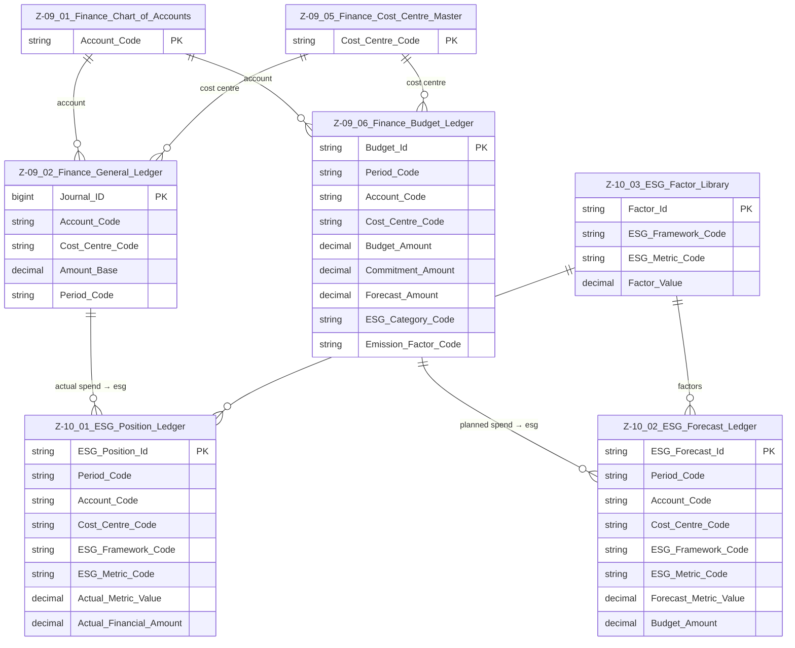

```mermaid
erDiagram
    %% FINANCE CORE
    Z-09_01_Finance_Chart_of_Accounts {
        string Account_Code PK
    }

    Z-09_05_Finance_Cost_Centre_Master {
        string Cost_Centre_Code PK
    }

    Z-09_02_Finance_General_Ledger {
        bigint Journal_ID PK
        string Account_Code
        string Cost_Centre_Code
        decimal Amount_Base
        string Period_Code
    }

    Z-09_06_Finance_Budget_Ledger {
        string Budget_Id PK
        string Period_Code
        string Account_Code
        string Cost_Centre_Code
        decimal Budget_Amount
        decimal Commitment_Amount
        decimal Forecast_Amount
        string ESG_Category_Code
        string Emission_Factor_Code
    }

    %% ESG CORE
    Z-10_03_ESG_Factor_Library {
        string Factor_Id PK
        string ESG_Framework_Code
        string ESG_Metric_Code
        decimal Factor_Value
    }

    Z-10_01_ESG_Position_Ledger {
        string ESG_Position_Id PK
        string Period_Code
        string Account_Code
        string Cost_Centre_Code
        string ESG_Framework_Code
        string ESG_Metric_Code
        decimal Actual_Metric_Value
        decimal Actual_Financial_Amount
    }

    Z-10_02_ESG_Forecast_Ledger {
        string ESG_Forecast_Id PK
        string Period_Code
        string Account_Code
        string Cost_Centre_Code
        string ESG_Framework_Code
        string ESG_Metric_Code
        decimal Forecast_Metric_Value
        decimal Budget_Amount
    }

    %% RELATIONSHIPS
    Z-09_01_Finance_Chart_of_Accounts ||--o{ Z-09_02_Finance_General_Ledger : "account"
    Z-09_05_Finance_Cost_Centre_Master ||--o{ Z-09_02_Finance_General_Ledger : "cost centre"

    Z-09_01_Finance_Chart_of_Accounts ||--o{ Z-09_06_Finance_Budget_Ledger : "account"
    Z-09_05_Finance_Cost_Centre_Master ||--o{ Z-09_06_Finance_Budget_Ledger : "cost centre"

    Z-09_02_Finance_General_Ledger ||--o{ Z-10_01_ESG_Position_Ledger : "actual spend → esg"
    Z-10_03_ESG_Factor_Library ||--o{ Z-10_01_ESG_Position_Ledger : "factors"

    Z-09_06_Finance_Budget_Ledger ||--o{ Z-10_02_ESG_Forecast_Ledger : "planned spend → esg"
    Z-10_03_ESG_Factor_Library ||--o{ Z-10_02_ESG_Forecast_Ledger : "factors"
```