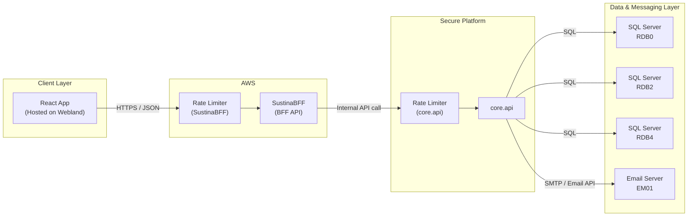

# Sustina Platform – High-Level Architecture

```mermaid
flowchart LR
  subgraph Client["Client Layer"]
    ReactApp["React App\n(Hosted on Webland)"]
  end

  subgraph AWS["AWS"]
    RL_BFF["Rate Limiter\n(SustinaBFF)"]
    SustinaBFF["SustinaBFF\n(BFF API)"]
  end

  subgraph SecurePlatform["Secure Platform"]
    RL_Core["Rate Limiter\n(core.api)"]
    CoreAPI["core.api"]
  end

  subgraph DataTier["Data & Messaging Layer"]
    RDB0["SQL Server\nRDB0"]
    RDB2["SQL Server\nRDB2"]
    RDB4["SQL Server\nRDB4"]
    EM01["Email Server\nEM01"]
  end

  ReactApp -->|HTTPS / JSON| RL_BFF
  RL_BFF --> SustinaBFF
  SustinaBFF -->|Internal API call| RL_Core
  RL_Core --> CoreAPI

  CoreAPI -->|SQL| RDB0
  CoreAPI -->|SQL| RDB2
  CoreAPI -->|SQL| RDB4

  CoreAPI -->|SMTP / Email API| EM01
```
