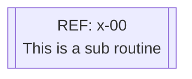
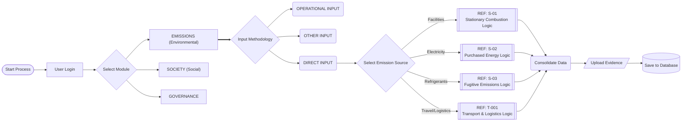

# Sustina Platform – Workflow Reference: M-001 (Master Emissions Flow)

**Description:**
This is the high-level "Orchestrator" view of the Sustina Platform. It governs the user journey from Login through to the specific ESG module selection.

Its primary function is **routing**. It distinguishes between the three ESG pillars (Environmental, Social, Governance) and further segregates the Environmental inputs into specific data streams. Rather than calculating data directly, this flow delegates logic to specific sub-routines (e.g., `T-001`, `S-01`) to maintain system architecture clarity.

### Schematics  
We adopt a schematic style to illustrates high lecve flows and more detailed viewd to allow our clients to appreciate how their access, data and reporting are collated and managed.
Due to size and complexity of some functions the schematic may grow very large and become diffuclt to follow. To avoid this we use the follwoing schematic elemnt to identify where there is more detailed functionality. We call this a subroutine and this is how it appears.

All subroutines are referenced  and you will find a page in this repository for each /referecene sub routine. 

### Key Logical Steps

1.  **Module Selection:**
    After authentication, the user selects the primary reporting pillar. This flow details the **Environmental (Emissions)** path.

2.  **Input Methodology:**
    Determines the data source:
    * **Direct Input:** Manual entry (handled in this flow's sub-routines).
    * **Operational Input:** Automated API/IoT ingestion (handled in parallel flows).

3.  **Sub-Routine Delegation:**
    For Direct Inputs, the system routes the user to specific calculation logic blocks:
    * **REF S-01 (Facilities):** Stationary combustion (Boilers/Generators).
    * **REF S-02 (Energy):** Purchased Electricity/Heating.
    * **REF S-03 (Fugitive):** Refrigerant gas leaks.
    * **REF T-001 (Transport):** Mobile combustion and logistics.

4.  **Data Consolidation:**
    All sub-routines return calculated data to this master flow for final aggregation, evidence attachment, and database commitment.

**M-001 (Master Emissions Flow) schematic:**

]
