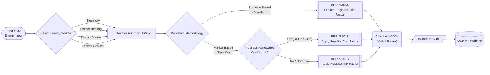

# Workflow Reference: S-02 (Purchased Energy Logic)

**Description:**
This workflow governs the calculation of **Scope 2 Indirect Emissions** (purchased electricity, heat, steam, and cooling). It is designed to comply with the **GHG Protocol Scope 2 Guidance**, which requires companies to account for emissions using two distinct methodologies: **Location-Based** and **Market-Based**.

### Key Logical Steps

1.  **Source Selection:**
    Identifies the utility type (Electricity, District Heating, Steam, or Cooling). This determines which emission factor database to query.

2.  **Methodology Decision:**
    The system enforces the "Dual Reporting" standard:
    * **Location-Based:** Uses average grid emission factors for the physical location.
    * **Market-Based:** Reflects the company's specific procurement choices (e.g., green tariffs).

3.  **Certificate Validation (The "Green Check"):**
    If a user selects "Market-Based," the system verifies if they possess **Energy Attribute Certificates** (RECs, GOs, I-RECs). Without proof, the system forces a fallback to the "Residual Mix" to prevent double-counting of green energy.

4.  **Sub-Routine Delegation:**
    Data lookup is delegated to specific sub-processes:
    * **REF S-02-A:** Lookups for standard Regional Grid Averages (e.g., eGRID, DEFRA).
    * **REF S-02-B:** Validation of Supplier Specific Rates and Certificates.
    * **REF S-02-C:** Lookups for Residual Mix Factors (for uncertified energy in a market-based scenario).

### Process Flow Diagram

