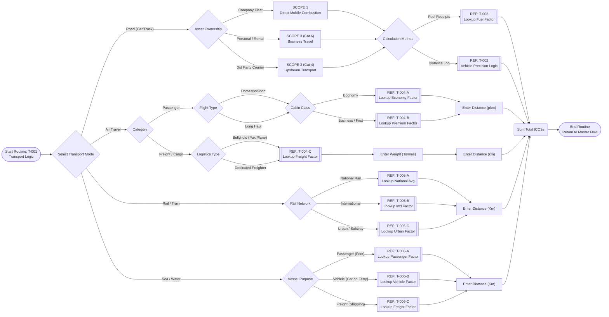

# Workflow Reference: T-001 (Transport & Logistics)

**Description:**
This subroutine handles the complex logic for Mobile Combustion (Scope 1) and Mobile Business Travel/Upstream Transport (Scope 3). It segregates emissions based on the **Transport Mode** and the **Asset Ownership** model.

### Key Logical Steps

1.  **Mode Selection:**
    Splits logic between Road, Air, Rail, and Sea.

2.  **Scope Determination:**
    * **Scope 1:** Applied only when the vehicle is **Company Owned/Leased**.
    * **Scope 3:** Applied to Personal Cars (Grey Fleet), Rentals, Flights, Trains, and 3rd Party Logistics (Couriers).

3.  **Sub-Routine Call (T-002):**
    For Road transport using **Distance**, the system calls a sub-routine (`T-002`) to handle precise license plate lookups and vehicle databases.

4.  **Cabin Class (Air):**
    Applies "Radiative Forcing" multipliers based on seat class (Economy vs. Business/First).

---

### Process Flow Diagram

