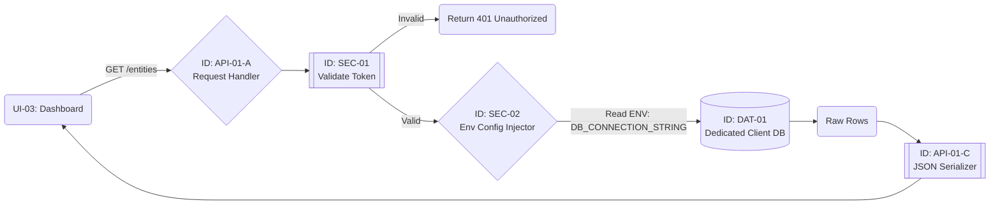

# Specification: API-01 (Entity Retrieval Service)

| **Document ID** | **Version** | **Status** | **Owner (Author)** | **Approved By** |
| :--- | :--- | :--- | :--- | :--- |
| API-01 | 1.1.0 | **DRAFT** | Business Architect | Product Officer |

## 1. Description & Scope
**API-01** provides the organizational data for the dashboard.
* **Architecture:** **Single-Tenant / Physically Isolated**. Each client has a dedicated database instance and API installation.
* **Security Model:** Infrastructure-level isolation. Cross-tenant data leakage is physically impossible via SQL injection, as other tenants' data does not exist in the connected database.
* **Data Source:** Reads from the local environment's configured `DAT-01` instance.

## 2. API Contract (OpenAPI Summary)

### Endpoint: List My Entities
* **Method:** `GET /api/v1/entities`
* **Headers:** `Authorization: Bearer <JWT_TOKEN>`
* **Query Parameters:** `depth` (integer, default: 1)

### Success Response (200 OK)
```json
{
  "installation_id": "inst_bmw_eu",  // Specific to this physical instance
  "data": [
    {
      "entity_id": "ent_001",
      "name": "Munich HQ",
      "status": "ACTIVE"
    }
  ]
}
```
## 3. Internal Workflow Logic
The diagram reflects the simplified logic due to physical isolation. No dynamic routing is required; the connection is static.


---
## 4. Component Dictionary (Internal Logic)

| Component ID | Name | Technical Description | Test Case Reference |
| :--- | :--- | :--- | :--- |
| **API-01-A** | Request Handler | Standard REST Controller. Validates query parameters. | `TC-ENT-001` |
| **SEC-02** | **Env Config Injector** | **Critical Infrastructure Component.** Loads the static database credentials from the secure server environment (e.g., Kubernetes Secrets or `.env`). Ensures the API connects ONLY to the pre-assigned database. | `TC-INFRA-001` |
| **API-01-C** | Serializer | Transforms SQL rows into JSON and removes internal primary keys. | `TC-ENT-008` |

## 5. Critical Test Registry (Infrastructure Focus)

*Since Isolation is handled by hardware/deployment, the tests focus on Configuration Integrity.*

### Component: SEC-02 (Env Config)
| Test ID | Title | Why we test this | Expected Result |
| :--- | :--- | :--- | :--- |
| **TC-INFRA-001** | **Connection String Validity** | **Availability:** Ensures the App is pointed to a live DB. | **Action:** Boot API with valid `.env`.<br>**Expected:** Health check returns `DB_CONNECTED`. |
| **TC-INFRA-002** | **Missing Config Handling** | **Safety:** Prevents app from starting insecurely. | **Action:** Boot API with missing `DB_HOST`.<br>**Expected:** API crashes immediately (Fast Fail) with `ERR_CONFIG_MISSING`. |

### Component: API-01-C (Serializer)
| Test ID | Title | Why we test this | Expected Result |
| :--- | :--- | :--- | :--- |
| **TC-ENT-008** | **Internal ID Stripping** | **Privacy:** Hides DB implementation details. | **Action:** Inspect JSON.<br>**Expected:** `id_pk_serial` is hidden; only `entity_uuid` is shown. |
