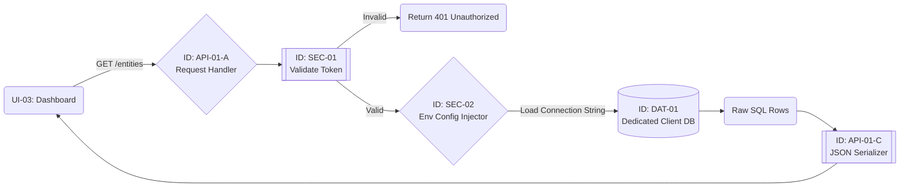

# Technical Specification: API-01 (Entity Retrieval Service)

| **Document ID** | **Version** | **Status** | **Owner (Author)** | **Approved By** |
| :--- | :--- | :--- | :--- | :--- |
| API-01 | 1.1.0 | **DRAFT** | Business Architect | Product Officer |

## 1. Description & Scope
**API-01** provides the organizational data required to render the Entity Dashboard (`UI-03`).

* **Architecture:** **Single-Tenant / Physically Isolated**.
    * Each client has a dedicated database instance and API installation.
    * **API-01-A** (Request Handler) does NOT perform tenant filtering. Security is guaranteed by the infrastructure configuration (`SEC-02`).
* **Trigger:** Called immediately upon successful User Login (`SEC-01`).
* **Data Source:** Reads from the local environment's configured `DAT-01` instance.

## 2. API Contract (OpenAPI Summary)

### Endpoint: List My Entities
* **Method:** `GET /api/v1/entities`
* **Headers:** `Authorization: Bearer <JWT_TOKEN>`
* **Query Parameters:**
    * `depth` (integer, default: `1`). Limits the hierarchy level returned to prevent database load.
    * `include_archived` (boolean, default: `false`).

### Success Response (200 OK)
```json
{
  "installation_id": "inst_bmw_eu",
  "data": [
    {
      "entity_id": "ent_001",
      "name": "Munich HQ",
      "type": "Headquarters",
      "status": "ACTIVE",
      "children": [...]
    }
  ]
}
```
## 3. Internal Workflow Logic (API-01-A Flow)
The following diagram details how the Request Handler (API-01-A) coordinates with Infrastructure Security (SEC-02) and the Serializer (API-01-C).


---
## 4. Component Dictionary (Internal Logic)

| Component ID | Name | Technical Description | Test Case Reference |
| :--- | :--- | :--- | :--- |
| **API-01-A** | **Request Handler** | The entry controller. <br>1. Enforces **Rate Limiting** (DDOS Protection).<br>2. Validates `depth` param (Must be integer 1-5).<br>3. Invokes `SEC-02` to get the DB connection. | `TC-ENT-001` (Params) |
| **SEC-02** | **Env Config Injector** | **Critical Infrastructure Component.** Loads the static database credentials from the secure server environment (e.g., Kubernetes Secrets or `.env`). Ensures the API connects ONLY to the pre-assigned database. | `TC-INFRA-001` (Config) |
| **API-01-C** | **Serializer** | Transforms SQL rows into nested JSON. **Privacy Rule:** Must explicitly strip internal database keys (`id_pk`) and audit metadata (`created_by_ip`) before sending to client. | `TC-ENT-008` (Privacy) |

---
## 5. Audit & Quality Checkpoints (ISO 27001)

| ID | Control Requirement | Implementation Logic |
| :--- | :--- | :--- |
| **QC-API-01** | **Isolation Enforcement** | The Request Handler (`API-01-A`) must **never** accept a `tenant_id` from the client request body or params. The target database is determined solely by the server-side `SEC-02` configuration. |
| **QC-API-02** | **Depth Throttling** | To prevent Denial of Service via complex graph queries, `API-01-A` must hard-reject any request with `depth > 5` with a `400 Bad Request`. |
---