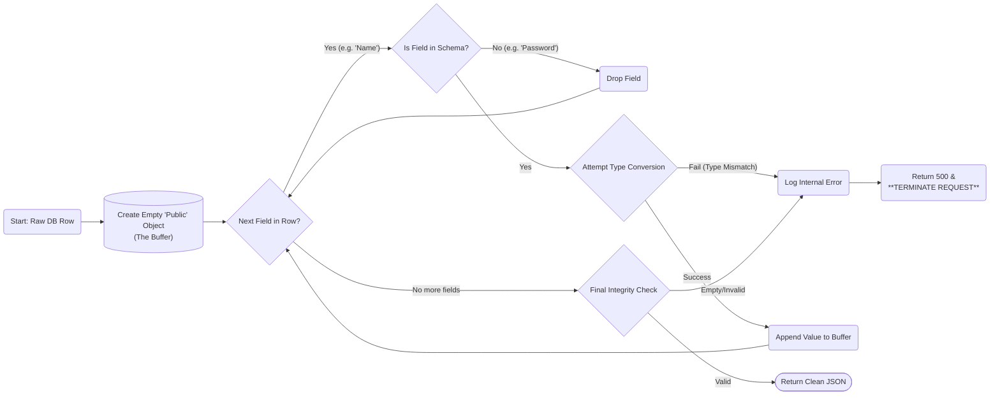

# Specification: API-01-C (JSON Serializer)

| **Document ID** | **Version** | **Status** | **Owner** | **Approved By** |
| :--- | :--- | :--- | :--- | :--- |
| API-01-C | 1.1.0 | **DRAFT** | Lead Developer | Security Architect |

## 1. Description & Scope
**API-01-C** is the transformation engine responsible for converting raw Database Objects (Internal State) into public-facing JSON responses (Public State).

* **Primary Function:** **Data Sanitization.**
* **Security Policy:** **"Explicit Allow-list."** The system utilizes a predefined "Public Schema." Only fields explicitly defined in this schema are permitted to leave the secure boundary. All other fields (internal keys, system flags) are discarded.
* **Failure Mode:** **Fail-Safe.** If a database value cannot be mapped to the Public Schema (e.g., data type mismatch), the serialization aborts, and a 500 Error is logged internally. No partial or corrupt data is ever transmitted.

## 2. Transformation Logic (The "Allow-list")
The Serializer applies the following strict mapping rules. Any database column *not* listed here is discarded.

| Source Column (DB) | Target Field (JSON) | Transformation Rule |
| :--- | :--- | :--- |
| `id_pk_serial` (int) | **[DROPPED]** | **STRIP** (Security Risk: ID Enumeration) |
| `entity_uuid` (uuid) | `entity_id` | Stringify |
| `entity_name` (varchar) | `name` | Copy Value |
| `created_at` (timestamp) | `created_at` | Format to `ISO-8601` String |
| `is_deleted` (bool) | **[DROPPED]** | **STRIP** (Internal Logic Only) |

## 3. Internal Workflow Logic
*The diagram demonstrates the "Fail-Safe" enforcement. If data does not fit the schema, the process terminates to prevent data corruption.*

---

## 4. Component Dictionary (Internal Logic)

| Component ID | Name | Technical Description | Test Case Reference |
| :--- | :--- | :--- | :--- |
| **SER-01** | **Recursive Walker** | Iterates through the entity tree. Handles nested children objects to ensure the schema is applied to the entire hierarchy. | `TC-SER-001` |
| **SER-02** | **Schema Enforcer** | Acts as a **Data Leakage Firewall**. It compares every database field against the Public Schema.  1. **Allowed Fields:** Are copied to the response. 2. **Unknown/Internal Fields:** Are **silently discarded**. This ensures that accidental database changes do not result in accidental public data exposure. | `TC-SER-002` |
| **SER-03** | **Exception Handler** | Catches serialization failures.  1. **Stops Processing:** Prevents partial JSON from being sent. 2. **Sanitizes Error:** Returns a generic "Internal Error" to the client while logging the specific field failure for admins. | `TC-SER-004` |

---
## 5. Audit & Quality Checkpoints (ISO 27001)

| ID | Control Requirement | Implementation Logic |
| :--- | :--- | :--- |
| **QC-SER-01** | **Data Minimization** | The serializer operates on a "deny-by-default" basis. New database columns are automatically hidden from the API unless explicitly added to the schema. |
| **QC-SER-02** | **Fail-Safe Integrity** | If the source data is corrupted (e.g., text found in a date field), the Serializer must **not** attempt to "guess" or "fix" it. It must abort the request to prevent downstream calculation errors. |
| **QC-SER-03** | **Precision Safety** | Financial/Emission numbers (CO2e) must be serialized as **Strings** to prevent floating-point rounding errors (IEEE 754) in the client. |