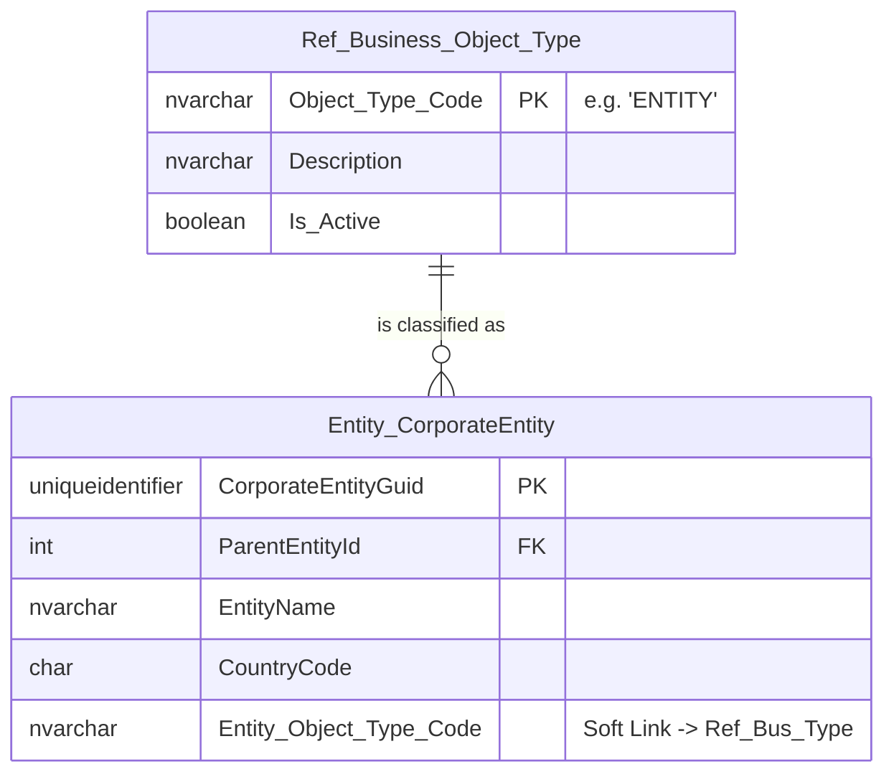

```mermaid
erDiagram
    %% =======================================================
    %% 1. THE TYPE DICTIONARY (The Central Discriminator)
    %% =======================================================
    Ref_Business_Object_Type {
        nvarchar Object_Type_Code PK "e.g. 'ENTITY'"
        nvarchar Description
        boolean Is_Active
    }

    %% =======================================================
    %% 2. THE CORE BUSINESS OBJECT (The Entity)
    %% =======================================================
    Entity_CorporateEntity {
        uniqueidentifier CorporateEntityGuid PK
        int ParentEntityId FK
        nvarchar EntityName
        char CountryCode
        
        %% This links back to the Type Dictionary to define what the entity IS
        nvarchar Entity_Object_Type_Code "Soft Link -> Ref_Bus_Type"
    }

    %% =======================================================
    %% RELATIONSHIP (Logical Classification)
    %% =======================================================
    
    %% One Type can apply to many Entities (Classification)
    Ref_Business_Object_Type ||--o{ Entity_CorporateEntity : "is classified as"
```
