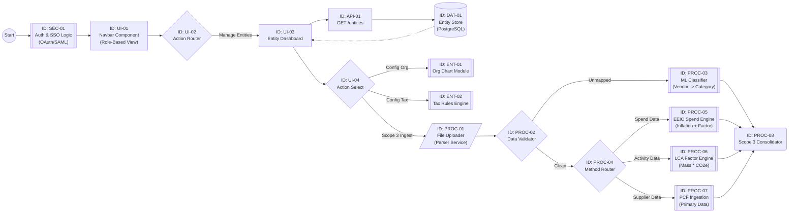
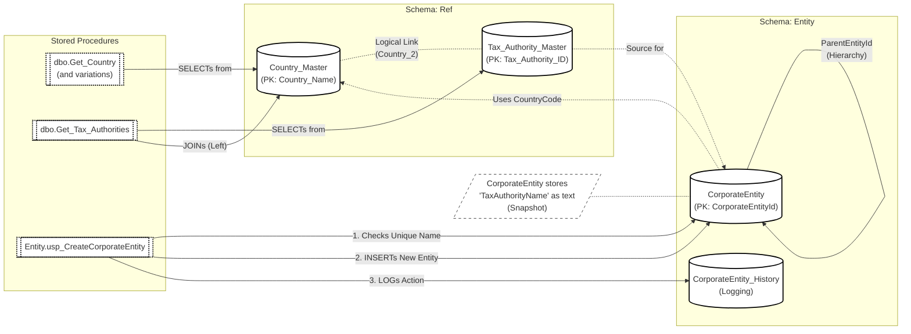

# Overview of Process flow for Entity Management including corporate affairs  

```mermaid
flowchart LR
    %% ==========================================
    %% SYSTEM ENTRY & SECURITY LAYER
    %% ==========================================
    START((Start)) --> SEC_01[["ID: SEC-01<br/>Auth & SSO Logic<br/>(OAuth/SAML)"]]
    
    SEC_01 --> UI_01["ID: UI-01<br/>Navbar Component<br/>(Role-Based View)"]
    
    UI_01 --> UI_02{"ID: UI-02<br/>Action Router"}

    %% ==========================================
    %% ENTITY MANAGEMENT (CORE)
    %% ==========================================
    UI_02 -- "Manage Entities" --> UI_03["ID: UI-03<br/>Entity Dashboard"]
    
    UI_03 --> API_01["ID: API-01<br/>GET /entities"]
    API_01 --> DAT_01[("ID: DAT-01<br/>Entity Store<br/>(PostgreSQL)")]
    DAT_01 -.-> UI_03

    %% ==========================================
    %% ACTION HUB
    %% ==========================================
    UI_03 --> UI_04{"ID: UI-04<br/>Action Select"}

    %% ADMIN BRANCH
    UI_04 -- "Config Org" --> ENT_01[["ID: ENT-01<br/>Org Chart Module"]]
    UI_04 -- "Config Tax" --> ENT_02[["ID: ENT-02<br/>Tax Rules Engine"]]
    
    %% ==========================================
    %% THE PROCUREMENT AUDIT BRANCH (Detailed)
    %% ==========================================
    UI_04 -- "Scope 3 Ingest" --> PROC_01[/"ID: PROC-01<br/>File Uploader<br/>(Parser Service)"/]

    PROC_01 --> PROC_02{"ID: PROC-02<br/>Data Validator"}

    %% PROC AI MAPPING
    PROC_02 -- "Unmapped" --> PROC_03[["ID: PROC-03<br/>ML Classifier<br/>(Vendor -> Category)"]]
    
    %% PROC CALCULATION ENGINES
    PROC_02 -- "Clean" --> PROC_04{"ID: PROC-04<br/>Method Router"}

    PROC_04 -- "Spend Data" --> PROC_05[["ID: PROC-05<br/>EEIO Spend Engine<br/>(Inflation + Factor)"]]
    PROC_04 -- "Activity Data" --> PROC_06[["ID: PROC-06<br/>LCA Factor Engine<br/>(Mass * CO2e)"]]
    PROC_04 -- "Supplier Data" --> PROC_07[["ID: PROC-07<br/>PCF Ingestion<br/>(Primary Data)"]]

    %% CONSOLIDATION
    PROC_03 & PROC_05 & PROC_06 & PROC_07 --> PROC_08("ID: PROC-08<br/>Scope 3 Consolidator")
```

## Supporting data model 

```mermaid
flowchart LR
    %% STYLING - High Contrast / No Fills
    classDef table fill:#ffffff,stroke:#000000,stroke-width:2px;
    classDef proc fill:#ffffff,stroke:#000000,stroke-width:2px,stroke-dasharray: 2 2;
    classDef note fill:#ffffff,stroke:#333333,stroke-width:1px,stroke-dasharray: 5 5;

    %% --- SCHEMA: REF (Reference Data) ---
    subgraph REF_SCHEMA [Schema: Ref]
        direction TB
        CM[("Country_Master<br/>(PK: Country_Name)")]:::table
        TAM[("Tax_Authority_Master<br/>(PK: Tax_Authority_ID)")]:::table
        
        %% Logical Link
        CM -. "Logical Link<br/>(Country_2)" .- TAM
    end

    %% --- SCHEMA: ENTITY (Core Business Data) ---
    subgraph ENTITY_SCHEMA [Schema: Entity]
        direction TB
        CE[("CorporateEntity<br/>(PK: CorporateEntityId)")]:::table
        CEH[("CorporateEntity_History<br/>(Logging)")]:::table
        
        %% Self-Reference for Parent/Child
        CE -- "ParentEntityId<br/>(Hierarchy)" --> CE
    end

    %% --- STORED PROCEDURES (Operations) ---
    subgraph OPERATIONS [Stored Procedures]
        direction TB
        
        %% Readers
        GET_C[["dbo.Get_Country<br/>(and variations)"]]:::proc
        GET_TA[["dbo.Get_Tax_Authorities"]]:::proc
        
        %% Writers
        CREATE_ENT[["Entity.usp_CreateCorporateEntity"]]:::proc
    end

    %% --- FLOW LOGIC ---

    %% Reading Country Data
    GET_C -- "SELECTs from" --> CM

    %% Reading Tax Data
    GET_TA -- "SELECTs from" --> TAM
    GET_TA -- "JOINs (Left)" --> CM

    %% Creating Entities
    CREATE_ENT -- "1. Checks Unique Name" --> CE
    CREATE_ENT -- "2. INSERTs New Entity" --> CE
    CREATE_ENT -- "3. LOGs Action" --> CEH

    %% Cross-Schema Relationships
    CE -. "Uses CountryCode" .-> CM
    
    %% Note on Tax Authority
    TAM -. "Source for" .-> CE
    note[/"CorporateEntity stores<br/>'TaxAuthorityName' as text<br/>(Snapshot)"/]:::note
    note -.- CE
```
---

## RDBMS Entity Relatinships

```mermaid
erDiagram
    %% =======================================================
    %% 1. CORE REFERENCE (The Standards)
    %% =======================================================
    Ref_Business_Object_Type {
        string Object_Type_Code PK "ENTITY, TAX_OFFICE"
        string Description
    }

    Ref_Country_Master {
        string Country_Name PK
        char Country_2
    }

    Ref_NACE_Code_Master {
        string NACE_Code PK "C.25.11"
        string Description
        boolean Is_Taxonomy_Eligible
    }

    dbo_IFRS_Standard_Dictionary {
        string Standard_Code PK "IFRS 15, IAS 12"
        string Standard_Name
    }

    dbo_BusObj_IFRS_Map {
        int Map_ID PK
        string Object_Type_Code FK
        string Standard_Code FK
    }

    %% =======================================================
    %% 2. THE LEGAL ENTITY & LOCATION (The "Who" & "Where")
    %% =======================================================
    Entity_CorporateEntity {
        guid CorporateEntityGuid PK
        string EntityName
        char CountryCode
    }

    dbo_Address_Master {
        int Address_ID PK
        string Addr_1
        string City
        string PostCode
    }

    dbo_Address_Addressee {
        int Link_ID PK
        int Address_ID FK
        string Addressee_Object_Key "Polymorphic ID"
        string Addressee_Type_Code "Link -> Ref_Bus_Type"
        string Usage_Type "BILLING, HQ"
    }

    %% =======================================================
    %% 3. TAX LANDSCAPE (The "Whom" & "Why")
    %% =======================================================
    Ref_Tax_Authority_Master {
        int Authority_ID PK
        string Authority_Name "Federal"
    }

    Ref_Local_Tax_Office {
        int Local_Office_ID PK
        int Parent_Authority_ID
        string Office_Name "Municipal"
    }

    Ref_Tax_Regime_Master {
        string Regime_Code PK "VAT, CIT"
        string IFRS_Ref "Link -> IFRS Dict"
    }

    Entity_Tax_Assignment {
        int Assignment_ID PK
        guid CorporateEntityGuid "Link -> Entity"
        int Tax_Authority_Ref_ID "Link -> Fed/Local"
        string Regime_Code "Link -> Regime"
    }

    %% =======================================================
    %% 4. COMPLIANCE ENGINE (The "When")
    %% =======================================================
    Ref_Filing_Frequency {
        string Frequency_Code PK "M, Q, A"
    }

    Entity_Reporting_Obligation {
        int Obligation_ID PK
        int Assignment_ID
        string Frequency_Code
    }

    Entity_Filing_Event {
        bigint Event_ID PK
        int Obligation_ID
        string Period_Name "Q3 2025"
        date Submission_Deadline
        string Status
    }

    %% =======================================================
    %% 5. FINANCE & ACTIVITY (The "What" & "ESG")
    %% =======================================================
    Finance_Chart_of_Accounts {
        string Account_Code PK
        string Account_Name
        string IFRS_Mapping_Code
    }

    Finance_General_Ledger {
        bigint Journal_ID PK
        guid CorporateEntityGuid
        string Account_Code "Link -> CoA"
        string Activity_NACE_Code "Link -> NACE"
        decimal Amount_Debit
        decimal Calculated_CO2e_kg
    }

    Sustainability_Activity_Ledger {
        bigint Activity_ID PK
        bigint GL_Journal_ID "Link -> GL"
        string NACE_Code "Link -> NACE"
        decimal Consumption_Value "Liters/kWh"
        decimal Total_CO2e_kg
    }

    %% =======================================================
    %% RELATIONSHIPS (ALL SOFT LINKS)
    %% =======================================================

    %% A. Standards & Classification
    Ref_Business_Object_Type ||..o{ dbo_BusObj_IFRS_Map : "governed by"
    dbo_IFRS_Standard_Dictionary ||..o{ dbo_BusObj_IFRS_Map : "applies to"
    Ref_NACE_Code_Master ||..o{ Finance_General_Ledger : "classifies spend"
    Ref_NACE_Code_Master ||..o{ Sustainability_Activity_Ledger : "classifies impact"

    %% B. Addresses (Polymorphic)
    dbo_Address_Master ||..o{ dbo_Address_Addressee : "physical loc"
    Ref_Business_Object_Type ||..o{ dbo_Address_Addressee : "validates type"
    Entity_CorporateEntity ||..o{ dbo_Address_Addressee : "has address"
    Ref_Local_Tax_Office ||..o{ dbo_Address_Addressee : "has address"

    %% C. Tax Routing
    Entity_CorporateEntity ||..o{ Entity_Tax_Assignment : "obligated to"
    Entity_Tax_Assignment }|..|| Ref_Tax_Regime_Master : "tax type"
    Entity_Tax_Assignment }|..|| Ref_Tax_Authority_Master : "pays (Fed)"
    Entity_Tax_Assignment }|..|| Ref_Local_Tax_Office : "pays (Local)"
    Ref_Tax_Authority_Master ||..o{ Ref_Local_Tax_Office : "parent of"

    %% D. Compliance
    Entity_Tax_Assignment ||..o{ Entity_Reporting_Obligation : "setup"
    Entity_Reporting_Obligation ||..o{ Entity_Filing_Event : "schedule"
    Entity_Reporting_Obligation }|..|| Ref_Filing_Frequency : "timing"

    %% E. Finance & ESG
    Entity_CorporateEntity ||..o{ Finance_General_Ledger : "books"
    Finance_General_Ledger }|..|| Finance_Chart_of_Accounts : "GL code"
    Finance_General_Ledger ||..o| Sustainability_Activity_Ledger : "pays for resource"
```
---
