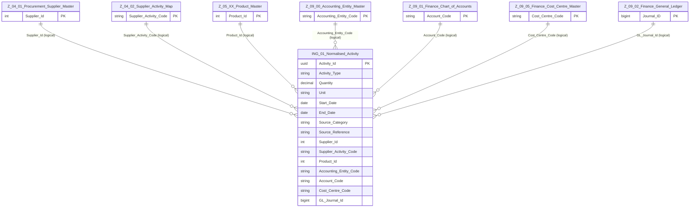

# Specification: ING-01 Activity_Normalisation
| **Document ID** | **Version** | **Status** | **Owner (Author)** | **Approved By** |
|-----------------|-------------|------------|---------------------|------------------|
| **ING-01** | 1.0.0 | **DRAFT** | Business Architect | Product Officer |

---

# 1. Purpose

ING‑01 defines the **canonical activity model** used across SUSTINA for emissions calculations.  
Its role is to convert heterogeneous inbound data (RAW zone) into a **single, structured, enterprise‑keyed representation** (NORMALISED zone).

This specification is **language-agnostic** and does not define Python, SQL, or API details.  
It defines **what normalised activity data must contain** and **how it relates to core enterprise data**.

---

# 2. Relationship to Other ING Specifications

| Spec | Purpose |
|------|---------|
| **ING‑00** | Defines ingestion tiers & governance |
| **ING‑01** | Defines the *normalised activity layer* |
| **ING‑02** | Maps normalised activities to emission factors |
| **ING‑03** | Builds curated inputs for scope calculations |
| **ING‑10** | Details raw staging, API collection & manual uploads |

---

# 3. Scope of ING‑01

ING‑01 covers:

### ● Structural normalisation  
Transforming raw data (API extracts, manual uploads, system feeds) into a unified schema.

### ● Enterprise-key alignment  
Mapping activities to:  
- Supplier master (Z‑04.01)  
- Supplier activity codes (Z‑04.02)  
- Product structures & ESG maps (Z‑05.xx)  
- GL accounts, entities & cost centres (Z‑09.xx)

### ● Harmonisation of quantities & units  
Ensuring consistent representation for energy, distance, spend, volume, occupancy, etc.

### ● Temporal alignment  
Normalising dates, periods, validity windows, billing spans, and granularity.

### ● Quality scoring  
Assessing data completeness, precision, provenance, and reliability.

ING‑01 does **not** perform emissions calculations — that is defined in ING‑02 and ING‑03.

---

# 4. Normalised Activity Model

The **Normalised Activity** entity is the core output of ING‑01.

It represents *any unit of activity that can produce emissions*.

## 4.1 Conceptual Model




---
```
RAW Data (Tier 1/2/3)
    → ING‑01 Normalisation
        → Normalised_Activity
            + enterprise keys
            + harmonised units
            + metadata
            + quality score
```

## 4.2 Entity Definition: Normalised_Activity

| Field | Type | Description |
|-------|------|-------------|
| **Activity_Id** | GUID | Unique row identifier |
| **Activity_Type** | Enum | electricity_kwh, gas_kwh, vehicle_km, spend_usd, flight_km, hotel_night, etc. |
| **Quantity** | Decimal | Harmonised value |
| **Unit** | Text | Normalised unit of measure |
| **Start_Date** | Date | Beginning of activity period |
| **End_Date** | Date | End of activity period |
| **Source_Category** | Enum | (Tier-1, Tier-2, Tier-3, Manual) |
| **Source_Reference** | Text/JSON | Metadata linking back to RAW dataset |

## 4.3 Enterprise Key Mapping

Normalised activity rows must attach to enterprise structures **when present**:

| Key | Source Domain |
|-----|---------------|
| Supplier_Id | Z‑04.01 Supplier Master |
| Supplier_Activity_Code | Z‑04.02 NACE Mapping |
| Product_Id | Z‑05.xx Product structures |
| Accounting_Entity_Code | Z‑09.00 |
| Account_Code | Z‑09.01 Chart of Accounts |
| Cost_Centre_Code | Z‑09.05 |
| GL_Journal_Id | Z‑09.02 General Ledger |

If a mapping is not possible (e.g., API-derived grid intensity), ING‑01 stores a **null-safe placeholder** and records the mapping gap in its quality score.

---


# 5. Output Tables (Logical)

ING‑01 produces two logical datasets.

## 5.1 Normalised_Activity

A wide table capturing all harmonised fields and mappings.

## 5.2 Normalised_Activity_Metadata

Stores:
- Original source file/API reference  
- Version and checksum  
- Data lineage  
- Mapping confidence  
- Normalisation warnings/errors  

These datasets form the **input to ING‑02 (Factor Mapping)**.

---

# 6. Validation Requirements

ING‑01 must validate:

### Required fields:
- Activity_Type  
- Quantity > 0  
- Valid date window  

### Enterprise key integrity:
- Supplier/Product/Account keys must be valid when present  
- Missing mappings must be flagged, not blocked  

### Unit integrity:
- Units must exist in ING‑01 Unit Catalogue  

### Duplicate detection:
- Based on source reference + date + supplier/product keys  

---

# 7. Governance

- Normalisation rules cannot be changed without version increment  
- Backfill operations must record lineage  
- RAW zone files must never be mutated  
- NORMALISED zone retains all versions for auditability  

---

# 8. Change History

| Version | Date | Author | Notes |
|---------|------|--------|-------|
| 1.0.0 | 2025‑12‑10 | Business Architect | Initial draft aligned with Z‑domain entities | 
