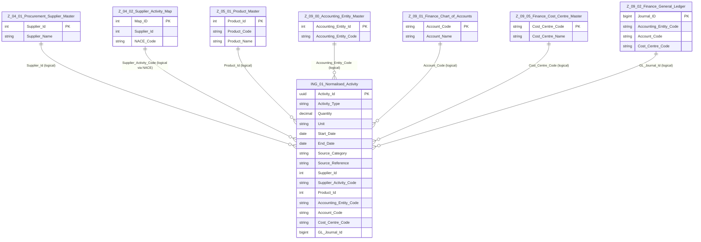

# Specification: ING-01.03 Supplier_Product_Account_Mapping
| **Document ID** | **Version** | **Status** | **Owner (Author)** | **Approved By** |
|-----------------|-------------|------------|---------------------|------------------|
| **ING-01.03** | 1.0.0 | **DRAFT** | Business Architect | Product Officer |

---

# 1. Purpose

ING-01.03 defines how **Normalised Activity** records (from ING-01) are mapped onto the core **enterprise keys** from Procurement, Product, and Finance domains.

This specification answers:

- How a normalised activity is linked to a **Supplier** and its **NACE procurement activities**  
- How product-linked activities are connected to **Product** structures and **ESG impact** mappings  
- How spend-based activities are tied to **Accounting Entities**, **Accounts**, **Cost Centres**, and **GL lines**  

It is **language-agnostic** and describes logical relationships only.  
Physical keys and enforcement are handled at application and ETL layer.

---

# 2. Relationship to Other Specifications

| Spec | Role |
|------|------|
| **ING-00** | Defines overall ingestion tiers and governance. |
| **ING-01** | Defines the structure of `Normalised_Activity`. |
| **ING-01.01** | Activity categories referenced by `Activity_Type`. |
| **ING-01.02** | Normalisation rules (structure, units, time). |
| **ING-01.03** | ***This document*** – mapping of activities to enterprise keys. |
| **ING-02** | Uses these mappings to select appropriate emission factors. |
| **ING-03** | Uses mapped activities to build curated scope inputs. |

---

# 3. Mapping Objectives

ING-01.03 ensures that every `Normalised_Activity` row is, where possible:

- Attached to a **known supplier** and its **procurement activities**  
- Attached to a **known product** and its **ESG and financial mappings**  
- Attached to a **known accounting context** for spend-based and financial activities  

If a mapping cannot be resolved, the activity remains valid but is:

- Flagged with a lower **data quality score** (ING-01)  
- Carried forward with explicit **mapping gaps** for remediation  

---

# 4. Entity Definition (Extended View)

The **Normalised Activity** entity from ING-01 is extended here to highlight enterprise-key fields.

## 4.1 Normalised_Activity (Key Fields)

Alongside core activity attributes (Activity_Id, Activity_Type, Quantity, Unit, Start_Date, End_Date, Source_Category, Source_Reference), the entity contains the following *optional* mapping fields:

| Field | Description | Source Domain |
|-------|-------------|---------------|
| `Supplier_Id` | Canonical supplier identifier | Z-04.01 Supplier_Master |
| `Supplier_Activity_Code` | Supplier's NACE-based procurement activity | Z-04.02 Supplier_Activity_Map |
| `Product_Id` | Product or service identifier | Z-05.01 Product_Master |
| `Accounting_Entity_Code` | Accounting / reporting entity | Z-09.00 Accounting_Entity_Master |
| `Account_Code` | Financial account (revenue / cost / adjustment) | Z-09.01 Finance_Chart_of_Accounts |
| `Cost_Centre_Code` | Responsibility centre / department | Z-09.05 Finance_Cost_Centre_Master |
| `GL_Journal_Id` | Link to original GL posting line | Z-09.02 Finance_General_Ledger |

All fields are **logically optional**: their presence depends on the type and provenance of the activity.

---

# 5. Mapping Rules (Logical)

## 5.1 Supplier Mapping

For activities that originate from:

- Supplier invoices  
- Purchase orders  
- Vendor master-based extracts  

ING-01 must:

- Resolve supplier names / codes to **Z-04.01 Supplier_Master.Supplier_Id**  
- Attach one or more NACE activities from **Z-04.02 Supplier_Activity_Map** where available  
- Use `Supplier_Activity_Code` to support Scope 3 category decisions and EEIO-style factor selection (ING-02)

## 5.2 Product Mapping

For product- or service-related activities (e.g. production volumes, product-level impacts):

- Resolve product references to **Z-05.01 Product_Master.Product_Id**  
- Use downstream mappings from:  
  - **Z-05.04 Product_ESG_Impact_Map** (ESG factors)  
  - **Z-05.05 Product_Financial_Map** (revenue/cost accounts & entities)  

The `Product_Id` on `Normalised_Activity` forms the bridge into these Z-05 structures.

## 5.3 Finance Mapping (Spend-Based & GL-Driven)

For spend-based Scope 3 and financial activities:

- Map to **Z-09.00 Accounting_Entity_Master** via `Accounting_Entity_Code`  
- Map to **Z-09.01 Finance_Chart_of_Accounts** via `Account_Code`  
- Map to **Z-09.05 Finance_Cost_Centre_Master** via `Cost_Centre_Code` when available  
- Link back to **Z-09.02 Finance_General_Ledger** via `GL_Journal_Id` for traceability  

These keys ensure that financial postings and activity-based records can be reconciled.

---

# 6. ERD – One-Tier Logical View

The following Mermaid ERD shows **Normalised_Activity** and its one-tier logical links to the Z-domain entities it depends on.

> **Note:**  
> - All relationships shown are **logical only**; no physical FKs are required.  
> - The diagram follows the **one-tier rule**: only entities directly linked to `Normalised_Activity` are connected to it. Downstream links (e.g. Product → ESG Impact Map) are shown with dotted lines for context.

---

# 7. Governance

- Changes to mapping logic (e.g. how supplier names are matched) require a new version of ING-01.03.  
- Any unmapped activities must be reportable via DQ processes and remediation workflows.  
- Mapping rules must be implemented consistently across all ingestion pipelines that produce `Normalised_Activity`.

---

# 8. Change History

| Version | Date | Author | Notes |
|---------|------|--------|-------|
| 1.0.0 | 2025-12-10 | Business Architect | Initial version extracted from ING-01 §6.4 into standalone mapping spec |
