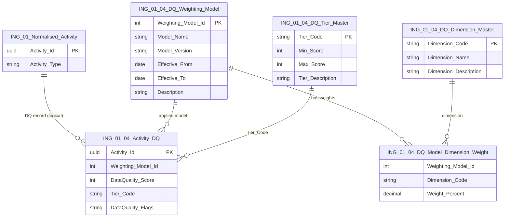

# Specification: ING-01.04 Data_Quality_Scoring
| **Document ID** | **Version** | **Status** | **Owner (Author)** | **Approved By** |
|-----------------|-------------|------------|---------------------|------------------|
| **ING-01.04** | 1.0.0 | **DRAFT** | Business Architect | Product Officer |

---

# 1. Purpose

ING-01.04 defines the **data quality scoring model** applied to `Normalised_Activity` records produced by ING-01.

Each activity receives a **0–100 DataQuality_Score** plus optional flags, providing a consistent way to:

- Assess how trustworthy an activity is for ESG calculations  
- Prioritise remediation of low-quality data  
- Support audit, transparency, and ISO-9001 style process evidence  

This specification is **implementation-agnostic** – it defines *which dimensions* are scored and *how they should be combined*, not how any specific code or ETL tool implements them.
  

## 1.1 Overiew of entities

---

# 2. Relationship to Other Specifications

| Spec | Role |
|------|------|
| **ING-01** | Defines the Normalised_Activity structure (including DQ fields). |
| **ING-01.01** | Defines activity categories. |
| **ING-01.02** | Defines normalisation rules (structure, units, time). |
| **ING-01.03** | Defines enterprise-key mapping to Z-04/Z-05/Z-09 domains. |
| **ING-01.04** | ***This document*** – defines Data Quality scoring. |
| **ING-02 / ING-03** | May apply thresholds to decide which activities are eligible for factor mapping / scope calculations. |

---

# 3. DQ Score Fields on Normalised_Activity

The following fields expand the `Normalised_Activity` entity (ING-01):

| Field | Type | Description |
|-------|------|-------------|
| `DataQuality_Score` | INT (0–100) | Overall score representing activity data quality. |
| `DataQuality_Tier` | ENUM | e.g. `A`, `B`, `C`, `D` derived from the score. |
| `DataQuality_Flags` | TEXT/JSON | Structured list of flags/warnings (missing mappings, unit issues, anomalies, etc.). |

> These fields are **logical** and may be implemented in a separate DQ companion table if required, but they must be conceptually available per activity.

---

# 4. Scoring Dimensions

The DataQuality_Score is built from five dimensions:

1. **Completeness**  
2. **Source Reliability (Tier)**  
3. **Unit Accuracy**  
4. **Enterprise-Key Mapping Success**  
5. **Anomaly Detection**

Each dimension is scored individually (0–100) and then weighted into an overall score.

## 4.1 Completeness

Measures:  
- Presence of mandatory fields (Activity_Type, Quantity, Unit, Start_Date, End_Date)  
- Presence of key optional fields depending on category (e.g. flight route, vehicle type, currency)  

Example rules:  
- All mandatory fields present → 100  
- 1 mandatory field missing → 40  
- >1 mandatory fields missing → 0  

## 4.2 Source Reliability (Tier)

Reflects trust level of the originating source (from ING-00):

- Tier-1: Internal Master Data → 100  
- Tier-2: Internal Operational Systems → 85  
- Tier-3: External APIs → 70  
- Tier-3: Manual Uploads → 60  

These values may be tuned per implementation but must be documented.

## 4.3 Unit Accuracy

Checks that:

- The unit is in the **ING-01 Unit Catalogue**  
- A valid conversion path exists to the canonical unit for the activity type  
- No conflicting units are present in the same record  

Example scoring:  
- Valid canon unit or successfully converted → 100  
- Non-canonical but convertible unit → 80  
- Unknown / unconvertible unit → 0 (and flag raised)

## 4.4 Enterprise-Key Mapping Success

Measures how well the activity is anchored into the core Z-domain entities (ING-01.03):

- Supplier_Id resolved (where applicable)  
- Supplier_Activity_Code resolved (if used)  
- Product_Id resolved (if product-based)  
- Accounting_Entity_Code, Account_Code, Cost_Centre_Code resolved (for spend-based)  

Example approach:  
- Start from 0, allocate a fraction for each relevant mapping that succeeds:  
  - Supplier mapping success: +25  
  - Product mapping success: +25  
  - Finance mapping (entity/account/cost centre) success: +50 (distributed among them)  

The exact weighting may vary, but should be **deterministic** and documented.

## 4.5 Anomaly Detection

Identifies suspicious or invalid patterns, such as:

- Negative quantities where not expected  
- Zero quantity with non-zero financial amounts  
- Start_Date > End_Date  
- Activity periods far outside reporting window  
- Extreme outliers compared to historical distributions  

Scoring example:  
- No anomalies detected → 100  
- Minor anomaly (e.g. borderline outlier) → 70  
- Critical anomaly (e.g. invalid date range) → 0 and flag  

---

# 5. DQ Flags

`DataQuality_Flags` captures **why** a record did not reach 100.  
Examples:

- `MISSING_MANDATORY_FIELD:Start_Date`  
- `UNMAPPED_SUPPLIER`  
- `UNKNOWN_UNIT:miles_per_thing`  
- `NEGATIVE_QUANTITY`  
- `DATE_RANGE_INVERTED`  

Flags should be:

- Machine-readable (for dashboards & DQ workflows)  
- Human-interpretable (for auditors and analysts)  

---

# 6. Usage in Downstream Processes

- ING-02 may choose to **exclude Tier D** from factor mapping, or treat them as separate what-if scenarios.  
- ING-03 may apply weighting or filtering based on score per scope and reporting requirement.  
- Z-10 ESG ledgers can store score/tiers alongside emissions to provide transparency over data quality.

---

# 7. Governance

- Changes to scoring rules or weights must trigger a new version of ING-01.04.  
- Backfilling scores for historical data must be documented.  
- Any overrides (manual adjustments to scores) must be logged with justification.

---

# 8. Change History

| Version | Date | Author | Notes |
|---------|------|--------|-------|
| 1.0.0 | 2025-12-10 | Business Architect | Initial definition of data quality scoring for Normalised_Activity. |
