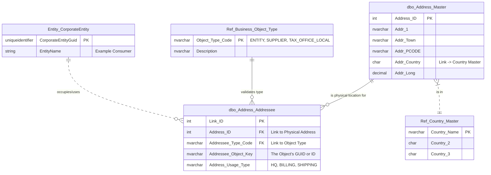

# Specification: OVR-01 (Address Management)

| **Document ID** | **Version** | **Status** | **Owner (Author)** | **Approved By** |
| :--- | :--- | :--- | :--- | :--- |
| OVR-01 | 1.0.0 | **DRAFT** | Business Architect | Architext |

# Process flow  OVR-01

---
