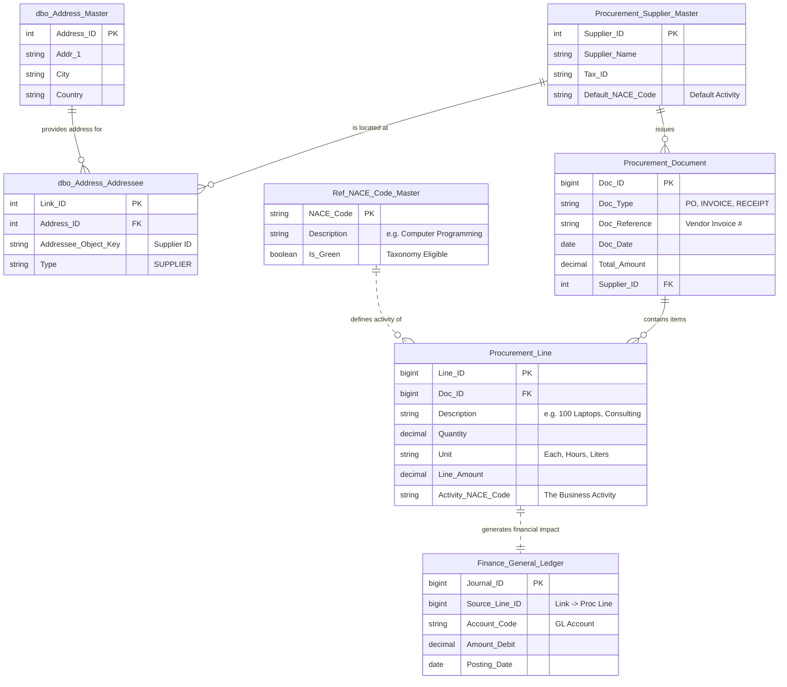

# Process Specification: P- (Procurement Master Workflow)

| **Document ID** | **Version** | **Status** | **Owner (Author)** | **Approved By** |**Approved On** |
| :--- | :--- | :--- | :--- | :--- |:--- |
| P- | 1.0.0 | **DRAFT** | Business Architect | Product Officer | | 

## 1. Description & Scope
This document defines the master architectural workflow for the **Procurement & Scope 3 Data Ingestion** module.
* **Naming Convention:**
    * All objects owned by this workflow are dsignated by the ALpha prefix "P-" followed by a numeric ID.
    * Objects not owned by this workflow but impacting it (creating a dependency) will bear an alternative pair of characters followed by a numeric id. 
* **Objective:**
    * To securely ingest, validate, and categorize supply chain data to calculate Scope 3 (Category 1) emissions in compliance with the GHG Protocol.
    * To  introduce the  objects supporting the workflow whcih are then described in other pages.
* **Access Control:** Strict **Role-Based Access Control (RBAC)** is enforced. The flow creates a dependency on **M-002 (Authentication)**; only authenticated sessions with `WRITE_SCOPE_3` permissions may initiate this routine.

## 2. Process Flow Diagram
*The following diagram illustrates the logical path from User Login through to Scope 3 Ledger commit.*

---

## Entity Relationship diagram for Procurement

---

## 3. Component Dictionary (Traceability Matrix)

The following components are subject to **ISO 9001 Quality Assurance** and **ISO 27001 Security** testing.

### A. Security & Interface Layer
| Component ID | Name | Functional Description | Audit Control |
| :--- | :--- | :--- | :--- |
| **SEC-01** | Auth & SSO Logic | Validates JWT tokens and enforces session timeouts. | **Verification:** Penetration Test Report (Annual). |
| **UI-02** | Action Router | Routes user to modules based on their Entity permissions. | **Control:** Unit tests ensuring cross-tenant data isolation. |

### B. Procurement Logic Layer (The Core Engine)
| Component ID | Name | Functional Description | Methodology / Standard |
| :--- | :--- | :--- | :--- |
| **PROC-01** | File Uploader | Accepts `.csv`, `.xlsx`. Sanitizes inputs to prevent SQL injection/XSS. | **Security:** Virus scan on upload. |
| **PROC-02** | Data Validator | Checks for required columns (Date, Vendor, Amount, Currency). Rejects malformed rows. | **Quality:** Rejection log is presented to user. |
| **PROC-03** | ML Classifier | Maps vendor strings (e.g., "AWS") to Economic Sectors (e.g., "Data Processing"). | **AI Gov:** Users must approve/override AI suggestions (Human-in-the-loop). |
| **PROC-05** | **EEIO Spend Engine** | 1. Calls `ENT-02` to strip Tax/VAT. 2. Applies **Inflation Adjustment** (CPI/PPI). 3. Maps to USEEIO/Exiobase factors. | **CSRD:** "Spend-based method" (GHG Protocol Scope 3 Guidance). |
| **PROC-06** | LCA Factor Engine | Calculates based on physical units (kg, liters) using standard libraries (Ecoinvent, DEFRA). | **CSRD:** "Average-data method." |
| **PROC-07** | PCF Ingestion | Ingests verified Product Carbon Footprints (ISO 14067) directly from suppliers. | **CSRD:** "Supplier-specific method" (Gold Standard). |
| **PROC-08** | Consolidator | Merges calculated lines into a unified dataset. | **Data Integrity:** Checksum validation. |

### C. Data Persistence
| Component ID | Name | Storage Policy |
| :--- | :--- | :--- |
| **DAT-02** | Scope 3 Ledger | Immutable append-only log of all calculated emissions. |

---

## 4. Regulatory Compliance Note
This workflow supports the principle of **Double Materiality** by enabling a "Hybrid Methodology."
1.  **Default:** The system falls back to `PROC-05` (Spend-based) to ensure 100% coverage of the supply chain.
2.  **Refinement:** As data quality improves, specific line items are moved to `PROC-07` (Supplier Specific), increasing accuracy without breaking the audit trail.
