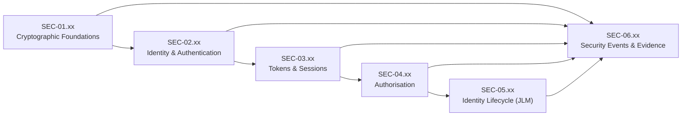
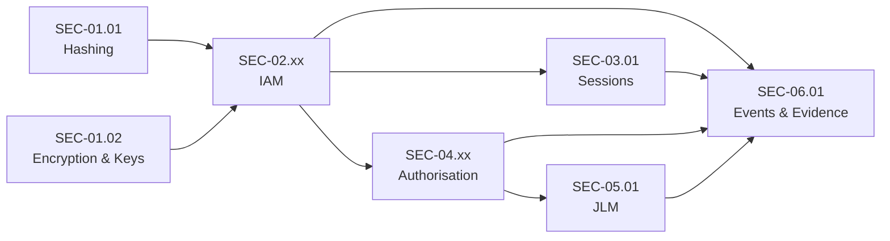

# Security Domain Master: SEC-00

| **Document ID** | **Version** | **Status** | **Owner (Author)** | **Approved By** |
|-----------------|-------------|------------|---------------------|------------------|
| **SEC-00** | **1.1.1** | **DRAFT** | Business Architect | Product Officer |

---

## 1. Purpose

This document is the **authoritative master specification** for the Security (SEC) domain within the SUSTINA platform.

It defines:
- The scope and structure of the SEC domain
- The catalogue of security specifications
- Mandatory documentation conventions
- Governance principles that apply across all SEC documents

SEC specifications define **logical security policy and behaviour only**.  
They deliberately avoid implementation, transport, storage, or vendor-specific detail.

---

## 2. Domain Scope

The SEC domain governs:
- Cryptographic foundations
- Identity and authentication
- Account protection
- Session and token handling
- Authorisation and access control
- Identity lifecycle governance
- Security events and audit evidence

Out of scope:
- Application feature design
- API/interface definitions
- Data model implementations
- Infrastructure and cloud services

---

## 3. SEC Specification Catalogue

### 3.1 Cryptographic Foundations

| ID | Title |
|----|-------|
| SEC-01.01 | Hashing & Irreversible Transformation |
| SEC-01.02 | Encryption & Key Management |

<div><sub><strong>Table 1 –</strong> Cryptographic foundations specification catalogue</sub></div>

### 3.2 Identity & Authentication

| ID | Title |
|----|-------|
| SEC-02.01 | Registration |
| SEC-02.02 | Sign-In & Password Recovery |
| SEC-02.03 | Account Protection |
| SEC-02.04 | Identity Identifiers & Canonicalisation |

<div><sub><strong>Table 2 –</strong> Identity and authentication specification catalogue</sub></div>

### 3.3 Sessions

| ID | Title |
|----|-------|
| SEC-03.01 | Token & Session Handling |

<div><sub><strong>Table 3 –</strong> Session specification catalogue</sub></div>

### 3.4 Authorisation & Access Control

| ID | Title |
|----|-------|
| SEC-04.01 | Roles & Permissions Model |
| SEC-04.02 | Role Lifecycle Management |
| SEC-04.03 | Role Assignment & Entitlement Management |
| SEC-04.04 | Access Decision & Enforcement |

<div><sub><strong>Table 4 –</strong> Authorisation and access control specification catalogue</sub></div>

### 3.5 Identity Lifecycle Governance

| ID | Title |
|----|-------|
| SEC-05.01 | Joiner–Leaver–Mover Policy |

<div><sub><strong>Table 5 –</strong> Identity lifecycle governance specification catalogue</sub></div>

### 3.6 Security Evidence & Audit

| ID | Title |
|----|-------|
| SEC-06.01 | Security Events & Evidence |

<div><sub><strong>Table 6 –</strong> Security evidence and audit specification catalogue</sub></div>

---

## 4. Domain Structure Overview (Logical)



<div><sub><strong>Figure 1 –</strong> SEC domain logical layering and evidence cross-cut</sub></div>

---

## 5. Specification Dependency View (Logical)



<div><sub><strong>Figure 2 –</strong> High-level dependency relationships between SEC specifications</sub></div>

---

## 6. Mandatory Documentation Conventions

### 6.1 Logical-Only Rule
SEC documents:
- MUST define logical behaviour and policy
- MUST NOT define REST endpoints, message encodings, database models, infrastructure, or vendors
- MUST remain implementation-agnostic

### 6.2 Table & Figure Caption Standard
- Captions MUST appear **after** the table or figure
- Captions MUST use the following format

**Tables**
```html
<div><sub><strong>Table n –</strong> Descriptive title</sub></div>
```

**Figures**
```html
<div><sub><strong>Figure n –</strong> Descriptive title</sub></div>
```

### 6.3 Mermaid Diagram Rules
- All node labels MUST be quoted
- No HTML tags inside Mermaid nodes
- Line breaks allowed using literal newlines inside quoted labels
- Diagrams must represent logical flow only

### 6.4 Deterministic Outcomes
All SEC-defined operations must:
- Produce deterministic success/failure outcomes
- Be auditable
- Support ISO-9001 evidence requirements

---

## 7. Governance & Change Control

- All SEC documents are version-controlled
- Changes require documented approval
- Breaking policy changes must be version-incremented
- Deprecated documents must not be silently altered

---

## 8. Standards Alignment

The SEC domain aligns with:
- ISO-9001 (process consistency and evidence)
- GDPR (data minimisation, lawful processing)
- OWASP ASVS (where logically applicable)

---

## 9. Change History

| Version | Date | Author | Notes |
|--------|------|--------|-------|
| 1.0.0 | 2025-12-09 | Business Architect | Initial SEC domain master |
| 1.1.0 | 2025-12-13 | Business Architect | Updated catalogue; formalised conventions; closed SEC-01 through SEC-06 |
| **1.1.1** | **2025-12-13** | Business Architect | Added missing table captions; added domain structure and dependency Mermaid figures; caption placement aligned to standard |

<div><sub><strong>Table 7 –</strong> Change history</sub></div>
