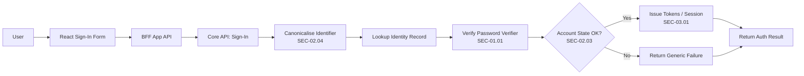
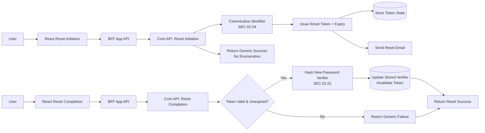

# Specification: SEC-02.02 Sign-In & Password Recovery

| **Document ID** | **Version** | **Status** | **Owner (Author)** | **Approved By** |
|-----------------|-------------|------------|---------------------|------------------|
| **SEC-02.02** | **1.1.0** | **DRAFT** | Business Architect | Product Officer |

---

## 1. Purpose

SEC-02.02 defines the **sign-in** and **password recovery** workflows for authenticated access to SUSTINA.

It governs:
- Authentication using identity identifiers (e.g. email) under SEC-02.04
- Credential verification using password hashing controls under SEC-01.01
- Abuse prevention and enumeration-safe behaviour under SEC-02.03
- Password reset token issuance and consumption
- Coordination with token/session issuance defined in SEC-03.01

This specification is **workflow-focused** and implementation-agnostic.

---

## 2. Relationship to Other Security Specifications

| Spec | Role |
|------|------|
| **SEC-01.01** | Password hashing and verification policy |
| **SEC-01.02** | Encryption and key management policy (identifier protection at rest) |
| **SEC-02.01** | Registration workflow |
| **SEC-02.03** | Account protection and abuse controls |
| **SEC-02.04** | Identity identifiers and canonicalisation |
| **SEC-03.01** | Token & session handling |
| **SEC-10.00** | GDPR handling strategy |

<strong>Table 1-</strong>Relationship to Other Security Specifications

---

## 3. Scope

### 3.1 Sign-In
- Submission of credentials
- Canonicalised identity lookup
- Password verification (Core-only)
- Account state enforcement (active/verified/unlocked)

### 3.2 Password Recovery
- Reset initiation (enumeration-safe)
- Reset token issuance + expiry
- Reset completion (token validation, password update)

Out of scope:
- Token cryptography and refresh semantics (SEC-03.xx)
- Encryption implementation specifics (SEC-01.02)

---

## 4. Sign-In Workflow (Logical)

<strong>Figure 1 –</strong> Sign in worrkflow

 
All failure outcomes must be **enumeration-safe** and protected by SEC-02.03.

---

## 5. Password Recovery Workflow (Logical)

<strong>Figure 2 –</strong> Password Recovery Workflow

 

---

## 6. Mandatory Controls

### 6.1 Identifier Handling (SEC-02.04)
- Sign-in and recovery must use canonicalised identifiers for lookup.
- Identifiers must be protected at rest per SEC-01.02.
- Logs must mask identifiers; no raw identifiers in telemetry.

### 6.2 Credential Verification (SEC-01.01)
- Password verification is performed in Core only.
- No plaintext credentials may be logged or persisted.
- Stored password verifiers must remain irreversible.

### 6.3 Account Protection (SEC-02.03)
- Sign-in, reset initiation, and reset completion endpoints must be rate-limited.
- Responses must not disclose whether an account exists.
- Lockout/suspension rules must be enforced consistently.

### 6.4 Reset Token Controls
- Tokens are random, single-use, and time-bound.
- Token consumption must invalidate the token immediately.
- Reset completion should invalidate active sessions per SEC-03.xx policy where applicable.

---

## 7. Authentication & Recovery Service Contracts (Logical)

The platform shall provide **authentication and credential recovery operations** that support secure access to SUSTINA.

These operations define **logical service capabilities**, not transport-level interfaces.

### 7.1 Sign-In Operation (Logical)

| Information Element | Required | Description |
|--------------------|----------|-------------|
| Identity Identifier | Yes | Canonicalised identity identifier (e.g. email) per SEC-02.04 |
| Password | Yes | Plaintext credential supplied transiently for verification (SEC-01.01) |

<strong>Table 1 –</strong> Sign-In operation: required information elements

   

Processing semantics (normative):

1. Canonicalise supplied identity identifier (SEC-02.04)  
2. Apply account protection controls (SEC-02.03)  
3. Retrieve the associated credential verifier  
4. Verify the supplied password against the stored verifier (SEC-01.01)  
5. Enforce account state (active, verified, unlocked)  
6. Return a deterministic, enumeration-safe outcome  
7. On success, delegate session issuance to SEC-03.01  

### 7.2 Password Reset Initiation Operation (Logical)

| Information Element | Required | Description |
|--------------------|----------|-------------|
| Identity Identifier | Yes | Canonicalised identifier used to locate the account (SEC-02.04) |

<strong>Table 2 –</strong> Password reset initiation: required information elements

   

Processing semantics (normative):

1. Canonicalise identifier  
2. Apply account protection and rate limiting (SEC-02.03)  
3. Generate a password reset token and expiry metadata  
4. Persist reset token state  
5. Trigger reset notification  
6. Return a generic success outcome without disclosing account existence  

### 7.3 Password Reset Completion Operation (Logical)

| Information Element | Required | Description |
|--------------------|----------|-------------|
| Reset Token | Yes | Single-use, time-bound reset token |
| New Password | Yes | Plaintext credential supplied transiently |

<strong>Table 3 –</strong> Password reset completion: required information elements

 

Processing semantics (normative):

1. Validate reset token and expiry  
2. Derive a new password verifier (SEC-01.01)  
3. Persist updated verifier  
4. Invalidate the reset token  
5. Apply post-reset account protection actions (SEC-02.03)  
6. Return a deterministic outcome  

---

## 8. Data Storage Requirements (Logical)

The authentication and recovery operations must ensure that:

- **Credential verifiers** are persisted only as irreversible hash outputs derived under SEC-01.01.  
- **Identity identifiers** are persisted in a form protected at rest under SEC-01.02.  
- **Canonical identifiers** are enforced as unique within the identity domain, independent of physical storage technology.  
- **Password reset tokens** and associated expiry metadata are persisted in a manner that:
  - enforces single-use semantics
  - deterministically enforces expiry
  - prevents token reuse after consumption  
- **Account state indicators** required for enforcement under SEC-02.03 are retrievable by the authentication logic.  
- Persistence outcomes produce **deterministic, auditable result indicators** suitable for ISO-9001 evidence.  

These requirements describe **logical guarantees only**.  
The choice of storage technology, indexing strategy, and enforcement mechanism is **explicitly out of scope**.

---

## 9. GDPR & Privacy Requirements

- No plaintext passwords or tokens logged
- Enumeration-safe responses for reset initiation
- Token retention limited to operational need and enforced by expiry
- Identity attributes handled per SEC-02.04 and SEC-10.00

---

## 10. ISO-9001 Governance

- Workflows must be documented, repeatable, and auditable
- Security control changes require version increment and change record
- Threshold and lockout behaviour changes governed under SEC-02.03

---

## 11. Change History

| Version | Date | Author | Notes |
|---------|------|--------|-------|
| 1.0.1 | 2025-12-09 | Business Architect | Prior draft |
| **1.1.0** | **2025-12-13** | Business Architect | Updated to reference SEC-01.01/SEC-01.02 primitives and SEC-02.03/SEC-02.04 IAM controls; removed legacy SEC-99/implementation details |
