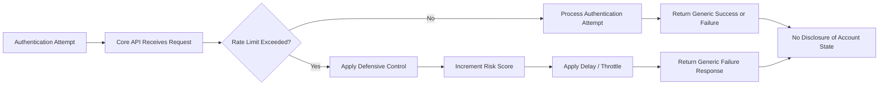
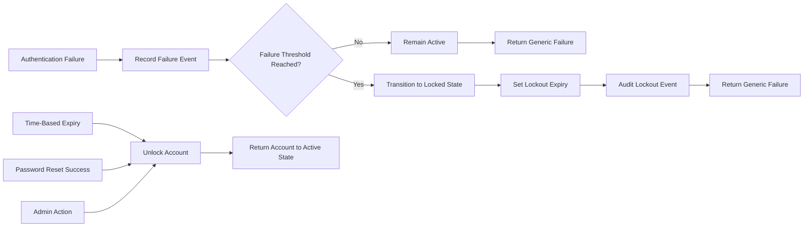

# Specification: SEC-02.03 Account Protection

| **Document ID** | **Version** | **Status** | **Owner (Author)** | **Approved By** |
|-----------------|-------------|------------|---------------------|------------------|
| **SEC-02.03** | **1.0.0** | **DRAFT** | Business Architect | Product Officer |

---

## 1. Purpose

SEC-02.03 defines the **account protection controls** used within the SUSTINA platform to defend user accounts against compromise, abuse, and automated attacks.

This specification governs:
- Rate limiting and throttling of authentication attempts
- Account lockout and recovery behaviour
- Protection against credential stuffing and brute-force attacks
- Step-up and defensive controls triggered by risk signals
- Enumeration-safe responses across IAM workflows

Account protection controls apply across **registration, sign-in, recovery, and ongoing account usage**.

---

## 2. Scope

### 2.1 In Scope
- Sign-in attempt protection
- Password reset and verification abuse prevention
- Account lockout and unlock rules
- Suspicious activity detection and response
- Defensive delays and automation resistance

### 2.2 Out of Scope
- Password hashing (SEC-01.01)
- Encryption and key management (SEC-01.02)
- Identity identifiers and canonicalisation (SEC-02.04)
- Token and session handling (SEC-03.xx)
- Role-based authorisation (SEC-04.xx)

---

## 3. Normative Principles

### 3.1 Protection Without Enumeration
Security controls must **not leak account existence or status**.
User-facing responses must remain generic.

### 3.2 Defence-in-Depth
Account protection relies on **multiple overlapping controls** rather than a single mechanism.

### 3.3 Proportional Response
Controls must escalate based on **risk and behaviour**, not punish legitimate users unnecessarily.

### 3.4 Centralised Enforcement
All account protection decisions are enforced by the **Core API**.

---

## 4. Threats Addressed

SEC-02.03 explicitly mitigates:

- Credential stuffing attacks
- Brute-force password guessing
- Account enumeration
- Automated password reset abuse
- Token replay following credential compromise

---

## 5. Account States

Accounts may exist in the following states:

| State | Description |
|------|-------------|
| Active | Normal operation |
| Unverified | Email not yet verified |
| Locked | Temporarily blocked due to risk |
| Suspended | Administratively disabled |
| Deactivated | User-initiated or compliance removal |

Authentication must fail for all states except **Active**.

---

## 6. Rate Limiting & Throttling

Fig 1 - SEC02.03.06: rate limiiting and throttling flow

### 6.1 Sign-In Attempts
- Maximum failed attempts per identifier within a rolling window
- Additional limits per IP and per device fingerprint
- Progressive delay after repeated failures

### 6.2 Recovery & Verification Endpoints
- Reset initiation rate-limited per identifier and per IP
- Verification resend strictly throttled
- Responses always return generic success

Exact thresholds are configurable but must be documented.

---

## 7. Account Lockout Behaviour

Fig 2 -SEC-02.03.07:account lockout behaviour flow

### 7.1 Lockout Triggers
An account may be temporarily locked when:
- Failed authentication attempts exceed threshold
- Suspicious automation patterns are detected
- Anomalous geolocation or device changes occur

### 7.2 Lockout Properties
- Lockouts are time-bound
- Lockout duration may increase progressively
- Users are informed generically without revealing cause

### 7.3 Unlock Mechanisms
Accounts may be unlocked via:
- Time-based expiry
- Successful password reset
- Administrative action

All unlock events must be auditable.

---

## 8. Defensive Controls

### 8.1 Automation Resistance
The platform may apply:
- CAPTCHA or equivalent challenges
- Behavioural analysis
- Request pacing and jitter

### 8.2 Step-Up Verification
Under elevated risk, Core may require:
- Email confirmation
- Additional verification steps
- Forced password reset

---

## 9. Logging & Monitoring

- Failed attempts logged with pseudonymised identifiers
- Lockout and unlock events audited
- No passwords or secrets logged
- Alerting thresholds defined for abnormal patterns

---

## 10. GDPR Alignment

- Protection data classified as behavioural metadata
- Stored pseudonymously where possible
- Retention limited to operational need
- Users may request visibility into account status

---

## 11. Governance

- Threshold changes require version increment
- Risk model adjustments must be documented
- Controls reviewed after incidents or annually

---

## 12. Change History

| Version | Date | Author | Notes |
|--------|------|--------|-------|
| 1.0.0 | 2025-12-13 | Business Architect | Initial authoritative account protection specification |
