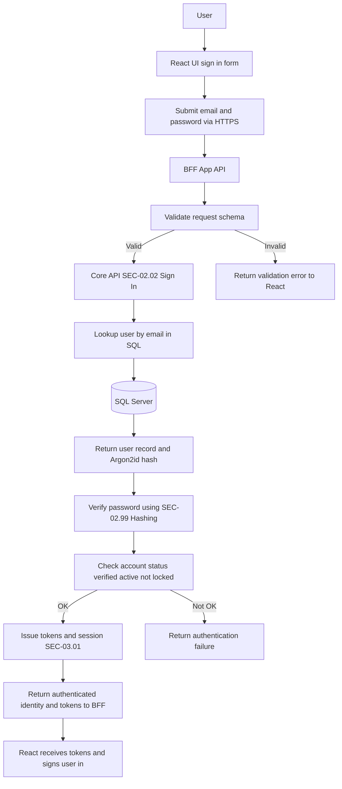
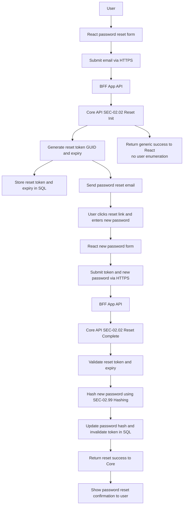

# Specification: SEC-02.02 Sign-In & Password Recovery

| **Document ID** | **Version** | **Status** | **Owner (Author)** | **Approved By** |
|-----------------|-------------|------------|---------------------|------------------|
| SEC-02.02 | 1.0.1 | **DRAFT** | Business Architect | Product Officer |

---

# 1. Purpose
The purpose of this document is to define the **sign-in** and **password recovery** processes for authenticated access to the SUSTINA platform.

This includes:

- Authentication using email + password  
- Verification of password correctness using Argon2id  
- Resetting forgotten passwords  
- Secure token handling for password reset  
- Ensuring no plaintext passwords are stored or logged  

This specification **does not** cover user registration (see SEC-02.01).

---

# 2. Scope
This specification governs:

### Sign-In
- Submission of credentials  
- Lookup of user identity  
- Verification of user passwords  
- Enforcement of account status (verified, active, unlocked)  

### Password Recovery
- Initiation of password reset  
- Secure issuance of reset tokens  
- Reset confirmation and password update  

This specification applies to:

- React application  
- App API / BFF (`SUSTINA.AppApi`)  
- Core API (`nrg_Core_API`)  
- SQL Server authentication tables  

Passwords must ALWAYS be handled according to **SEC-99.00 Hashing Strategy**.

---

# 3. Sign-In Workflow


## 3.1 High-Level Sequence

1. **React UI** collects:
   - Email  
   - Password (plaintext)

2. **React → BFF** transmits credentials securely via HTTPS.

3. **BFF** performs:
   - Schema validation  
   - Basic request shaping  
   - Forwards request to Core without altering password  

4. **Core API**:
   - Retrieves user record by **email only**  
   - Extracts stored Argon2id hash  
   - Performs verification:

```
SEC_02_99_Hashing.Verify(plaintextPassword, storedHash)
```

   - Validates account:
     - Email verified  
     - Status active  
     - Not locked / suspended  

5. **Core API** returns authenticated identity and issues session tokens under SEC-03.01.

---

# 4. Password Recovery Workflow




## 4.1 Reset Initiation

1. User submits their email for password reset.  
2. Core API:
   - Generates reset token (GUID)  
   - Stores the token + expiry timestamp  
   - Sends password reset email  

The system returns **generic success**, even when email is unknown, to prevent enumeration.

---

## 4.2 Reset Completion

1. User provides:
   - Reset token  
   - New password (plaintext)  

2. Core API:
   - Validates reset token  
   - Checks expiry  
   - Hashes new password:

```
var newHash = SEC_02_99_Hashing.Hash(newPassword);
```

   - Updates SQL record  
   - Invalidates token  

3. Core API returns success.

---

# 5. Core API Endpoints (Naming: SEC_02_02_XXX)

## 5.1 Sign-In
```
POST /api/core/auth/sign-in
```

Expected Payload:
```json
{ "email": "user@example.com", "password": "plainTextPassword" }
```

## 5.2 Initiate Reset
```
POST /api/core/auth/reset/init
```

Expected Payload:
```json
{ "email": "user@example.com" }
```

## 5.3 Complete Reset
```
POST /api/core/auth/reset/complete
```

Expected Payload:
```json
{ "token": "GUID", "newPassword": "plainTextPassword" }
```

---

# 6. SQL Server Requirements

- SQL retrieves users by email only  
- SQL returns Argon2id hash and status fields  
- SQL never compares passwords  
- Reset tokens stored as GUID + expiry  
- Tokens must be invalidated after use  

---

# 7. GDPR & Privacy Requirements

- No plaintext passwords stored or logged  
- Reset tokens must be single-use, time-bound  
- Reset tokens may not reveal user identity  
- Passwords remain irreversible at all times  

---

# 8. ISO-9001 Governance

Processes must be:
- Documented  
- Repeatable  
- Auditable  
- Version-controlled  

Changes to:
- Authentication flow  
- Password policy  
- Token lifetime  

…must follow SUSTINA change control procedures.

---

# 9. Change History

| Version | Date | Author | Notes |
|---------|------|--------|-------|
| 1.0.1 | 2025-12-09 | Business Architect | Corrected to strictly cover sign-in + password recovery only |
