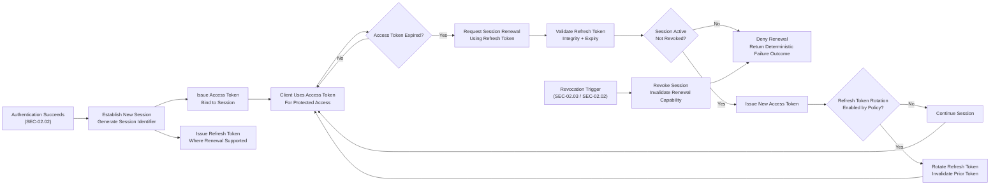

# Specification: SEC-03.01 Token & Session Handling

| **Document ID** | **Version** | **Status** | **Owner (Author)** | **Approved By** |
|-----------------|-------------|------------|---------------------|------------------|
| **SEC-03.01** | **1.1.0** | **DRAFT** | Business Architect | Product Officer |

---

## 1. Purpose

This specification defines the **logical standards, controls, and behavioural guarantees** for token issuance, session management, renewal, and revocation across the SUSTINA platform.

Token and session handling ensures that:
- Only authenticated subjects gain access to protected resources
- Sessions are bounded in time, traceable, and revocable
- Tokens cannot be forged, replayed, or used beyond their authorised lifespan
- Behaviour is auditable and repeatable in accordance with ISO-9001
- Personal data exposure is minimised in accordance with GDPR

This specification defines **logical behaviour only** and deliberately excludes:
- Transport protocols
- Message encodings
- Interface routes
- Client or server implementation technologies

---

## 2. Relationship to Other Security Specifications

<strong>Table 1 –</strong> Relationship to other security specifications

| Specification | Relationship |
|---------------|--------------|
| **SEC-01.01** Hashing & Irreversible Transformation | Governs credential verification inputs to token issuance |
| **SEC-01.02** Encryption & Key Management | Governs protection of token and session artefacts at rest |
| **SEC-02.01** User Registration | Establishes identity prior to token issuance |
| **SEC-02.02** Sign-In & Password Recovery | Initiates authenticated token issuance |
| **SEC-02.03** Account Protection | Defines lockout and revocation triggers |
| **SEC-02.04** Identity Identifiers & Canonicalisation | Governs subject identifiers used in tokens |
| **SEC-10.00** GDPR Data Handling Strategy | Governs lawful processing and minimisation |

<strong>Table 1-</strong>Relationship to Other Security Specifications

---

## 3. Scope

This specification governs:
- Token issuance following successful authentication
- Session establishment and renewal
- Session expiry and revocation
- Logical properties of token contents

Out of scope:
- Password handling and hashing (SEC-01.01)
- Registration and credential recovery workflows (SEC-02.01 / SEC-02.02)
- Authorisation and role modelling (SEC-04.xx)
- Transport-level interface definitions

---

## 4. Token Types

<strong>Table 2 –</strong> Supported token types

| Token Type | Purpose | Lifetime | Reusability |
|-----------|--------|----------|-------------|
| Access Token | Authorises access to protected resources | Short-lived | Not reusable |
| Refresh Token | Enables renewal without re-authentication | Longer-lived | Controlled, revocable |
| Verification Token | Confirms user-controlled contact points | Time-bound | Single-use |
| Reset Token | Enables credential reset | Time-bound | Single-use |

<strong>Table 2-</strong>Token Types

---

## 5. Token Properties (Logical)

### 5.1 Mandatory Access Token Attributes

Each access token must adhere to the following 

| Token Content Element | Required | Prohibited | Notes |
|----------------------|:--------:|:----------:|-------|
| Subject identifier (User GUID) | ✓ |  | Pseudonymised subject reference |
| Issuance timestamp | ✓ |  | Supports auditability and replay controls |
| Expiry timestamp | ✓ |  | Bounds token validity window |
| Session identifier | ✓ |  | Links token to a logical session |
| Authorisation context (roles and/or scopes) | ✓ |  | Minimum necessary authorisation data |
| Passwords or credential material |  | ✗ | Never include secrets |
| Raw personal identifiers (e.g. email address) |  | ✗ | Avoid PII in tokens |
| Reset or verification artefacts |  | ✗ | Never mix recovery artefacts into access tokens |

<strong>Table 3-</strong>Token Attributes

### 5.2 Token Confidentiality

- Access tokens may be presented to resource services as proof of authorisation.
- Refresh tokens must be protected against client-side disclosure.
- Token material must never be logged or exposed in operational telemetry.

---

## 6. Session Handling Model

<strong>Figure 1 –SEC03.01 </strong> Session establishment, renewal, and revocation (logical)

 

### 6.1 Session Establishment

After successful authentication (SEC-02.02):
1. A new logical session identifier is generated.
2. An access token is issued and bound to the session.
3. A refresh token is issued where renewal is supported.
4. Session state is recorded if required for enforcement.

### 6.2 Session Renewal

When an access token expires, a client may request session renewal using a valid refresh token.

The session authority must:
- Validate refresh token integrity and expiry
- Confirm the associated session is active
- Issue a new access token
- Optionally rotate the refresh token
- Deny renewal if the session has been revoked

### 6.3 Session Expiry

Sessions must expire when:
- Token expiry is reached and not renewed
- Inactivity exceeds policy-defined thresholds
- Account state changes require termination

---

## 7. Session Revocation

| Trigger | Source Specification | Required Outcome |
|-------|----------------------|------------------|
| User logout | SEC-03.01 | Session terminated |
| Password reset | SEC-02.02 | All active sessions revoked |
| Account lock or suspension | SEC-02.03 | Session invalidated |
| Administrative action | Policy | Session terminated |

<strong>Table 4-</strong> Session revocation triggers

 

Revocation must:
- Prevent further token renewal
- Invalidate existing refresh capability
- Be auditable and deterministic

---

## 8. Data Storage Requirements (Logical)

The token and session handling mechanisms must ensure that:

- Token artefacts persisted for enforcement are protected at rest under SEC-01.02.
- Session identifiers are unique and non-reusable.
- Revocation state is enforceable across all access paths.
- Persistence outcomes produce deterministic, auditable indicators suitable for ISO-9001 evidence.

These requirements describe **logical guarantees only**.  
Storage technology and enforcement mechanisms are explicitly out of scope.

---

## 9. GDPR & Privacy Requirements

- Tokens must use pseudonymised subject references.
- No token may contain sensitive personal data.
- Users must be able to terminate active sessions.
- Retention of session artefacts must be limited to operational necessity.

---

## 10. ISO-9001 Governance

Token and session handling must be:
- Documented and repeatable
- Auditable with deterministic outcomes
- Version-controlled
- Updated under formal change control

Significant changes include:
- Token lifetime policy adjustments
- Session revocation behaviour changes
- Cryptographic or protection policy updates

---

## 11. Change History

<strong>Table 4 –</strong> Change history

| Version | Date | Author | Notes |
|--------|------|--------|-------|
| 1.0.0 | 2025-12-09 | Business Architect | Initial draft |
| **1.1.0** | **2025-12-13** | Business Architect | Refactored to technology-neutral logical specification; aligned with SEC-01.xx and SEC-02.xx; applied captioning standard |
