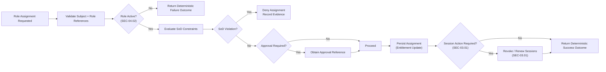

# Specification: SEC-04.03 Role Assignment & Entitlement Management

| **Document ID** | **Version** | **Status** | **Owner (Author)** | **Approved By** |
|-----------------|-------------|------------|---------------------|------------------|
| **SEC-04.03** | **1.0.0** | **DRAFT** | Business Architect | Product Officer |

---

## 1. Purpose

This specification defines the **logical controls for role assignment and entitlement management** within the SUSTINA platform.

Role assignment ensures that:
- Subjects receive only the roles required to perform their function (least privilege)
- Assignments are time-bound and reviewable where appropriate
- Separation-of-duties constraints are enforced
- Changes to entitlements are auditable and deterministic
- Session and token behaviour remains consistent with account protection and revocation policies

This document is **technology-neutral** and excludes transport protocols, storage technologies, and implementation details.

---

## 2. Relationship to Other Security Specifications

| Specification | Relationship |
|---------------|--------------|
| **SEC-04.01** Roles & Permissions Model | Defines roles and permission aggregation |
| **SEC-04.02** Role Lifecycle Management | Defines role states; only Active roles are assignable |
| **SEC-02.04** Identity Identifiers & Canonicalisation | Defines subject identifiers used in assignments |
| **SEC-02.03** Account Protection | Defines risk states that may force entitlement changes |
| **SEC-03.01** Token & Session Handling | Defines session revocation requirements after entitlement changes |
| **SEC-05.01** Joiner–Leaver–Mover Policy | Drives assignment changes based on lifecycle events |
| **SEC-10.00** GDPR Data Handling Strategy | Governs lawful processing and minimisation of identity data |

<strong>Table 1 –</strong> Relationship to other security specifications

---

## 3. Scope

This specification governs:
- Assigning roles to subjects
- Removing roles from subjects
- Time-bound role assignments (start/end)
- Delegation and approval rules
- Separation-of-duties (SoD) constraints
- Evidence and audit requirements
- Entitlement review triggers

Out of scope:
- Role definition (SEC-04.01)
- Role creation and retirement (SEC-04.02)
- Access decision enforcement mechanisms (SEC-04.04)

---

## 4. Core Concepts

### 4.1 Subject
A **Subject** is a uniquely identified actor, referenced by a stable User GUID (SEC-02.04).

### 4.2 Entitlement
An **Entitlement** is the effective access granted to a subject through one or more assigned roles.

### 4.3 Role Assignment
A **Role Assignment** is a controlled association between a subject and a role, including governance metadata.

---

## 5. Assignment Types

| Assignment Type | Description | Typical Use |
|----------------|-------------|-------------|
| Direct | Explicitly assigned to a subject | Normal access granting |
| Time-bound | Assigned with start/end constraints | Temporary project access |
| Delegated | Assigned by an authorised delegate | Managed access models |
| Emergency | Short-lived elevated access | Incident response |

<strong>Table 2 –</strong> Role assignment types

---

## 6. Minimum Assignment Attributes (Logical)

| Attribute | Required | Description |
|----------|----------|-------------|
| Assignment ID | Yes | Stable, system-generated identifier |
| Subject ID (User GUID) | Yes | Subject reference (SEC-02.04) |
| Role ID | Yes | Role reference (SEC-04.01) |
| Assigned By | Yes | Subject or authority initiating assignment |
| Assigned Date | Yes | Audit timestamp |
| Reason / Justification | Yes | Business justification |
| Start Date | Conditional | Required for time-bound assignments |
| End Date | Conditional | Required for time-bound assignments |
| Approval Reference | Conditional | Required for high-risk roles |
| Status | Yes | Active / Ended / Revoked |

<strong>Table 3 –</strong> Required assignment attributes

---

## 7. Normative Assignment Rules

### 7.1 Assignable Role Constraint
Only roles in **Active** state (SEC-04.02) may be assigned.

### 7.2 Least Privilege
Assignment decisions must grant **only roles required** for the stated purpose.

### 7.3 Separation of Duties (SoD)
Assignments must be validated against SoD constraints before activation.

Examples of conflicting combinations may include:
- Requestor and Approver roles
- Data submitter and Data auditor roles
- Role administrator and Audit reviewer roles

### 7.4 Approval Requirements
High-risk roles must:
- Require explicit approval
- Capture approval reference in the assignment record
- Be time-bound where possible

### 7.5 Time-Bound Enforcement
Where an end date is provided:
- Entitlement must end automatically at expiry
- Expiry must be enforceable deterministically

---

## 8. Assignment Operations (Logical)

The platform shall provide logical operations to:
- Assign role to subject
- Remove role from subject
- Replace subject role set (batch update)
- Suspend or revoke entitlements due to risk state

### 8.1 Deterministic Outcomes
Each operation must return a deterministic, auditable outcome indicator suitable for ISO-9001 evidence.

---

## 9. Entitlement Change and Session Impact

Entitlement changes may require session actions to ensure that access changes take effect.

| Entitlement Change | Required Session Action |
|-------------------|-------------------------|
| Grant low-risk role | No immediate action required |
| Grant high-risk role | Optional step-up or renewal required |
| Remove any role | Invalidate authorisation context |
| Remove privileged role | Revoke active sessions |
| Leaver event | Revoke all sessions and tokens |

<strong>Table 4 –</strong> Session impact of entitlement changes

Session and token behaviours are governed by SEC-03.01.

---

## 10. Audit, Review, and Recertification

### 10.1 Audit Requirements
All assignments must be auditable:
- Who assigned
- What was assigned
- When it was assigned
- Why it was assigned
- When it ended (if time-bound)
- Approvals (if required)

### 10.2 Review Triggers

| Trigger | Description |
|--------|-------------|
| Scheduled review | Periodic review based on risk tier |
| Role change | When a role definition changes materially |
| Mover event | When a subject changes job function |
| Incident | After security event affecting access |

<strong>Table 5 –</strong> Entitlement review triggers

---

## 11. Mermaid Flow (Logical)

<strong>Figure 1 –</strong> Role assignment decision flow (logical)

---

## 12. Data Storage Requirements (Logical)

The entitlement management mechanisms must ensure that:
- Assignments are persisted with the minimum attributes defined in Table 3
- SoD evaluation outcomes are evidentiary and auditable
- Time-bound assignment expiry is enforceable deterministically
- Historical assignment records are retained for audit in accordance with governance policy
- Persistence outcomes provide deterministic indicators suitable for ISO-9001 evidence

These requirements describe **logical guarantees only**.  
Storage technology and enforcement mechanisms are explicitly out of scope.

---

## 13. Change History

| Version | Date | Author | Notes |
|--------|------|--------|-------|
| 1.0.0 | 2025-12-13 | Business Architect | Initial authoritative role assignment and entitlement management specification |

<strong>Table 6 –</strong> Change history

