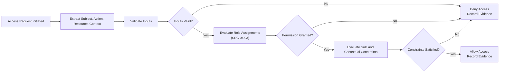

# Specification: SEC-04.04 Access Decision & Enforcement

| **Document ID** | **Version** | **Status** | **Owner (Author)** | **Approved By** |
|-----------------|-------------|------------|---------------------|------------------|
| **SEC-04.04** | **1.0.0** | **DRAFT** | Business Architect | Product Officer |

---

## 1. Purpose

This specification defines the **logical access decision and enforcement model** used across the SUSTINA platform.

It governs:
- How access decisions are evaluated
- What inputs are required to make an access decision
- The principles applied when deciding to allow or deny access
- How decisions are enforced consistently across protected resources
- How decision outcomes are recorded for audit and evidence

This document is **technology-neutral** and deliberately excludes transport protocols, storage technologies, and implementation details.

---

## 2. Relationship to Other Security Specifications

| Specification | Relationship |
|---------------|--------------|
| **SEC-04.01** Roles & Permissions Model | Defines roles and permissions used in decisions |
| **SEC-04.03** Role Assignment & Entitlement Management | Defines which roles a subject holds |
| **SEC-03.01** Token & Session Handling | Supplies authorisation context |
| **SEC-02.03** Account Protection | Defines account states affecting access |
| **SEC-02.04** Identity Identifiers & Canonicalisation | Defines subject identifiers |
| **SEC-05.01** Joiner–Leaver–Mover Policy | Drives entitlement recalculation |
| **SEC-10.00** GDPR Data Handling Strategy | Governs evidence and minimisation |

<strong>Table 1 –</strong> Relationship to other security specifications

---

## 3. Scope

This specification governs:
- Logical access decision evaluation
- Enforcement principles applied to protected resources
- Evidence produced by access decisions

Out of scope:
- Transport-layer enforcement (e.g. HTTP middleware)
- Interface-level definitions
- Implementation of policy engines or libraries

---

## 4. Core Access Decision Model

All access decisions must be evaluated using the following logical inputs:

| Input | Description |
|------|-------------|
| Subject | Authenticated subject reference (User GUID) |
| Action | Requested operation or capability |
| Resource | Target resource or resource class |
| Context | Environmental and risk context (time, state, risk) |

<strong>Table 2 –</strong> Logical inputs to an access decision

The access decision outcome must be **Allow** or **Deny**.

---

## 5. Normative Decision Principles

### 5.1 Deny by Default
If any required input is missing or invalid, access must be denied.

### 5.2 Explicit Allow
Access may be granted only where:
- The subject holds a role granting the required permission
- The role assignment is active and valid
- No conflicting constraints apply

### 5.3 Separation of Duties Enforcement
Access must be denied where SoD constraints are violated.

### 5.4 Context Sensitivity
Contextual signals may influence decisions, including:
- Account state (SEC-02.03)
- Time-bound assignment expiry
- Elevated risk indicators

---

## 6. Authorisation Context Evaluation

The authorisation context supplied to decision logic may include:
- Assigned role identifiers
- Derived permission sets
- Risk tier indicators
- Session state

The representation of this context is governed by **SEC-03.01** and is out of scope here.

---

## 7. Enforcement Responsibilities

Access decisions must be enforced:
- At every protected resource boundary
- Consistently across all components
- Prior to performing the requested action

Enforcement must ensure that:
- Denied actions are not partially executed
- Side effects do not occur on denied access
- Enforcement behaviour is deterministic

---

## 8. Evidence & Audit Requirements

Each access decision must be capable of producing evidence including:
- Subject identifier
- Action and resource reference
- Decision outcome (allow/deny)
- Timestamp
- Decision basis reference (policy version or role set)

<strong>Table 3 –</strong> Required access decision evidence

Evidence must:
- Avoid recording sensitive personal data
- Support forensic analysis and audit
- Be retained in accordance with governance policy

---

## 9. Mermaid Flow (Logical)

<strong>Figure 1 –</strong> Logical access decision and enforcement flow

---

## 10. Governance

Access decision logic must:
- Be version-controlled
- Be applied consistently across all services
- Change only under formal governance
- Produce deterministic outcomes for identical inputs

---

## 11. Change History

| Version | Date | Author | Notes |
|--------|------|--------|-------|
| 1.0.0 | 2025-12-13 | Business Architect | Initial authoritative access decision and enforcement specification |

<strong>Table 4 –</strong> Change history

