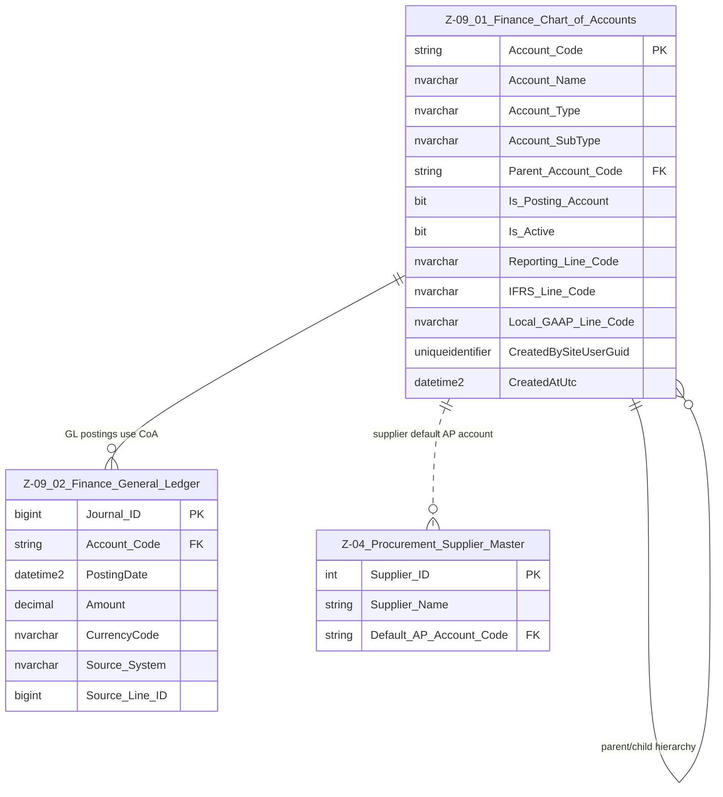

# Data Entity Specification: Z-09.01 Finance Chart of Accounts

| **Document ID** | **Version** | **Status** | **Owner (Author)** | **Approved By** | **Approved On** |
| :--- | :--- | :--- | :--- | :--- | :--- |
| **Z-09.01** | 1.0.0 | **DRAFT** | Business Architect | Product Officer | |

## 1. Description & Scope

## 2. Purpose

Z-09.01 provides the master definition for all financial accounts used across the platform.

## 3. Structure

| Feature | Column | Type | Purpose |
| :--- | :--- | :--- | :--- |
| Primary Key | Account_Code | NVARCHAR(50) | Globally unique account identifier. |
| Name | Account_Name | NVARCHAR(200) | Human-readable label. |
| Type | Account_Type | NVARCHAR(50) | Asset / Liability / Equity / Income / Expense. |
| Sub-Type | Account_SubType | NVARCHAR(100) | AP, AR, Payroll, Operating Revenue, etc. |
| Hierarchy | Parent_Account_Code | NVARCHAR(50) | Multi-level roll-up. |
| Posting Flag | Is_Posting_Account | BIT | 1 = posting, 0 = header. |
| Active Flag | Is_Active | BIT | Controls lifecycle. |
| Reporting Line | Reporting_Line_Code | NVARCHAR(50) | Internal P&L mapping. |
| IFRS Mapping | IFRS_Line_Code | NVARCHAR(50) | Statutory reporting. |
| Local GAAP Mapping | Local_GAAP_Line_Code | NVARCHAR(50) | Local reporting. |
| Audit | CreatedBySiteUserGuid, CreatedAtUtc | GUID, DATETIME | Governance compliance. |

## 4. Data Management

| Object Type | Name | Description |
| :--- | :--- | :--- |
| Stored Procedure | usp_Finance_CreateAccount | Creates new CoA entries. |
| Stored Procedure | usp_Finance_UpdateAccount | Safely updates account metadata. |
| Stored Procedure | usp_Finance_DeactivateAccount | Retires accounts. |
| View | vw_Finance_ChartOfAccounts_Hierarchy | Flattened CoA hierarchy for reporting. |
