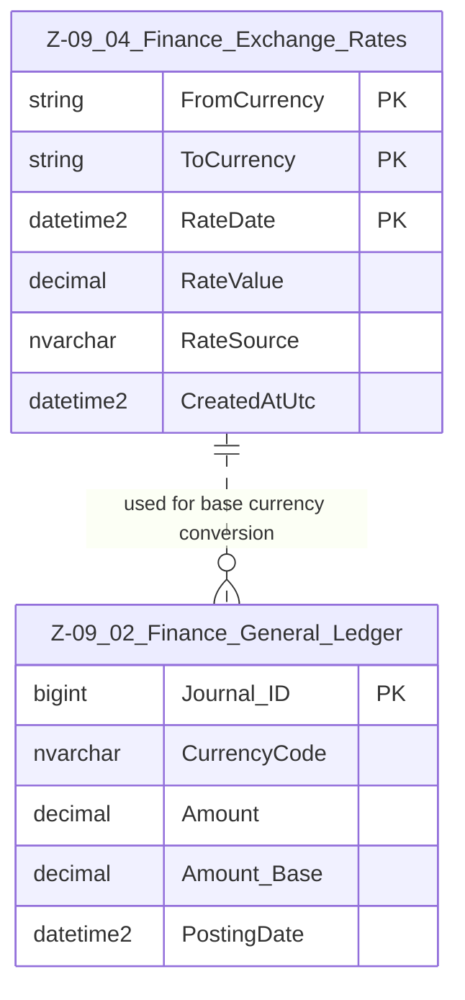

# Data Entity Specification: Z-09.04 Finance Exchange Rates

| **Document ID** | **Version** | **Status** | **Owner (Author)** | **Approved By** | **Approved On** |
| :--- | :--- | :--- | :--- | :--- | :--- |
| **Z-09.04** | 1.0.0 | **DRAFT** | Business Architect | Product Officer | |

## 1. Description & Scope

The **Finance Exchange Rates (FX Rates)** entity provides the authoritative source of currency conversion values used by the Finance General Ledger (Z-09.02).  

It stores historical, daily, or period-based exchange rates to support:

- Base currency conversion  
- Foreign currency reporting  
- Revaluation processes  
- Consolidated financial statements  

This document follows the **one-tier relationship rule**: only entities that directly reference FX are included.

---

## 2. ERD — One-Tier View

---

## 3. Structure

### 3.1 Column Definitions

| Feature | Column | Type | Purpose |
| :--- | :--- | :--- | :--- |
| **Currency From** | FromCurrency | NVARCHAR(10) | Original currency code (e.g., USD). |
| **Currency To** | ToCurrency | NVARCHAR(10) | Target/base currency code (e.g., EUR). |
| **Rate Date** | RateDate | DATETIME2 | Date the rate is valid for. |
| **Rate Value** | RateValue | DECIMAL | Conversion multiplier. |
| **Source** | RateSource | NVARCHAR(50) | Provider (ECB, FED, Manual, System). |
| **Created Timestamp** | CreatedAtUtc | DATETIME2 | Audit timestamp. |

---

## 4. Behaviour & Processing Rules

- GL postings (Z-09.02) **must convert Amount → Amount_Base** using the correct FX rate for:
  - Posting date
  - Matching FromCurrency → ToCurrency
- If no FX rate exists for the posting date:
  - System may fall back to previous available rate (configurable)
  - System may block postings (depending on financial policy)
- Rates may not be edited after creation except through authorised FX correction procedures.

---

## 5. Data Management

| Object Type | Name | Description |
| :--- | :--- | :--- |
| **Stored Procedure** | usp_Finance_LoadExchangeRates | Loads FX rates from external sources. |
| **Stored Procedure** | usp_Finance_ValidateExchangeRates | Ensures completeness and accuracy. |
| **Stored Procedure** | usp_Finance_ApplyRevaluation | Uses FX rates to revalue foreign balances. |
| **View** | vw_Finance_FX_Latest | Returns the most recent valid FX rates for each currency pair. |

---
