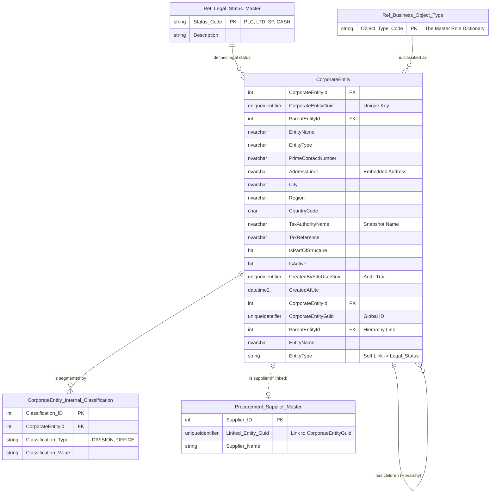

# Data Entity Specification: Z-01 CorporateEntity

| **Document ID** | **Version** | **Status** | **Owner (Author)** | **Approved By** |**Approved On** |
| :--- | :--- | :--- | :--- | :--- |:--- |
| Z-01 | 1.0.0 | **DRAFT** | Business Architect | Product Officer | | 

## 1. Description & Scope
The schematic below illustartes the structure and the relationships the  CorporateEntty data object enjoys.  
See the dedictaed pages for the objects related to the CorporateEntity object

## Core Details
The **[Entity].[CorporateEntity]** table is the foundational master data object for the entire organizational structure module. It is designed to capture the legal and physical identity of every company or organizational unit that exists within your system.

**Key Characteristics and Data Fields**
The table structure indicates a design focused on auditability, global identity, and structural relationships.

## 1 Identity and Structure Management
This table enables the primary function of the application: modeling the corporate group.
| Feature | Attribute / Column | Primary Function |
| :--- | :--- | :--- |
| Dual Primary Key | CorporateEntityId | A standard auto-incrementing integer (INT IDENTITY) used internally for simple database lookups and relationships. |
| Global Identifier | CorporateEntityGuid | A unique identifier (UNIQUEIDENTIFIER) used for external integration, APIs, and as the standard soft link across schemas (e.g., linking to the General Ledger or Tax Assignment tables). |
| Hierarchy Link | ParentEntityId | The ParentEntityId column allows the table to link to itself, creating the Parent/Child organizational tree. This defines the consolidation structure (e.g., which subsidiaries roll up to which parent). |

Audit Trail: It maintains mandatory audit fields (CreatedBySiteUserGuid, CreatedAtUtc, etc.) to enforce user accountability for initial setup and subsequent changes.

## 2 Core Operational & Compliance Data
The table embeds necessary operational and compliance data directly onto the record:
| Feature | Attributes / Columns | Purpose |
| :--- | :--- | :--- |
| **Identification** | EntityName, PrimeContactNumber | Stores the **legal name** and primary contact information. |
| **Embedded Location** | AddressLine1, City, PostalCode, CountryCode | Represents the **Registered or Primary Headquarters Address** (fields are part of the core table structure). |
| **Tax Snapshot** | TaxAuthorityName, TaxReference | Serves as a quick **snapshot of the primary tax obligation** for the entity. |
| **Control Flags** | IsActive, IsPartOfStructure | Binary flags used for **enabling/disabling** the entity or determining inclusion in **hierarchical roll-ups and reports**. |

## 3.Data Management
| Obejct Type | Name | Description |
| :--- | :--- | :--- |
| **Stored Procedure** | usp_CreateCorporateEntity | Creating Coprorate entities in the dtabase suppotring the application |
| **Stored Procedure** | usp_UpdateEntityStructure | Managing the flow of data into the audit table, [Entity].[CorporateEntity_History] |

## Architectural Role  
This table is the source of truth for the "Who" in the application:
Every subsequent action, transaction, or compliance requirement (Tax Assignment, GL Entry, Scope 3 Report) will link back to a specific CorporateEntityGuid.
Its primary function is to define the boundaries of financial consolidation and compliance obligations within the group.
---
