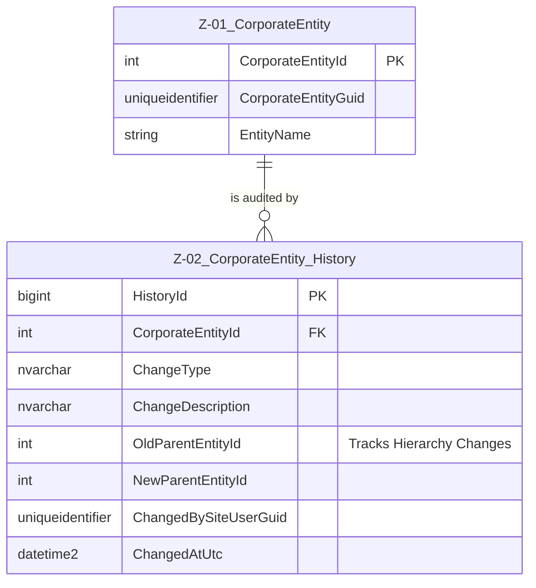

# Data Entity Specification: Z-01 Entity

| **Document ID** | **Version** | **Status** | **Owner (Author)** | **Approved By** |**Approved On** |
| :--- | :--- | :--- | :--- | :--- |:--- |
| Z-01 | 1.0.0 | **DRAFT** | Business Architect | Product Officer | | 

## 1. Description & Scope

## Corporate Entity History Structure

This table is essential for **audit and compliance**. The `[Entity].[CorporateEntity_History]` table serves as a permanent **audit log** for all significant changes made to the corresponding `[Entity].[CorporateEntity]` records.

Since it tracks historical states and changes, it is typically implemented using **soft/logical foreign key links** back to the main entity table, consistent with your system's design.

## Corporate Entity History Structure

The primary function of this table is to record **who** made **what** change **when**, especially concerning the critical **Parent/Child hierarchy**.

| Feature | Attribute / Column | Data Type | Primary Function |
| :--- | :--- | :--- | :--- |
| **Primary Key** | `HistoryId` | `BIGINT IDENTITY` | Unique identifier for each historical record/change event. |
| **Entity Link** | `CorporateEntityId` | `INT` | Links the history record to the specific **CorporateEntity** that was modified. |
| **Change Event** | `ChangeType` | `NVARCHAR(50)` | Describes the action taken (e.g., 'CREATE', 'UPDATE', 'DELETE', 'PARENT_CHANGE'). |
| **Description** | `ChangeDescription` | `NVARCHAR(500)` | Provides human-readable notes about the reason for the change. |
| **Hierarchy Tracking** | `OldParentEntityId`, `NewParentEntityId` | `INT NULL` | **Critical audit fields** that track changes to the entity's position within the organizational structure. |
| **Snapshot Data** | `Snapshot_EntityName` | `NVARCHAR(256)` | Stores the entity's name at the time of the change, ensuring accuracy even if the name is changed later. |
| **Audit Trail** | `ChangedBySiteUserGuid`, `ChangedByUserName`, `ChangedAtUtc` | `UNIQUEIDENTIFIER`, `NVARCHAR(100)`, `DATETIME2` | Tracks the specific user responsible for the modification and the timestamp. |

| Feature | Attribute / Column | Data Type | Primary Function |
| :--- | :--- | :--- | :--- |
| **Dual Primary Key** | `CorporateEntityId` | `INT IDENTITY` | Internal database lookup and relationships. |
| **Global Identifier** | `CorporateEntityGuid` | `UNIQUEIDENTIFIER` | External integration, APIs, and standard soft link across schemas (e.g., linking to the General Ledger or Tax Assignment tables). |
| **Hierarchy Link** | `ParentEntityId` | `INT NULL` | The ParentEntityId column allows the table to link to itself, creating the Parent/Child organizational tree. This defines the consolidation structure (e.g., which subsidiaries roll up to which parent). |

## 3.Data Management
| Obejct Type | Name | Description |
| :--- | :--- | :--- |
| **Stored Procedure** | usp_CreateCorporateEntity | Creating Coprorate entities in the dtabase suppotring the application |
| **Stored Procedure** | usp_UpdateEntityStructure | Managing the flow of data into the audit table, [Entity].[CorporateEntity_History] |
