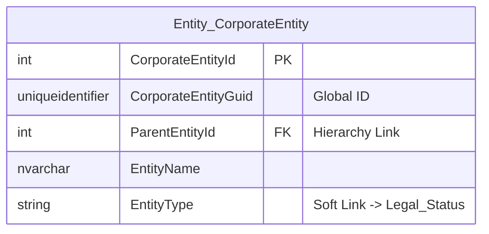

# Data Entity Specification: Z-03 CorporateEntity_Internal_Classification

| **Document ID** | **Version** | **Status** | **Owner (Author)** | **Approved By** |**Approved On** |
| :--- | :--- | :--- | :--- | :--- |:--- |
| Z-03 | 1.0.0 | **DRAFT** | Business Architect | Product Officer | | 

## 1. Description & Scope
The schematic below illustrates the structure the CorporateEntity_Internal_Classification data object enjoys.  

## Core Details
The **[Entity].[CorporateEntity_Internal_Classification]** table is a **segmentation layer** designed to break down a single legal entity into multiple reporting or functional units (e.g., divisions, departments, offices). It is built to capture the flexible, internal reporting view required by management.

**Key Characteristics and Data Fields**
The table structure focuses on creating flexible, many-to-many-like links between the legal entity and its reporting segments.

---

## 1 Identity and Structure Management
This table establishes a vital one-to-many relationship, linking granular management data to the main corporate legal structure.

| Feature | Attribute / Column | Primary Function |
| :--- | :--- | :--- |
| **Primary Key** | ClassificationId | A standard auto-incrementing integer (INT IDENTITY) used as the unique identifier for each classification link. |
| **Entity Link** | CorporateEntityId | The soft link to the main **[Entity].[CorporateEntity]** table, identifying **which legal entity** this classification applies to. |
| **Hierarchical Role** | *None* | This table defines *internal* segments and **does not** participate in the Parent/Child legal hierarchy; it supports the structural breakdown. |

Audit Trail: This table may implicitly link to audit logs via procedures that track changes to these classifications, ensuring data governance over internal segmentation.

---

## 2 Core Operational & Compliance Data
The table contains the specific data elements required to define and identify the internal reporting unit.

| Feature | Attributes / Columns | Purpose |
| :--- | :--- | :--- |
| **Classification Type** | Classification_Type | Defines the **category** of the segment (e.g., 'DIVISION', 'OFFICE', 'COST\_CENTER', 'OPERATING\_SEGMENT'). |
| **Classification Value** | Classification_Value | Provides the **name** or specific identifier of the segment (e.g., 'EMEA Sales', 'Zurich Office'). |
| **Compliance Support** | *Implicit* | Provides the required segmentation basis for compliance needs like **IFRS 8 (Operating Segments)** and Activity-Based Costing. |

---

## 3. Data Management
| Obejct Type | Name | Description |
| :--- | :--- | :--- |
| **Stored Procedure** | usp_AddInternalClassification | Procedure used to add or update new internal tags for a given entity, linking the segment value to the `CorporateEntityId`. |
| **Stored Procedure** | usp_GetEntitySegmentation | Procedure used to retrieve all internal reporting segments (Divisions, Offices) linked to a specific entity for reporting purposes. |

---

## Architectural Role
This table is the source of truth for **Internal Segmentation** and the **Management Reporting View**:
Every subsequent action, transaction, or cost allocation must reference this table to be correctly aggregated by Division, Office, or Cost Center.
Its primary function is to define the operational and management reporting boundaries, transforming the single legal entity view into a detailed cost and activity allocation model.
---
