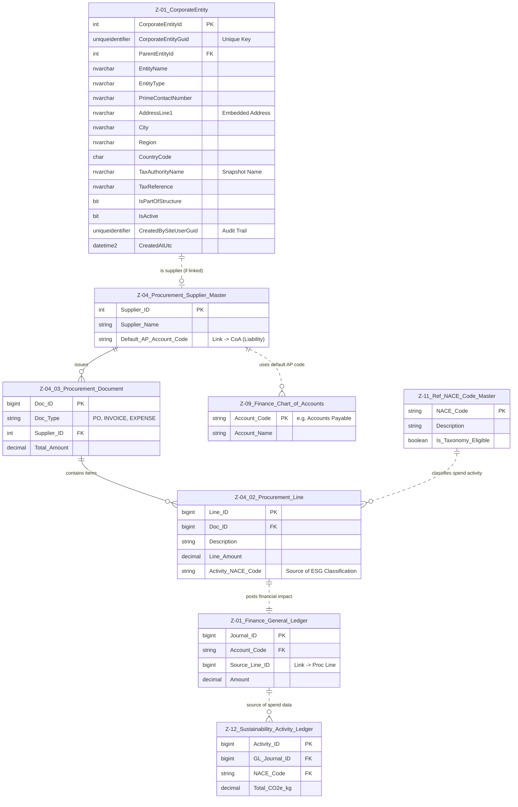

# Data Entity Specification: Z-04 Procurement Overview

| **Document ID** | **Version** | **Status** | **Owner (Author)** | **Approved By** |**Approved On** |
| :--- | :--- | :--- | :--- | :--- |:--- |
| Z-04 | 1.0.0 | **DRAFT** | Business Architect | Product Officer | | 

## 1. Description & Scope
The schematic below illustartes the structure and the relationships the  data objects involved in the Procurement workflow enjoy.  
See the dedictaed pages for the objects related to the CorporateEntity object

## Core Details
The **[Procurement].[Supplier\_Master]** table is the foundational master data object for all **external and internal vendors** that transact with your corporate entities. Its primary role is to centralize vendor identity while enabling granular **ESG activity mapping** and **Internal/External boundary classification**.

---
