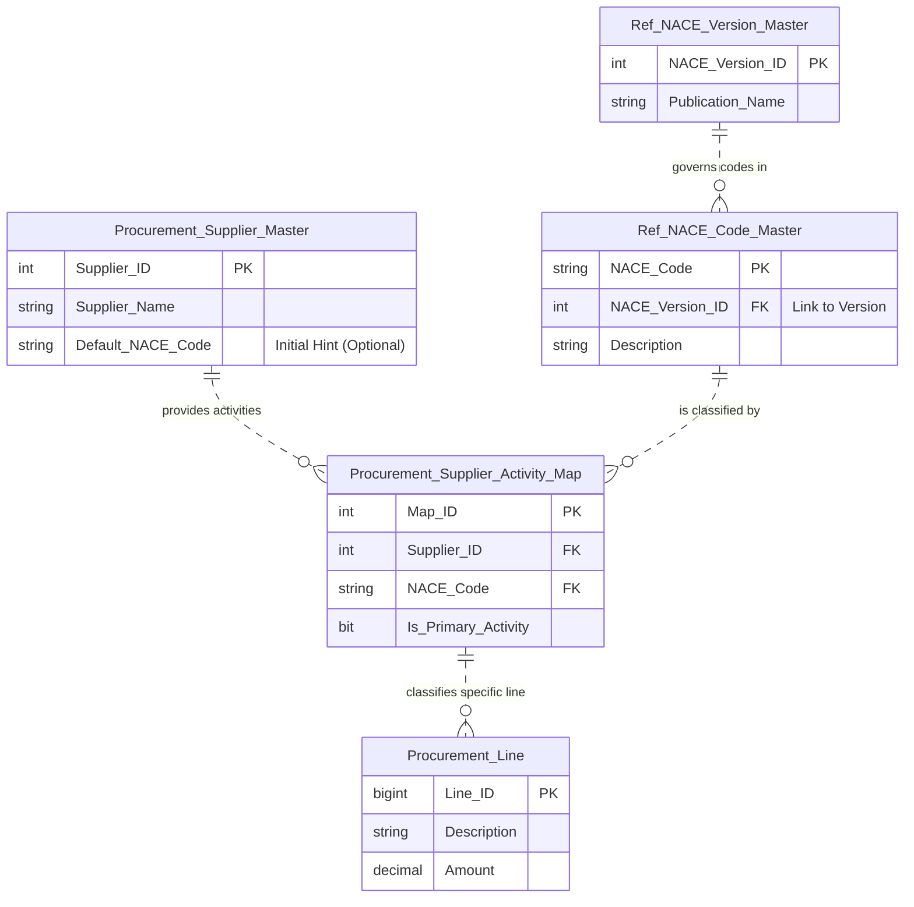

# Data Entity Specification: Z-04 Procurement_Supplier_Master

| **Document ID** | **Version** | **Status** | **Owner (Author)** | **Approved By** |**Approved On** |
| :--- | :--- | :--- | :--- | :--- |:--- |
| Z-04 | 1.0.0 | **DRAFT** | Business Architect | Product Officer | | 

## 1. Description & Scope
The schematic below illustartes the structure and the relationships the  Procurement_Supplier_Master data object enjoys.  
See the dedictaed pages for the objects related to the CorporateEntity object

## Core Details
The **[Procurement].[Supplier\_Master]** table is the foundational master data object for all **external and internal vendors** that transact with your corporate entities. Its primary role is to centralize vendor identity while enabling granular **ESG activity mapping** and **Internal/External boundary classification**.

**Key Characteristics and Data Fields**
The table structure is designed to support the audit trail, activity classification, and flexible linking required for polymorphic relationships across the application.

---

## 1 Identity and Structure Management
This table establishes the fundamental vendor identity and links the external supplier universe into your internal corporate structure.

| Feature | Attribute / Column | Primary Function |
| :--- | :--- | :--- |
| **Primary Key** | Supplier_ID | A standard auto-incrementing integer (`INT IDENTITY`) used internally for simple database lookups and transactional links. |
| **Internal Link** | Linked_Entity_Guid | A unique identifier (`UNIQUEIDENTIFIER NULL`) used to establish the **Internal/External Boundary**. If populated, the supplier is an **Intercompany Entity** (Internal); otherwise, it's an **External** third-party vendor. |
| **SME Identifier** | Internal_Cost_Code | Stores a specific cost center or internal identifier used by Subject Matter Experts (SMEs) to quickly identify the vendor's cost allocation stream. |

Audit Trail: The table maintains standard audit fields (`Created_Date`, `Is_Active`) to enforce data governance and track the validity of the vendor record.

---

## 2 Core Operational & Compliance Data
The table embeds critical data necessary for processing procurement documents, financial transactions, and ESG calculations.

| Feature | Attributes / Columns | Purpose |
| :--- | :--- | :--- |
| **Identification** | Supplier_Name | Stores the official vendor name used in procurement documents and financial statements. |
| **Compliance Data** | Tax_Reference | Stores the vendor's primary tax identifier (e.g., VAT number, Tax ID) for compliance and reporting. |
| **Activity Mapping** | Default_NACE_Code | The **critical ESG link**. Serves as the standard classification for the *type of activity* this vendor typically provides (e.g., Transport, Manufacturing), used for initial **Scope 3 calculation routing**. |
| **Control Flags** | Is_Active | Binary flag used to control whether the supplier is currently available for new Purchase Orders or transactions. |

---

## 3. Data Management
| Obejct Type | Name | Description |
| :--- | :--- | :--- |
| **Stored Procedure** | usp_UpsertSupplier | Procedure used to create a new supplier record or update an existing one (the logic for `PROC-21` in the flowchart). |
| **Reporting SP** | usp_GetSupplierByNACE | Procedure used to efficiently retrieve a list of suppliers based on their default activity classification for ESG reporting and analysis. |

---

## Architectural Role
This table is the source of truth for **vendor identity and activity classification** for the entire Procurement module.
* **Boundary Control:** It defines the **Internal/External** boundary of the supply chain.
* **Activity-Based Costing:** It provides the crucial **default NACE code**, which initiates the process of calculating the environmental impact ($\text{CO}_2$e) of spending and ensures compliance with activity-based reporting requirements.
---
