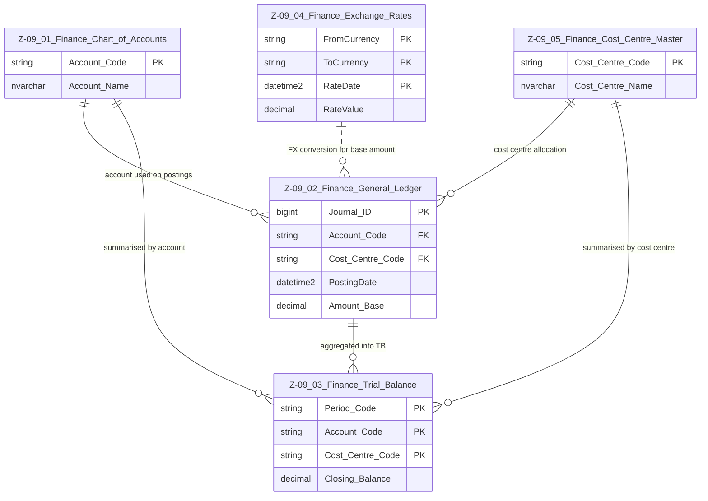

# Data Entity Specification: Z-09 Finance Domain Master

| **Document ID** | **Version** | **Status** | **Owner (Author)** | **Approved By** | **Approved On** |
| :--- | :--- | :--- | :--- | :--- | :--- |
| **Z-09** | 1.0.0 | **DRAFT** | Business Architect | Product Officer | |

## 1. Description & Scope

This document provides a **domain-level overview** of the **Z-09 Finance Family**, showing how the core finance entities relate to each other:

- **Z-09.01** – Finance Chart of Accounts  
- **Z-09.02** – Finance General Ledger  
- **Z-09.03** – Finance Trial Balance  
- **Z-09.04** – Finance Exchange Rates  
- **Z-09.05** – Finance Cost Centre Master  

Each individual entity has its own detailed specification (Z-09.01–Z-09.05).  
This master focuses on the **high-level relationships** between them.

---

## 2. Finance Domain Master ERD

---

## 3. Entity Roles in the Domain

| Entity ID | Name | Role in Domain |
| :--- | :--- | :--- |
| **Z-09.01** | Finance Chart of Accounts | Defines the financial account structure (master data). |
| **Z-09.02** | Finance General Ledger | Core transactional ledger; posts all financial events. |
| **Z-09.03** | Finance Trial Balance | Period-level summary by account and cost centre. |
| **Z-09.04** | Finance Exchange Rates | Provides FX conversion rates for base currency calculations. |
| **Z-09.05** | Finance Cost Centre Master | Defines management accounting / responsibility centres. |

---

## 4. Flow of Data

1. **Chart of Accounts (Z-09.01)** and **Cost Centres (Z-09.05)** define valid structural codes.  
2. **General Ledger (Z-09.02)** records postings, referencing:
   - `Account_Code` from Z-09.01  
   - `Cost_Centre_Code` from Z-09.05  
   - `Amount_Base` derived using Z-09.04 FX rates (when needed).  
3. **Trial Balance (Z-09.03)** aggregates Z-09.02 postings by:
   - Period  
   - Account  
   - Cost Centre  

This creates a clear, auditable path from **master data → transactions → summaries**.

---

## 5. Relationship Summary

| From | To | Relationship |
| :--- | :--- | :--- |
| Z-09.01 CoA | Z-09.02 GL | GL postings must reference a valid account. |
| Z-09.05 Cost Centres | Z-09.02 GL | GL postings may/must reference a valid cost centre. |
| Z-09.02 GL | Z-09.03 TB | TB aggregates GL by period, account, and cost centre. |
| Z-09.01 CoA | Z-09.03 TB | TB lines are grouped by chart of account. |
| Z-09.05 Cost Centres | Z-09.03 TB | TB lines are grouped by cost centre. |
| Z-09.04 FX | Z-09.02 GL | FX rates convert transaction amounts to base currency. |

---

## 6. Design Principles

- **Single Source of Truth per Concept**  
  - Accounts, Cost Centres, Exchange Rates, GL, and TB are all separated into their own governed entities.

- **One-Tier ERD per Entity**  
  - Each Z-09.0n spec shows only its direct relationships, to avoid diagram noise and duplication.

- **Clear Upstream and Downstream Flow**  
  - Master Data → Transactions → Summaries  
  - FX influences GL but does not alter master data.

---