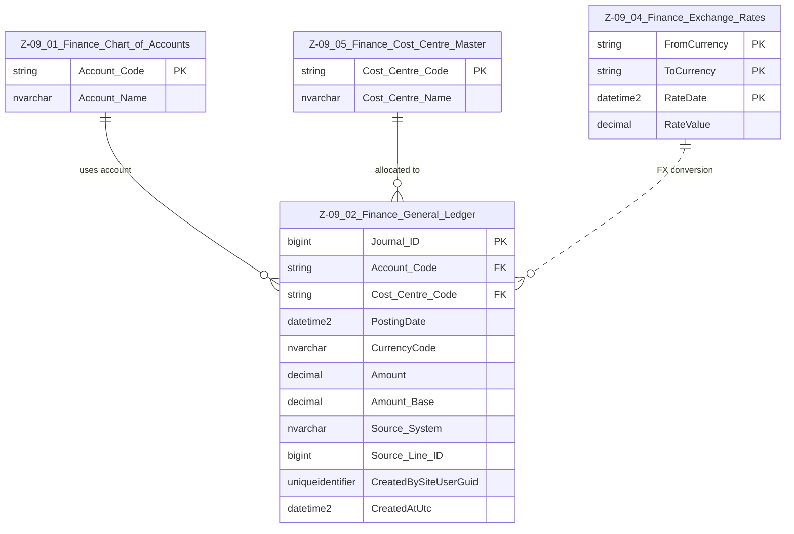

# Data Entity Specification: Z-09.02 Finance General Ledger

| **Document ID** | **Version** | **Status** | **Owner (Author)** | **Approved By** | **Approved On** |
| :--- | :--- | :--- | :--- | :--- | :--- |
| **Z-09.02** | 1.0.0 | **DRAFT** | Business Architect | Product Officer | |

## 1. Description & Scope

The **Finance General Ledger (GL)** is the central repository of all financial postings.  
This specification follows the **one-tier relationship rule**:  
**Only entities that connect directly to the GL appear in the ERD.**

## 2. ERD — One‑Tier View

## 3. Structure

| Feature | Column | Type | Purpose |
| :--- | :--- | :--- | :--- |
| **Primary Key** | Journal_ID | BIGINT | Unique row identifier. |
| **Account** | Account_Code | NVARCHAR(50) | Must exist in Z‑09.01. |
| **Cost Centre** | Cost_Centre_Code | NVARCHAR(50) | Must exist in Z‑09.05. |
| **Posting Date** | PostingDate | DATETIME2 | Determines period bucket. |
| **Currency** | CurrencyCode | NVARCHAR(10) | Origin transaction currency. |
| **Amount** | Amount | DECIMAL | Transaction‑currency value. |
| **Amount (Base)** | Amount_Base | DECIMAL | FX‑converted value using Z‑09.04. |
| **Source System** | Source_System | NVARCHAR(100) | System of origin (PROC, BILLING, HR, MANUAL_JE). |
| **Traceability** | Source_Line_ID | BIGINT | Links back to originating detail. |
| **Audit** | CreatedBySiteUserGuid, CreatedAtUtc | GUID, DATETIME | Accountability and compliance. |

## 4. Data Management

| Object Type | Name | Description |
| :--- | :--- | :--- |
| **Stored Procedure** | usp_Finance_PostJournal | Inserts and validates GL postings. |
| **Stored Procedure** | usp_Finance_PostRevaluation | Performs FX revaluation runs. |
| **Stored Procedure** | usp_Finance_ClosePeriod | Locks a period for adjustments. |
| **View** | vw_Finance_GL_With_CoA | Joins GL + CoA for reporting. |
| **View** | vw_Finance_GL_Period_Summary | Supplies data for Trial Balance (Z‑09.03). |
