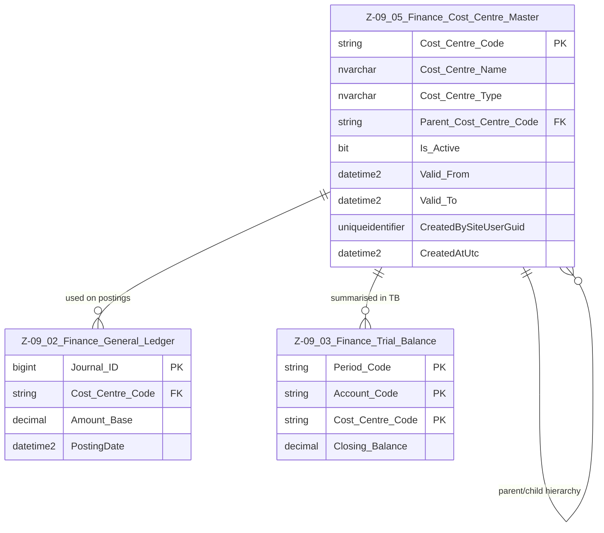

# Data Entity Specification: Z-09.05 Finance Cost Centre Master

| **Document ID** | **Version** | **Status** | **Owner (Author)** | **Approved By** | **Approved On** |
| :--- | :--- | :--- | :--- | :--- | :--- |
| **Z-09.05** | 1.0.0 | **DRAFT** | Business Architect | Product Officer | |

## 1. Description & Scope

The **Cost Centre Master** defines the organisational units used for **management accounting**, such as departments, teams, and responsibility centres.

Z-09.05 is the **authoritative list** of valid cost centres used by:

- The General Ledger (Z-09.02) for posting and allocation  
- The Trial Balance (Z-09.03) for period-end reporting  

This document follows the **one-tier relationship rule**: only **directly related** entities are shown in the ERD.

---

## 2. ERD — One-Tier View

---

## 3. Structure

### 3.1 Column Definitions

| Feature | Column | Type | Purpose |
| :--- | :--- | :--- | :--- |
| **Primary Key** | Cost_Centre_Code | NVARCHAR(50) | Unique identifier for each cost centre. |
| **Name** | Cost_Centre_Name | NVARCHAR(200) | Human-readable label (e.g., "Finance Dept – UK"). |
| **Type** | Cost_Centre_Type | NVARCHAR(50) | Classification: DEPARTMENT, TEAM, PROJECT, REGION, etc. |
| **Hierarchy** | Parent_Cost_Centre_Code | NVARCHAR(50) | Self-referencing parent for roll-up structures. |
| **Active Flag** | Is_Active | BIT | Controls lifecycle; inactive cost centres cannot be used for new postings. |
| **Validity From** | Valid_From | DATETIME2 | Start of validity period. |
| **Validity To** | Valid_To | DATETIME2 | End of validity period (NULL = open-ended). |
| **Audit – Created By** | CreatedBySiteUserGuid | UNIQUEIDENTIFIER | Identifies the user who created the record. |
| **Audit – Created At** | CreatedAtUtc | DATETIME2 | Timestamp for creation in UTC. |

---

## 4. Behaviour & Rules

- Every GL posting (Z-09.02) **may** or **must** reference a valid, active cost centre, depending on configuration.
- Cost centres can be **reorganised** via parent-child relationships without changing historical postings.
- Inactive cost centres:
  - Remain valid for historical data.
  - Must not be used on new GL postings or TB generations.
- Validity windows (`Valid_From`, `Valid_To`) allow time-bounded use (e.g., project cost centres).

---

## 5. Data Management

| Object Type | Name | Description |
| :--- | :--- | :--- |
| **Stored Procedure** | usp_Finance_CreateCostCentre | Creates new cost centres with validation and hierarchy checks. |
| **Stored Procedure** | usp_Finance_UpdateCostCentre | Updates descriptive data and hierarchy (parent) safely. |
| **Stored Procedure** | usp_Finance_DeactivateCostCentre | Marks a cost centre inactive and/or closes validity window. |
| **View** | vw_Finance_CostCentre_Hierarchy | Flattens the hierarchy for reporting and UI display. |

---
