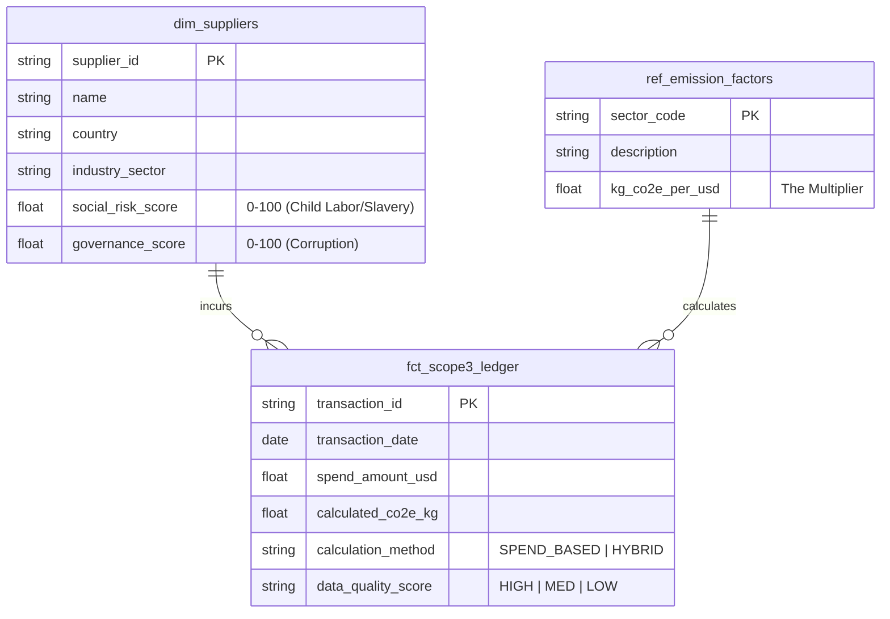

# Supplier ESG Data Model (Schema) 

| **Document ID** | **Version** | **Status** | **Owner (Author)** | **Approved By** |
| :--- | :--- | :--- | :--- | :--- |
| DM- | 1.1.0 | **DRAFT** | Business Architect | Product Officer |

## 1. Description & Scope 
Supplier ESG Impact falls under (Scope 3), we need a Data Model that links Financial Spend (Ingestion) to Non-Financial Impact (Carbon & Risk).
Three tables to tell the full story for an auditor:
* **dim_suppliers**: Who are they and what is their inherent ESG risk?
* **ref_emission_factors**: The lookup table (EEIO) converting Money to Carbon.
* **fct_scope3_ledger**: The transactional table calculating the actual impact.

The SQL DDL (Data Definition Language) script for your DAT-02 (Scope 3 Ledger).

### Data Entity Relationship Diagram

---
