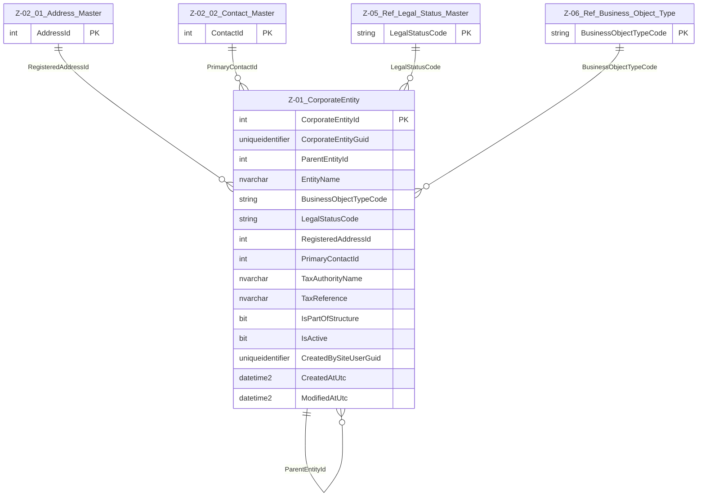

# Data Entity Specification: Z-01 CorporateEntity

| **Document ID** | **Version** | **Status** | **Owner (Author)** | **Approved By** | **Approved On** |
| :--- | :--- | :--- | :--- | :--- | :--- |
| Z-01 | 2.1.0 | **DRAFT** | Business Architect | Product Officer |  |

---

## 1. Description & Scope

The **Z-01 CorporateEntity** object defines the master structure used to represent any legal entity, subsidiary, branch, business unit, or organisational unit in the system.

It establishes:

- The **global unique identity** of each corporate entity  
- The **hierarchical parent–child structure** (group consolidation tree)  
- The **legal and operational classification** of each entity  
- The **linkages to address, contact, classification, and industry reference data**  
- The **audit trail** supporting ISO, regulatory, and financial compliance  

CorporateEntity is a **core master object** consumed by multiple domains (Tax, Finance, ESG, Procurement, Supply Chain, Risk, Compliance).

---

## 2. Master / Reference / Mapping Role

| Layer | Role |
|-----|-----|
| **Master** | Z-01 CorporateEntity |
| **Reference** | Z-05 Legal_Status_Master, Z-06 Business_Object_Type |
| **Mapping** | Z-01.03 Internal Classification, Z-01.05 Industry Map |

---

## 3. Referential Integrity Standard

> **Referential Integrity Standard**  
> All relationships involving CorporateEntity are **logical only**.  
> Referential correctness is enforced by application logic, governance workflows, and data‑quality processes.  
> No physical FOREIGN KEY constraints are created at database level.

Physical implementation:

- **Table**: `[Entity].[CorporateEntity]`

Logical references exist to:

- **Z-02.01 Address_Master**  
- **Z-02.02 Contact_Master**  
- **Z-03 CorporateEntity_Internal_Classification**  
- **Z-05 Legal_Status_Master**  
- **Z-06 Business_Object_Type**  
- **Z-01.05 CorporateEntity_Industry_Map**

---

## 4. Entity–Relationship Diagram

---

## 5. Table Definition

**Physical table name**: `[Entity].[CorporateEntity]`

| Column | Type | Null | Notes |
|------|------|------|------|
| `CorporateEntityId` | INT IDENTITY | NOT NULL | Internal surrogate key |
| `CorporateEntityGuid` | UNIQUEIDENTIFIER | NOT NULL | Global integration identifier |
| `ParentEntityId` | INT | NULL | Logical self‑reference hierarchy |
| `EntityName` | NVARCHAR(250) | NOT NULL | Legal or operating name |
| `BusinessObjectTypeCode` | NVARCHAR(50) | NOT NULL | Logical FK → Z‑06 Business_Object_Type |
| `LegalStatusCode` | NVARCHAR(50) | NOT NULL | Logical FK → Z‑05 Legal_Status_Master |
| `RegisteredAddressId` | INT | NULL | Logical FK → Z‑02.01 Address_Master |
| `PrimaryContactId` | INT | NULL | Logical FK → Z‑02.02 Contact_Master |
| `TaxAuthorityName` | NVARCHAR(250) | NULL | Snapshot reference |
| `TaxReference` | NVARCHAR(100) | NULL | Tax identifier |
| `IsPartOfStructure` | BIT | NOT NULL DEFAULT 1 | Included in roll‑ups |
| `IsActive` | BIT | NOT NULL DEFAULT 1 | Soft‑delete flag |
| `CreatedBySiteUserGuid` | UNIQUEIDENTIFIER | NOT NULL | Audit identity |
| `CreatedAtUtc` | DATETIME2(3) | NOT NULL | Creation timestamp |
| `ModifiedAtUtc` | DATETIME2(3) | NULL | Update timestamp |

---

## 6. Business Rules & Behaviour

- Every CorporateEntity **must** have a globally unique `CorporateEntityGuid`.
- The parent–child structure must form a **non‑cyclical tree**.
- `BusinessObjectTypeCode` and `LegalStatusCode` must reference valid, active codes.
- Inactive entities remain visible historically but cannot be assigned new downstream records.
- Structural or legal changes trigger a history write to **Z‑01.02 CorporateEntity_History**.

---

## 7. Architectural Role

CorporateEntity is the **root identity master** for the organisation.

All downstream domains — Finance, Tax, Procurement, ESG, Risk, Compliance — anchor to `CorporateEntityGuid` to ensure:

- Consistent legal identity
- Accurate consolidation
- Auditable organisational history

---
