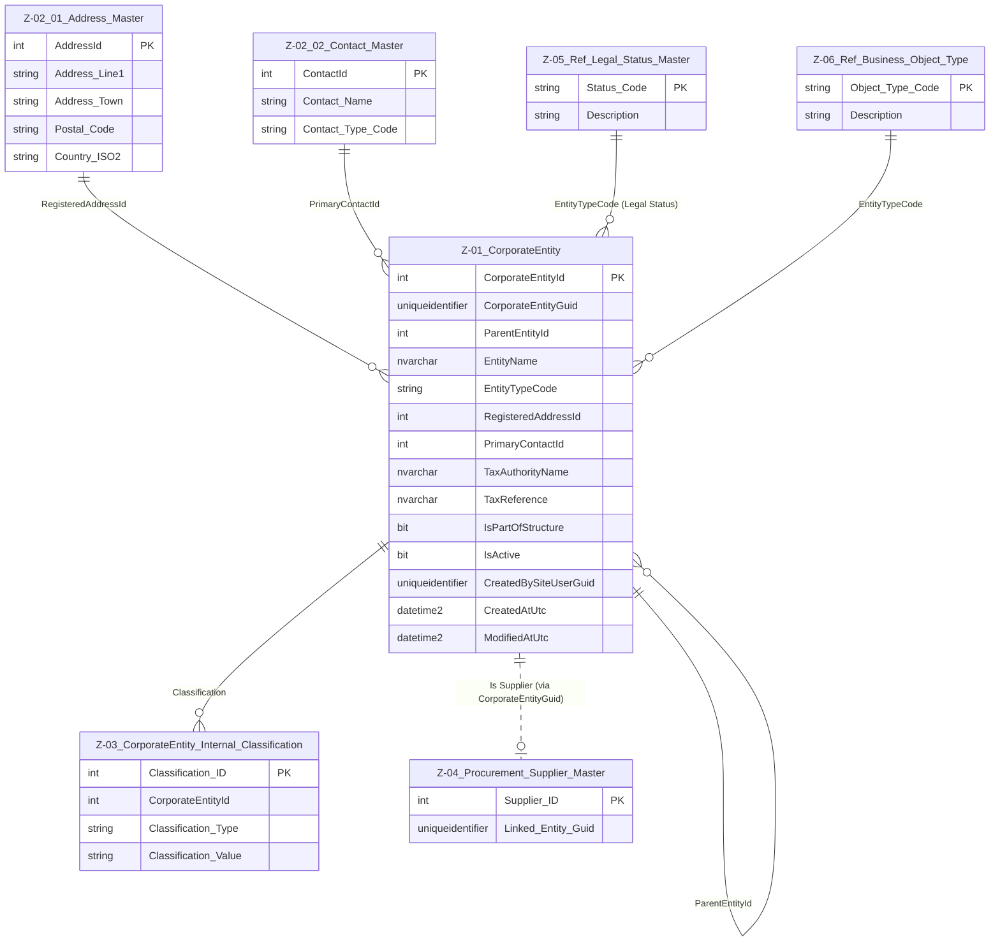

# Data Entity Specification: Z-01 CorporateEntity

| **Document ID** | **Version** | **Status** | **Owner (Author)** | **Approved By** | **Approved On** |
| :--- | :--- | :--- | :--- | :--- | :--- |
| Z-01 | 2.0.0 | **DRAFT** | Business Architect | Product Officer |  |

## 1. Description & Scope
The **Z-01 CorporateEntity** object defines the master structure used to represent any legal entity, subsidiary, branch, business unit, or organisational unit in the system.

It establishes:

- The **global unique identity** of each corporate entity  
- The **hierarchical parent-child structure** (group consolidation tree)  
- The **linkages to address, contact, supplier, classification, and legal status reference data**  
- The **audit trail** supporting ISO, regulatory, and financial compliance  

CorporateEntity is a **core object** consumed by multiple domains (Tax, Finance, ESG, Procurement, Supply Chain, etc.).

---

## 2. Referential Integrity Standard

> **Referential Integrity Standard**  
> Relationships involving CorporateEntity are **logical only** — application and reporting layers enforce correctness.  
> No physical FOREIGN KEY constraints are created at database level.

The physical implementation of the master entity is:

- **Table**: `[Entity].[CorporateEntity]`

CorporateEntity logically references:

- **Z-02.01 Address_Master** (Registered / Operational Address)
- **Z-02.02 Contact_Master** (Primary Contact)
- **Z-03 CorporateEntity_Internal_Classification**
- **Z-05 Legal_Status_Master**
- **Z-06 Business_Object_Type**
- **Z-04 Procurement_Supplier_Master**

---

## 3. Entity–Relationship Diagram (Updated)

---

## 4. Table Definition

### **Physical table name**: `[Entity].[CorporateEntity]`

| Column | Type | Null | Notes |
|--------|------|------|-------|
| `CorporateEntityId` | INT IDENTITY | NOT NULL | Internal primary key |
| `CorporateEntityGuid` | UNIQUEIDENTIFIER | NOT NULL | Global GUID used for cross-domain linking |
| `ParentEntityId` | INT | NULL | Logical FK → Z‑01 CorporateEntity self‑hierarchy |
| `EntityName` | NVARCHAR(250) | NOT NULL | Legal or operating name |
| `EntityTypeCode` | NVARCHAR(50) | NOT NULL | Logical FK → Z‑06 Business Object Type |
| `RegisteredAddressId` | INT | NULL | Logical FK → Z‑02.01 Address_Master |
| `PrimaryContactId` | INT | NULL | Logical FK → Z‑02.02 Contact_Master |
| `TaxAuthorityName` | NVARCHAR(250) | NULL | Snapshot reference |
| `TaxReference` | NVARCHAR(100) | NULL | Tax identifier |
| `IsPartOfStructure` | BIT | NOT NULL DEFAULT 1 | Used in roll‑ups, reporting |
| `IsActive` | BIT | NOT NULL DEFAULT 1 | Soft delete flag |
| `CreatedBySiteUserGuid` | UNIQUEIDENTIFIER | NOT NULL | Audit identity |
| `CreatedAtUtc` | DATETIME2(3) | NOT NULL | Creation timestamp |
| `ModifiedAtUtc` | DATETIME2(3) | NULL | Update timestamp |

---

## 5. Data Management

| Object Type | Name | Description |
|-------------|------|-------------|
| **Stored Procedure** | **usp_Z_01_CorporateEntity_Create** | Creates a new CorporateEntity record, validates `ParentEntityId`, `RegisteredAddressId` (Z-02.01), `PrimaryContactId` (Z-02.02), sets audit fields and default flags. |
| **Stored Procedure** | **usp_Z_01_CorporateEntity_Update** | Updates core identity, hierarchy, and reference pointers (address, contact, legal status, object type) while maintaining audit integrity. |
| **Stored Procedure** | **usp_Z_01_CorporateEntity_Get** | Retrieves a specific CorporateEntity by `CorporateEntityId` or `CorporateEntityGuid` for use by application services and integrations. |
| **View** | **vw_Z_01_CorporateEntity_AllActive** | Returns all active CorporateEntity records (`IsActive = 1`, `IsPartOfStructure` as required) for UI lists, reporting, and downstream consumers. |
| **History Table** | **[Entity].[CorporateEntity_History]** | Stores snapshots of key structural, legal, and classification attributes when materially changed, supporting audit and timeline analysis. |
| **Stored Procedure** | **usp_Z_01_CorporateEntity_WriteHistory** | Writes the current state of a CorporateEntity into `[Entity].[CorporateEntity_History]` when hierarchy, legal status, or other governed attributes are updated. |
| **Governance Process** | **Corporate Entity Stewardship Workflow** | Formal process controlling creation, modification, and deactivation of CorporateEntities, including approval for hierarchy changes and legal status updates. |
| **DQ Process** | **DQ_CorporateEntity_ValidationReport** | Data-quality checks to detect orphaned parent links, invalid or missing `RegisteredAddressId` / `PrimaryContactId`, inconsistent legal status or object type codes, and inactive entities still referenced by downstream records. |

---

## 6. Business Rules & Behaviour

- A CorporateEntity **must** have a globally unique `CorporateEntityGuid`.  
- The parent-child structure forms a **tree**, no circular references allowed.  
- `RegisteredAddressId` and `PrimaryContactId` must point to active Z‑02 records if populated.  
- Legal Status and Business Object Type must match allowed Z‑05 and Z‑06 values.  
- Entities marked `IsActive = 0` remain in history and reporting but cannot be assigned new downstream records.  

---

## 7. Architectural Role  
CorporateEntity is the **root identity object** for the entire organisation.  
All compliance, finance, supply chain, and ESG objects link back to a CorporateEntityGuid.

It defines:

- The consolidation boundaries  
- The reporting structure  
- The legal and operational identity of each organisational unit  

---