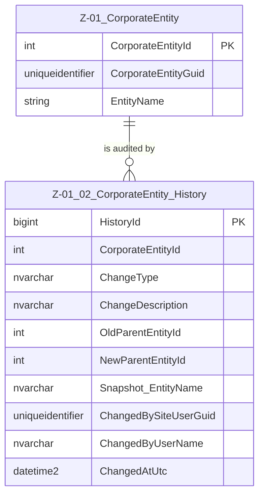

# Data Entity Specification: Z-01.02 CorporateEntity_History

| **Document ID** | **Version** | **Status** | **Owner (Author)** | **Approved By** | **Approved On** |
| :--- | :--- | :--- | :--- | :--- | :--- |
| **Z-01.02** | **1.0.0** | **DRAFT** | Business Architect | Product Officer | |

---

## 1. Description & Scope

The **Z-01.02 CorporateEntity_History** entity provides the permanent, append‑only audit log for all material changes made to **Z-01 CorporateEntity**.

This history ensures ISO9001-compliant traceability by capturing:

- **Who** made a change  
- **What** changed  
- **When** the change occurred  
- **Before/after hierarchy relationships**  
- **Snapshot identity values** ensuring stable historical reporting  

This document replaces the previous version and adheres to your updated naming, structure, and documentation standards.

---

## 2. Referential Integrity Standard

> **Referential Integrity Standard**  
> Relationships involving CorporateEntity_History are **logical only** — application and reporting layers enforce correctness.  
> No physical FOREIGN KEY constraints are created at database level.

Physical Implementations:

- **Master Entity** → `[Entity].[CorporateEntity]`  
- **Audit Log Entity** → `[Entity].[CorporateEntity_History]`

---

## 3. Entity–Relationship Diagram (ERD)

---

## 4. Corporate Entity History Structure

The `[Entity].[CorporateEntity_History]` table is essential for **audit and compliance**.  
It captures structural and identity changes that cannot be reconstructed from the live CorporateEntity record.

### Purpose
- Record hierarchy movements (parent/child position changes)  
- Log identity updates (names, classifications, operational status)  
- Satisfy ISO9001 and regulatory audit requirements  
- Provide historical snapshots for time‑based reporting  

---

## 5. Detailed Attribute Specification

### **History Table Definition**

| Feature | Attribute / Column | Data Type | Primary Function |
|--------|---------------------|-----------|------------------|
| **Primary Key** | `HistoryId` | BIGINT IDENTITY | Unique row identifier for each change event |
| **Entity Link** | `CorporateEntityId` | INT | Logical reference to Z‑01 CorporateEntity |
| **Change Event Type** | `ChangeType` | NVARCHAR(50) | E.g., CREATE, UPDATE, DELETE, PARENT_CHANGE |
| **Description** | `ChangeDescription` | NVARCHAR(500) | Human‑readable explanation of the change |
| **Hierarchy Tracking** | `OldParentEntityId`, `NewParentEntityId` | INT | Tracks changes in organisational structure |
| **Snapshot Identity** | `Snapshot_EntityName` | NVARCHAR(256) | Captures the EntityName at time of change |
| **Audit Trail** | `ChangedBySiteUserGuid` | UNIQUEIDENTIFIER | Who made the change |
| **Audit Trail (User)** | `ChangedByUserName` | NVARCHAR(100) | Username recorded at change time |
| **Audit Timestamp** | `ChangedAtUtc` | DATETIME2 | When the change occurred |

---

## 6. Relationship to CorporateEntity

The following core attributes of the CorporateEntity feed into the history log:

| Feature | Attribute / Column | Description |
|--------|---------------------|-------------|
| **Internal Identifier** | `CorporateEntityId` | Surrogate key used internally |
| **Global Integration ID** | `CorporateEntityGuid` | Used externally across domains |
| **Hierarchy Link** | `ParentEntityId` | Defines consolidation structure |
| **Identity Fields** | (`EntityName`, others) | Snapshot taken when meaningful change occurs |

History entries **never update existing records** — the audit log is strictly append‑only.

---

## 7. Data Management

The history component now uses standardised naming:

| Object Type | Name | Description |
|-------------|------|-------------|
| **Stored Procedure** | **usp_Z_01_02_CorporateEntity_WriteHistory** | Writes an immutable audit record whenever a material change occurs to CorporateEntity. |
| **Stored Procedure** | **usp_Z_01_02_CorporateEntityHistory_GetByEntity** | Retrieves all history records for a specific CorporateEntity. |
| **View** | **vw_Z_01_02_CorporateEntity_History_All** | Exposes the full audit trail for reporting and governance dashboards. |
| **Governance Process** | **Corporate Entity Audit Workflow** | Ensures that all changes to CorporateEntity follow a controlled approval and auditing lifecycle. |
| **DQ Process** | **DQ_CorporateEntityHistory_ValidationReport** | Confirms complete and consistent audit records, detects missing hierarchy snapshots, validates user and timestamp integrity. |

---

## 8. Architectural Role

CorporateEntity_History forms the **permanent audit backbone** of the Z‑01 domain.  
It ensures that every significant modification:

- Is **captured**  
- Is **attributed**  
- Is **timestamped**  
- Remains **immutable**  

This enables full reconstruction of the organisation structure at any point in time.

---

