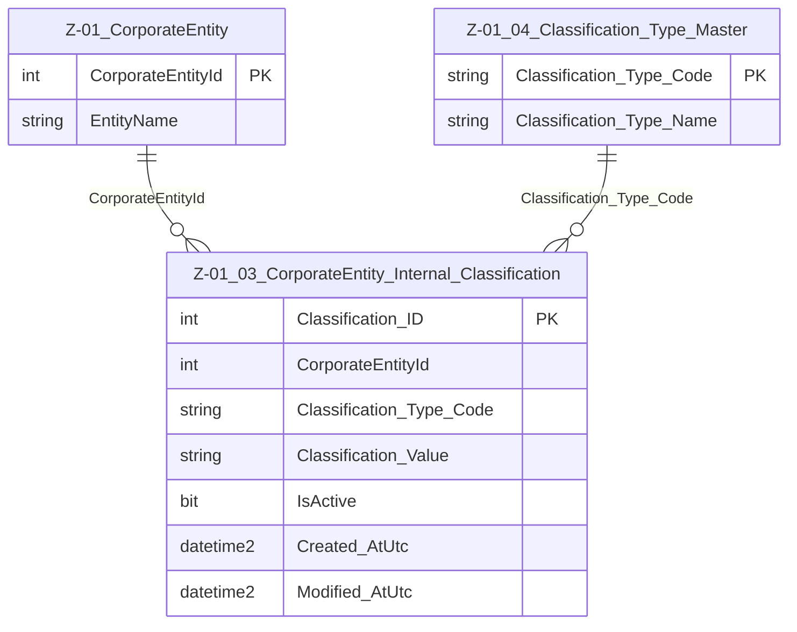

# Data Entity Specification: Z-01.03 CorporateEntity_Internal_Classification

| **Document ID** | **Version** | **Status** | **Owner (Author)** | **Approved By** | **Approved On** |
| :--- | :--- | :--- | :--- | :--- | :--- |
| Z-01.03 | 1.0.0 | **DRAFT** | Business Architect | Product Officer | |

## 1. Description & Scope
The **Z-01.03 CorporateEntity_Internal_Classification** entity defines organisational segmentation for CorporateEntities.  
Examples include:

- DIVISION  
- REGION  
- SEGMENT  
- MARKET CHANNEL  
- OPERATIONAL CLUSTER  

Each row assigns a classification **type** and **value** to a CorporateEntity.

This supports financial consolidation, reporting segmentation, compliance grouping, and hierarchical analytics.

---

## 2. Referential Integrity Standard

> **Referential Integrity Standard**  
> Relationships in this entity are **logical only** — correctness is enforced by application and reporting layers.  
> No physical FOREIGN KEY constraints exist in the database.

Physical implementation:

- **Table**: `[Entity].[CorporateEntity_Internal_Classification]`

---

## 3. Entity–Relationship Diagram (ERD)

---

## 4. Table Definition

| Column | Type | Nullability | Notes |
|--------|------|-------------|-------|
| `Classification_ID` | INT IDENTITY | NOT NULL | Primary key. |
| `CorporateEntityId` | INT | NOT NULL | Logical pointer → Z-01 CorporateEntity. |
| `Classification_Type_Code` | NVARCHAR(50) | NOT NULL | Logical FK → Z-01.04 Classification_Type_Master. |
| `Classification_Value` | NVARCHAR(250) | NOT NULL | The applied classification (e.g., “North Region”). |
| `IsActive` | BIT | NOT NULL DEFAULT 1 | Allows deactivation of historical or obsolete classifications. |
| `Created_AtUtc` | DATETIME2(3) | NOT NULL | Creation timestamp. |
| `Modified_AtUtc` | DATETIME2(3) | NULL | Update timestamp. |

---

## 5. Data Management

| Object Type | Name | Description |
|-------------|------|-------------|
| **Stored Procedure** | **usp_Z_01_03_InternalClassification_Create** | Creates a new classification for a CorporateEntity; validates type and value; sets audit fields. |
| **Stored Procedure** | **usp_Z_01_03_InternalClassification_Update** | Updates classification value or active flag; maintains audit integrity. |
| **Stored Procedure** | **usp_Z_01_03_InternalClassification_GetByEntity** | Returns all classifications for a given CorporateEntity. |
| **View** | **vw_Z_01_03_InternalClassification_AllActive** | Exposes all active classifications for reporting and analytics. |
| **Governance Process** | **Internal Classification Stewardship Workflow** | Approves classification structures and ensures taxonomy consistency. |
| **DQ Process** | **DQ_InternalClassification_ValidationReport** | Identifies invalid type codes, inactive classifications, or orphaned entity links. |

---

## 6. Architectural Role
This entity provides the **segmentation backbone** for reporting groups, operational clusters, and compliance categories.  
Its link to Z-01.04 ensures controlled, governed classification use across the organisation.

---