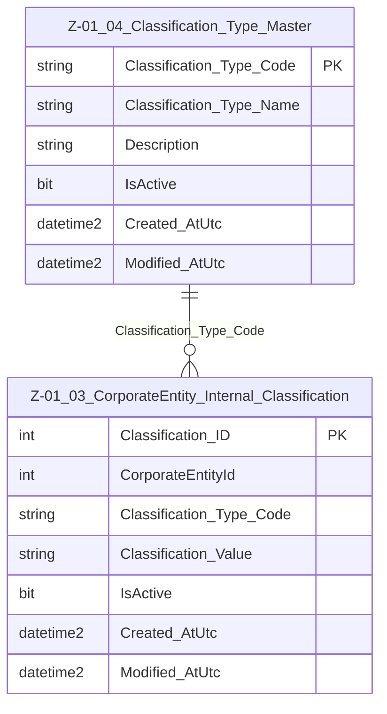

# Data Entity Specification: Z-01.04 Classification_Type_Master

| **Document ID** | **Version** | **Status** | **Owner (Author)** | **Approved By** | **Approved On** |
| :--- | :--- | :--- | :--- | :--- | :--- |
| Z-01.04 | 1.0.0 | **DRAFT** | Business Architect | Product Officer | |

## 1. Description & Scope
The **Z-01.04 Classification_Type_Master** entity defines the controlled vocabulary of classification types used in **Z-01.03 CorporateEntity_Internal_Classification**.

This ensures that organisational classifications (e.g. DIVISION, REGION, SEGMENT) follow a centrally governed, ISO9001-compliant model.

Classification types are **reference data** and must remain stable over time.

---

## 2. Referential Integrity Standard

> **Referential Integrity Standard**  
> Relationships involving Classification_Type_Master are **logical only** — validation occurs in application and reporting layers.  
> No physical FOREIGN KEY constraints exist in the database.

Physical implementation:

- **Table**: `[Ref].[Z_01_04_Classification_Type_Master]`

---

## 3. Entity–Relationship Diagram (ERD)

---

## 4. Table Definition

| Column | Type | Nullability | Notes |
|--------|------|-------------|-------|
| `Classification_Type_Code` | NVARCHAR(50) | NOT NULL | Primary key. Stable reference identifier. |
| `Classification_Type_Name` | NVARCHAR(250) | NOT NULL | Display label for UI and reporting. |
| `Description` | NVARCHAR(500) | NULL | Extended explanation. |
| `IsActive` | BIT | NOT NULL DEFAULT 1 | Allows soft deactivation. |
| `Created_AtUtc` | DATETIME2(3) | NOT NULL | Creation timestamp. |
| `Modified_AtUtc` | DATETIME2(3) | NULL | Modification timestamp. |

---

## 5. Data Management

| Object Type | Name | Description |
|-------------|------|-------------|
| **Stored Procedure** | **usp_Z_01_04_ClassificationType_Create** | Creates a new classification type; validates uniqueness; sets audit fields. |
| **Stored Procedure** | **usp_Z_01_04_ClassificationType_Update** | Updates name/description/activity state; prevents repurposing of codes. |
| **Stored Procedure** | **usp_Z_01_04_ClassificationType_Get** | Retrieves a classification type by code. |
| **View** | **vw_Z_01_04_ClassificationType_AllActive** | Returns all active types for UI selection and validation. |
| **Governance Process** | **Classification Stewardship Workflow** | Approves new types and manages controlled vocabulary changes. |
| **DQ Process** | **DQ_ClassificationType_ValidationReport** | Identifies inactive types still referenced or invalid classifications. |

---

## 6. Architectural Role
This entity ensures **classification consistency** across all CorporateEntity segmentation models and supports traceable governance for organisational taxonomy.

---