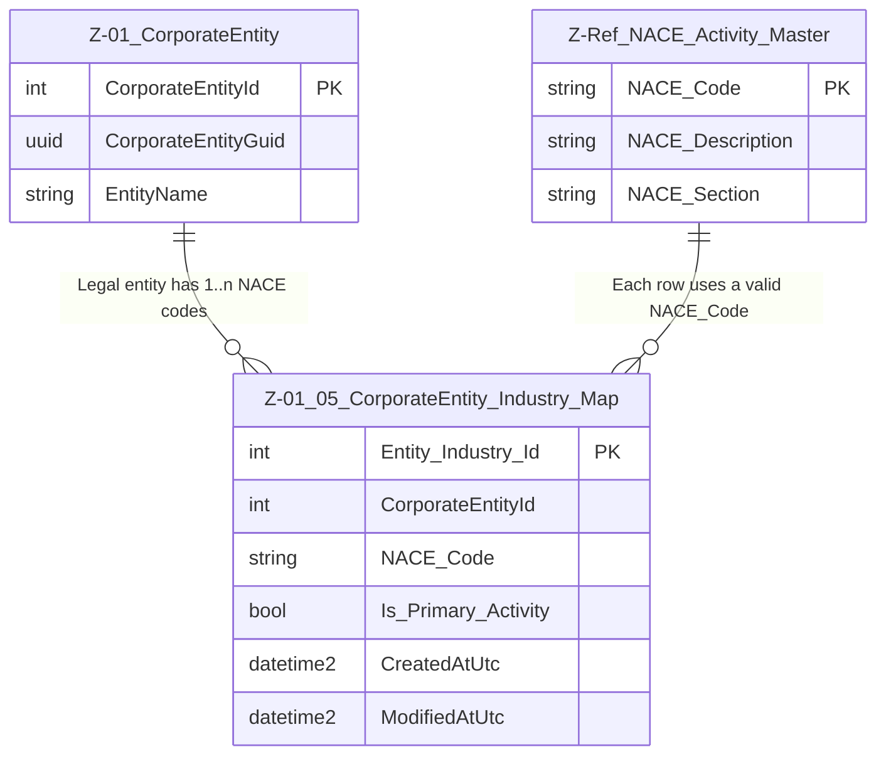

# Data Entity Specification: Z-01.05 CorporateEntity_Industry_Map

| **Document ID** | **Version** | **Status** | **Owner (Author)** | **Approved By** | **Approved On** |
| :--- | :--- | :--- | :--- | :--- | :--- |
| **Z-01.05** | 1.0.0 | **DRAFT** | Business Architect | Product Officer |  |

---

## 1. Description & Scope

The **Z-01.05 CorporateEntity_Industry_Map** entity defines the relationship between a **CorporateEntity (Z-01)** and its one or more **industry classifications** (e.g. NACE codes).

It is designed to:

- Store **legal / regulatory industry classifications** for each CorporateEntity.
- Allow **multiple codes per entity** (primary and secondary activities).
- Provide a single, governed source of truth for:
  - Risk and compliance processes (KYC / AML / credit risk).
  - ESG materiality assessment (which sectors an entity operates in).
  - Procurement and finance functions that consume legal industry information.

This mapping exists **at the CorporateEntity level** and is conceptually separate from:

- **Supplier activity mapping in Z-04** (which describes *what we buy from a supplier*), and
- Any internal product / service categorisation.

Z-01.05 is part of the **CorporateEntity family** and complements the existing:

- **Z-01 CorporateEntity** – legal identity master  
- **Z-01.02 CorporateEntity_History** – structural change log  
- **Z-01.03 CorporateEntity_Internal_Classification** – internal roles such as `SUPPLIER`, `CUSTOMER`, etc.

---

## 2. Referential Integrity Standard

> **Referential Integrity Standard**  
> Relationships involving CorporateEntity_Industry_Map are **logical only** — application and reporting layers enforce correctness.  
> No physical FOREIGN KEY constraints are created at database level.

Physical implementation of this entity is:

- **Table**: `[Entity].[Z_01_05_CorporateEntity_Industry_Map]`

Logical (soft) relationships exist to:

- `[Entity].[CorporateEntity]` (Z-01)  
- `[Ref].[NACE_Activity_Master]` (or equivalent reference-domain table)

---

## 3. ERD — Context (One Tier)

---

## 4. Table Definition

**Physical table name**: `[Entity].[Z_01_05_CorporateEntity_Industry_Map]`

Each row indicates that a given **CorporateEntity** is associated with a particular **NACE code**, and whether that code is the **primary** one for that entity.

| Column | Type | Nullability | Role | Notes |
|--------|------|-------------|------|-------|
| `Entity_Industry_Id` | INT IDENTITY(1,1) | NOT NULL | Primary Key | Surrogate key for the map row. |
| `CorporateEntityId` | INT | NOT NULL | Entity link | Logical pointer to `[Entity].[CorporateEntity].CorporateEntityId`. |
| `NACE_Code` | NVARCHAR(10) | NOT NULL | Industry code | Logical pointer to `[Ref].[NACE_Activity_Master].NACE_Code`. |
| `Is_Primary_Activity` | BIT | NOT NULL (default 0) | Flag | True if this is the **primary** NACE classification for the entity. |
| `CreatedBySiteUserGuid` | UNIQUEIDENTIFIER | NULL | Audit | Who created the row. |
| `CreatedAtUtc` | DATETIME2(3) | NOT NULL | Audit | When the row was created. |
| `ModifiedBySiteUserGuid` | UNIQUEIDENTIFIER | NULL | Audit | Who last modified the row. |
| `ModifiedAtUtc` | DATETIME2(3) | NULL | Audit | When the row was last modified. |

> **Implementation note**  
> Business rules should ensure that **at most one** row per `CorporateEntityId` has `Is_Primary_Activity = 1`.  
> Additional NACE codes for the same entity represent secondary or ancillary activities.

---

## 5. Behaviour & Business Rules

- Every CorporateEntity **may** have one or more NACE codes assigned.
- At least one NACE code **should** be present for entities subject to regulatory or ESG reporting, but this may not be mandatory for all entity types.
- Exactly one row per entity should be marked `Is_Primary_Activity = 1` when NACE classification is in scope.
- All `NACE_Code` values **must** exist in the reference table `[Ref].[NACE_Activity_Master]`.
- NACE codes in this map describe the **legal/regulatory industry classification** of the entire entity, not the activity of a specific supplier agreement or contract (see Z-04 Supplier_Activity_Map for that).

---

## 6. Data Management

| Object Type | Name | Description |
|-------------|------|-------------|
| **Stored Procedure** | **usp_Z_01_05_EntityIndustry_Add** | Adds a new NACE code mapping for a CorporateEntity; validates NACE code and ensures only one primary per entity. |
| **Stored Procedure** | **usp_Z_01_05_EntityIndustry_Update** | Updates an existing mapping (e.g. toggling primary flag or correcting NACE code under governance rules). |
| **Stored Procedure** | **usp_Z_01_05_EntityIndustry_Remove** | Deactivates or removes an existing mapping subject to audit/governance constraints. |
| **Stored Procedure** | **usp_Z_01_05_EntityIndustry_GetByEntity** | Retrieves all NACE codes for a given CorporateEntity. |
| **View** | **vw_Z_01_05_EntityIndustry_PrimaryOnly** | Exposes each CorporateEntity with its single primary NACE code for reporting and integration. |
| **Governance Process** | **Entity_Industry_Classification_Workflow** | Defines how NACE codes are proposed, reviewed, and approved for CorporateEntities. |
| **DQ Process** | **DQ_Entity_Industry_ValidationReport** | Identifies entities with missing primary NACE codes, invalid codes, or multiple primaries. |

---

## 7. Architectural Role

Z-01.05 **CorporateEntity_Industry_Map** is the **canonical source** of legal/regulatory industry classification for CorporateEntities.  

It supports:

- Risk and compliance functions (e.g. KYC, AML, sector sanctions).
- ESG teams needing to understand which industries are represented in the group.
- Procurement and Finance functions that must align transactional views (Z-04, Z-09) with the underlying legal identity and industry exposure.

It complements, but does not replace:

- **Z-04.02 Supplier_Activity_Map**, which describes the *procured activities* associated with a Supplier, and  
- Any domain-specific classification schemes that sit on top of NACE for operational or commercial purposes.

---