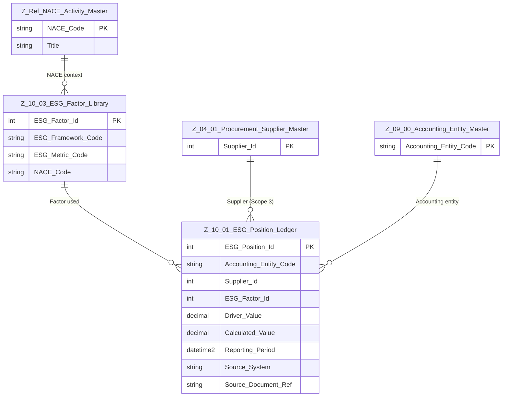

# Data Entity Specification: Z-10.01 ESG Position Ledger (Actual ESG Impact)

| **Document ID** | **Version** | **Status** | **Owner (Author)** | **Approved By** | **Approved On** |
| :--- | :--- | :--- | :--- | :--- | :--- |
| Z-10.01 | 2.0.0 | **DRAFT** | Business Architect | Product Officer |  |

---

## 1. Description & Scope

The **Z-10.01 ESG Position Ledger** captures **actual ESG impact** for a given reporting period.

Each row represents the result of applying a **single ESG factor** from **Z-10.03 ESG_Factor_Library** to a *driver value* such as:

- Financial spend (e.g. AP invoice line, GL posting)
- Resource consumption (e.g. kWh, tonnes, m³)
- Other operational metrics

In line with the cross-domain design:

- The ledger **does not store NACE codes directly**.  
- NACE sector information is resolved via the **factor** used:

> `ESG_Position_Ledger.ESG_Factor_Id → ESG_Factor_Library.NACE_Code → NACE_Activity_Master`

This keeps the ledger lean while still allowing sector-based reporting and alignment with NACE classification.

---

## 2. Referential Integrity Standard

> **Referential Integrity Standard**  
> All relationships are **logical only** — application and reporting layers enforce correctness.  
> No physical FOREIGN KEY constraints are created at database level.

Logical references:

- `ESG_Factor_Id` → **Z-10.03 ESG_Factor_Library**
- `Supplier_Id` → **Z-04.01 Procurement_Supplier_Master** (for Scope 3 purchased goods/services)
- `Accounting_Entity_Code` → **Z-09.00 Accounting_Entity_Master**

Physical implementation:

- **Table**: `[ESG].[Z_10_01_ESG_Position_Ledger]`

---

## 3. Entity–Relationship Diagram (Context)

---

## 4. Table Definition

**Physical table name**: `[ESG].[Z_10_01_ESG_Position_Ledger]`

Each row is a **calculated ESG position** for a specific combination of:

- Accounting entity  
- (Optionally) supplier  
- ESG factor  
- Reporting period  

| Column | Type | Nullability | Role | Notes |
|--------|------|-------------|------|-------|
| `ESG_Position_Id` | INT IDENTITY(1,1) | NOT NULL | Primary key | Unique identifier for each ESG position row. |
| `Accounting_Entity_Code` | NVARCHAR(50) | NOT NULL | Internal entity | Logical FK → Z-09.00 Accounting_Entity_Master. |
| `Supplier_Id` | INT | NULL | Supplier | Logical FK → Z-04.01 Procurement_Supplier_Master. Used mainly for Scope 3 purchased goods/services. |
| `ESG_Factor_Id` | INT | NOT NULL | Factor link | Logical FK → Z-10.03 ESG_Factor_Library. The factor carries NACE and metric context. |
| `Driver_Value` | DECIMAL(18,6) | NOT NULL | Driver | The value the factor is applied to (e.g. monetary spend, kWh, tonnes). |
| `Calculated_Value` | DECIMAL(18,6) | NOT NULL | ESG result | Result of applying the factor to the driver (e.g. kgCO2e). |
| `Reporting_Period` | DATETIME2(3) | NOT NULL | Period | Period end or reference date for the ESG position. |
| `Source_System` | NVARCHAR(100) | NULL | Provenance | Source system or pipeline that produced this record. |
| `Source_Document_Ref` | NVARCHAR(100) | NULL | Traceability | Reference to invoice, PO, GL document, ticket, etc. |
| `CreatedAtUtc` | DATETIME2(3) | NOT NULL | Audit | Creation timestamp (UTC). |
| `ModifiedAtUtc` | DATETIME2(3) | NULL | Audit | Last modification timestamp (UTC). |

> **NACE usage note**  
> NACE is **not stored as a column** in this table. It is derived through the factor chain:  
> `ESG_Position_Ledger.ESG_Factor_Id → ESG_Factor_Library.NACE_Code → NACE_Activity_Master`.

---

## 5. Data Management

### 5.1 Stored Procedures & Views

| Object Type | Name | Description |
|-------------|------|-------------|
| **Stored Procedure** | **usp_Z_10_01_ESG_Position_Insert** | Inserts new ESG positions after factor application. Validates `ESG_Factor_Id` and `Accounting_Entity_Code`. |
| **Stored Procedure** | **usp_Z_10_01_ESG_Position_Recalc** | Recalculates positions for a given period if factor values or drivers change within governed windows. |
| **View** | **vw_Z_10_01_ESG_Position_WithNACE** | Exposes ESG positions joined to factors and NACE to support sector-based reporting without modifying the ledger schema. |
| **DQ Process** | **DQ_ESG_Position_OrphanCheck** | Detects rows with invalid `ESG_Factor_Id`, missing accounting entity, or inconsistent supplier mappings. |

### 5.2 Governance

- Changes to the factor library (Z-10.03) that materially impact positions must follow **ESG Factor Stewardship** rules.  
- Recalculation of historical positions is controlled by **period lock** and **audit requirements**.

---

## 6. Business Rules & Behaviour

- Every position must link to **exactly one** `ESG_Factor_Id`.  
- Positions **must not** be overwritten for **closed** reporting periods. Any correction should be implemented as a **new adjusting entry** with its own `ESG_Position_Id`.  
- When Scope 3 purchased goods/services are in scope, `Supplier_Id` should be populated and valid.  
- NACE sector analysis is performed by joining:
  - `Z_10_01_ESG_Position_Ledger` → `Z_10_03_ESG_Factor_Library` → `Z_Ref_NACE_Activity_Master`.  
- The same factor and NACE semantics are reused for both **actuals** (this ledger) and **forecasts** (Z-10.02).

---

## 7. Architectural Role

The ESG Position Ledger is the **single source of truth for realised ESG impact** across the organisation:

- It is fed by Finance and operational systems, combined with factors from Z-10.03.  
- It enables consistent, auditable reporting for:
  - Scope 1, 2, and 3 emissions  
  - Other ESG metrics (water, waste, etc.)  
- Because NACE is resolved through the factor layer, the ledger remains structurally simple while still supporting:
  - Sector-based aggregation  
  - Regulatory and CSRD-aligned disclosure  
  - ISO9001-grade traceability and reproducibility.

---