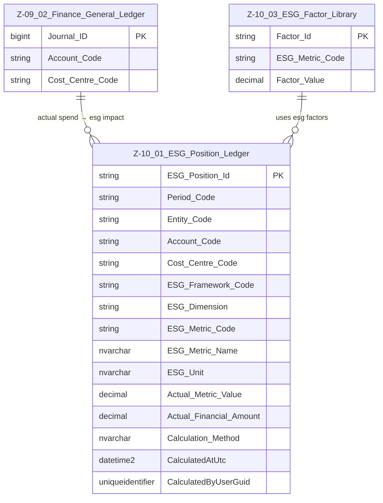

# Data Entity Specification: Z-10.01 ESG_Position_Ledger (Actual ESG Impact)

| **Document ID** | **Version** | **Status** | **Owner (Author)** | **Approved By** | **Approved On** |
| :--- | :--- | :--- | :--- | :--- | :--- |
| **Z-10.01** | 1.1.0 | **DRAFT** | Business Architect | Product Officer | |

---

## 1. Description & Scope

The **ESG Position Ledger** (**Z‑10.01**) captures the *actual* environmental, social, and governance impact associated with real financial activity.  
It consumes:

- Actual spend from the **Finance General Ledger (Z‑09.02)**  
- Active ESG factors from **Z‑10.03 ESG_Factor_Library**  
- Account and Cost Centre structure from the Finance domain

This entity supports **multiple ESG frameworks**, including but not limited to:

- SME Simple ESG Model  
- GHG Protocol (Scopes 1–3)  
- CSRD / ESRS  
- Internal ESG taxonomies

The design is **framework‑agnostic**, allowing multiple reporting layers to sit on the same ledger and reuse the same calculation base.

---

## 2. Referential Integrity Standard

> **Referential Integrity Standard**  
> Relationships involving ESG_Position_Ledger are **logical only** — application and reporting layers enforce correctness.  
> No physical FOREIGN KEY constraints are created at database level.

Physical implementation:

- **Table**: `[ESG].[Z_10_01_ESG_Position_Ledger]`

Logical relationships (no physical FKs) exist to:

- `[Finance].[Z_09_02_Finance_General_Ledger]` (actual spend)  
- `[ESG].[Z_10_03_ESG_Factor_Library]` (ESG factors)

---

## 3. ERD — One-Tier View



---

## 4. Structure

### 4.1 Column Definitions

| Column | Type | Purpose |
|--------|------|---------|
| `ESG_Position_Id` | NVARCHAR(50) | Unique row identifier for ESG metric output. |
| `Period_Code` | NVARCHAR(20) | Reporting period (month, quarter, year). |
| `Entity_Code` | NVARCHAR(50) | Optional entity/site reference. |
| `Account_Code` | NVARCHAR(50) | Finance account driving ESG conversion. |
| `Cost_Centre_Code` | NVARCHAR(50) | Cost centre for departmental attribution. |
| `ESG_Framework_Code` | NVARCHAR(50) | SME_SIMPLE, GHG_SCOPE3, CSRD_ESRS, INTERNAL, etc. |
| `ESG_Dimension` | NVARCHAR(10) | E, S, or G. |
| `ESG_Metric_Code` | NVARCHAR(50) | Identifier for ESG metric (CO2E, E1, G1, etc.). |
| `ESG_Metric_Name` | NVARCHAR(200) | Human‑readable metric label. |
| `ESG_Unit` | NVARCHAR(50) | kgCO2e, score_0_100, %, hours, etc. |
| `Actual_Metric_Value` | DECIMAL | The calculated ESG impact. |
| `Actual_Financial_Amount` | DECIMAL | Financial basis used in calculation. |
| `Calculation_Method` | NVARCHAR(200) | Description of how the metric was derived. |
| `CalculatedAtUtc` | DATETIME2 | Timestamp of calculation. |
| `CalculatedByUserGuid` | UNIQUEIDENTIFIER | Audit trail (who performed the calculation or loaded the data). |

---

## 5. Behaviour

- Converts **actual financial spend** into **actual ESG impacts** using factors from Z‑10.03.  
- Supports **multiple ESG frameworks** simultaneously on the same ledger row set.  
- Enables multi‑metric reporting across environmental, social, and governance dimensions.

Example conversions:

```text
CO2e          = Actual_Financial_Amount × Emission_Factor
Governance    = Actual_Financial_Amount × Supplier_Governance_Weighting
Social Impact = Actual_Financial_Amount × Social_Factor
```

---

## 6. Data Management

| Object Type | Name | Description |
|-------------|------|-------------|
| **Stored Procedure** | **usp_Z_10_01_ESG_Position_BuildFromGL** | Core procedure that reads from Z‑09.02 Finance General Ledger, joins to ESG_Factor_Library, and writes rows into `[ESG].[Z_10_01_ESG_Position_Ledger]`. |
| **Stored Procedure** | **usp_Z_10_01_ESG_Position_RebuildPeriod** | Rebuilds ESG positions for a specified period/entity based on latest GL and factor data. |
| **Stored Procedure** | **usp_Z_10_01_ESG_Position_GetByPeriod** | Returns ESG positions for a given period, entity, framework, or metric filter. |
| **View** | **vw_Z_10_01_ESG_Position_SimpleModel** | SME‑simple rollup view for dashboards and regulatory summaries. |
| **View** | **vw_Z_10_01_ESG_Position_GHG** | GHG reporting format view (Scopes 1–3 aligned). |
| **View** | **vw_Z_10_01_ESG_Position_CSRD** | CSRD/ESRS aligned reporting view. |
| **Governance Process** | **ESG Actuals Calculation Workflow** | Controls when and how ESG positions are (re)calculated, reviewed, and approved. |
| **DQ Process** | **DQ_ESG_Position_ValidationReport** | Validates that all GL lines have appropriate factors, flags missing or inconsistent ESG metrics, and checks for stale calculations. |

---

## 7. Audit & Change Considerations

- ESG_Position_Ledger is typically **rebuildable** from source GL and factor tables, but may still require audit logs for calculation runs.  
- `CalculatedAtUtc` and `CalculatedByUserGuid` track when and by whom positions were generated.  
- Any overrides or manual adjustments should follow a **governed process** and may be stored in a separate adjustment table, not in this core ledger.

---