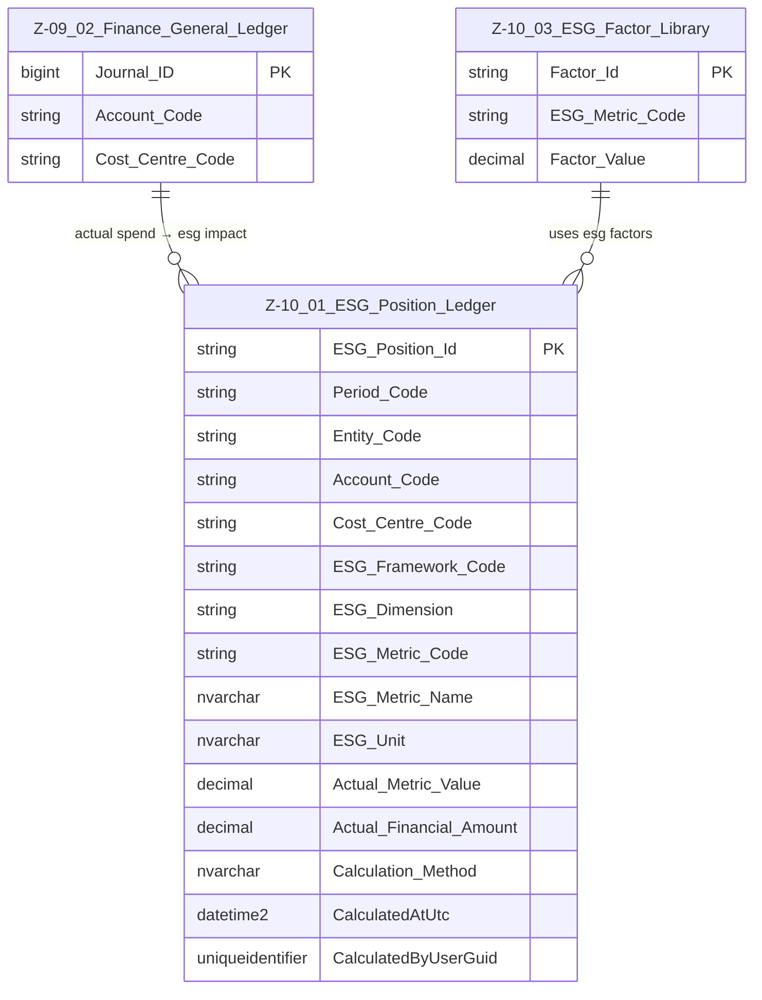

# Data Entity Specification: Z-10.01 ESG Position Ledger (Actual ESG Impact)

| **Document ID** | **Version** | **Status** | **Owner (Author)** | **Approved By** | **Approved On** |
| :--- | :--- | :--- | :--- | :--- | :--- |
| **Z-10.01** | 1.0.0 | **DRAFT** | Business Architect | Product Officer | |

---

## 1. Description & Scope

The **ESG Position Ledger** (Z‑10.01) captures the *actual* environmental, social, and governance impact associated with real financial activity.  
It consumes:

- Actual spend from the Finance General Ledger (Z‑09.02)  
- Active ESG factors from Z‑10.03  
- Account + Cost Centre structure from the Finance domain  

This entity supports **multiple ESG frameworks**, including:

- SME Simple ESG Model  
- GHG Protocol (Scopes 1–3)  
- CSRD / ESRS  
- Any internal or future ESG taxonomy  

The design is **framework‑agnostic**, allowing multiple reporting layers to sit on the same ledger.

---

## 2. ERD — One-Tier View



---

## 3. Structure

### 3.1 Column Definitions

| Column | Type | Purpose |
|--------|------|---------|
| **ESG_Position_Id** | NVARCHAR(50) | Unique row identifier for ESG metric output. |
| **Period_Code** | NVARCHAR(20) | Reporting period (month, quarter, year). |
| **Entity_Code** | NVARCHAR(50) | Optional entity/site reference. |
| **Account_Code** | NVARCHAR(50) | Finance account driving ESG conversion. |
| **Cost_Centre_Code** | NVARCHAR(50) | Cost centre for departmental attribution. |
| **ESG_Framework_Code** | NVARCHAR(50) | SME_SIMPLE, GHG_SCOPE3, CSRD_ESRS, INTERNAL, etc. |
| **ESG_Dimension** | NVARCHAR(10) | E, S, or G. |
| **ESG_Metric_Code** | NVARCHAR(50) | Identifier for ESG metric (CO2E, E1, G1, etc.). |
| **ESG_Metric_Name** | NVARCHAR(200) | Human‑readable metric label. |
| **ESG_Unit** | NVARCHAR(50) | kgCO2e, score_0_100, %, hours, etc. |
| **Actual_Metric_Value** | DECIMAL | The calculated ESG impact. |
| **Actual_Financial_Amount** | DECIMAL | Financial basis used in calculation. |
| **Calculation_Method** | NVARCHAR(200) | Description of how the metric was derived. |
| **CalculatedAtUtc** | DATETIME2 | Timestamp of calculation. |
| **CalculatedByUserGuid** | UNIQUEIDENTIFIER | Audit trail. |

---

## 4. Behaviour

- Converts *actual spend* → *actual ESG impacts*  
- Computes results across multiple frameworks  
- Supports multi‑metric reporting  

Examples:

```
CO2e = Actual_Spend × Emission_Factor
Governance = Spend × Supplier_Governance_Weighting
Social = Spend × Social_Factor
```

---

## 5. Data Management

| Type | Name | Purpose |
|------|------|---------|
| Stored Procedure | usp_ESG_BuildPosition_FromGL | Builds ESG Position rows from actual spend. |
| View | vw_ESG_Position_SimpleModel | SME‑simple rollup. |
| View | vw_ESG_Position_GHG | GHG reporting format. |
| View | vw_ESG_Position_CSRD | CSRD reporting view. |

---
