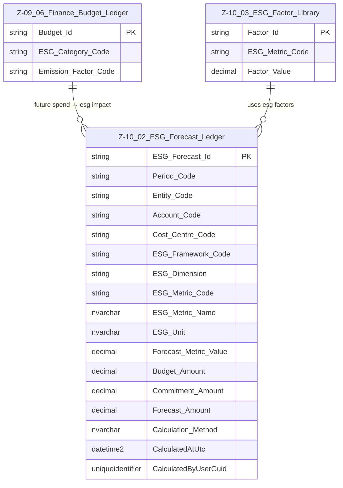

# Data Entity Specification: Z-10.02 ESG Forecast Ledger

| **Document ID** | **Version** | **Status** | **Owner (Author)** | **Approved By** | **Approved On** |
| :--- | :--- | :--- | :--- | :--- | :--- |
| **Z-10.02** | 1.0.0 | **DRAFT** | Business Architect | Product Officer | |

---

## 1. Description & Scope

The **ESG Forecast Ledger** (Z‑10.02) predicts future ESG outcomes using:

- Budget Ledger values (Z‑09.06)  
- Commitments  
- Forecast adjustments  
- Emission & social/governance factors (Z‑10.03)  

This entity models **future carbon, social, and governance impact** under any ESG framework.

---

## 2. ERD — One-Tier View



---

## 3. Structure

### 3.1 Column Definitions

| Column | Type | Purpose |
|--------|------|---------|
| **ESG_Forecast_Id** | NVARCHAR(50) | Unique row identifier. |
| **Period_Code** | NVARCHAR(20) | Forecast period. |
| **Entity_Code** | NVARCHAR(50) | Reporting entity / SME site. |
| **Account_Code** | NVARCHAR(50) | GL account to map forecast spend. |
| **Cost_Centre_Code** | NVARCHAR(50) | Cost centre used for attribution. |
| **ESG_Framework_Code** | NVARCHAR(50) | Framework applied (SME_SIMPLE, CSRD_ESRS, etc.). |
| **ESG_Dimension** | NVARCHAR(10) | E, S, G. |
| **ESG_Metric_Code** | NVARCHAR(50) | ESG metric being calculated. |
| **ESG_Metric_Name** | NVARCHAR(200) | Human‑readable metric name. |
| **ESG_Unit** | NVARCHAR(50) | Unit (kgCO2e, %, score). |
| **Forecast_Metric_Value** | DECIMAL | Forecasted metric value. |
| **Budget_Amount** | DECIMAL | Budget line from Z‑09.06. |
| **Commitment_Amount** | DECIMAL | Future contractual spend. |
| **Forecast_Amount** | DECIMAL | Updated forecast. |
| **Calculation_Method** | NVARCHAR(200) | How value was derived. |
| **CalculatedAtUtc** | DATETIME2 | Timestamp. |
| **CalculatedByUserGuid** | UNIQUEIDENTIFIER | Audit. |

---

## 4. Behaviour

Examples:

```
Forecast_CO2e = Forecast_Amount × Emission_Factor
Forecast_Social = Forecast_Amount × Social_Factor
Forecast_Governance = Forecast_Amount × Gov_Factor
```

Also supports scenario modelling.

---

## 5. Data Management

| Type | Name | Purpose |
|------|------|---------|
| Stored Procedure | usp_ESG_BuildForecast_FromBudget | Core forecast generator. |
| View | vw_ESG_Forecast_SimpleModel | SME‑simple projection view. |
| View | vw_ESG_Forecast_GHG | GHG projection. |
| View | vw_ESG_Forecast_CSRD | CSRD projection. |

---
