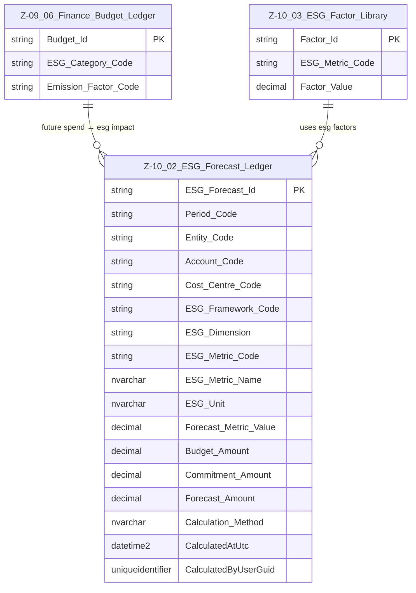

# Data Entity Specification: Z-10.02 ESG_Forecast_Ledger

| **Document ID** | **Version** | **Status** | **Owner (Author)** | **Approved By** | **Approved On** |
| :--- | :--- | :--- | :--- | :--- | :--- |
| **Z-10.02** | 1.1.0 | **DRAFT** | Business Architect | Product Officer | |

---

## 1. Description & Scope

The **ESG Forecast Ledger** (**Z‑10.02**) models **future ESG outcomes** using:

- Budget Ledger values (**Z‑09.06 Finance_Budget_Ledger**)  
- Contractual commitments  
- Forecast adjustments  
- Emission and social/governance factors from **Z‑10.03 ESG_Factor_Library** fileciteturn2file1

This entity supports **scenario modelling** and forward‑looking ESG analysis under any ESG framework.

---

## 2. Referential Integrity Standard

> **Referential Integrity Standard**  
> Relationships involving ESG_Forecast_Ledger are **logical only** — application and reporting layers enforce correctness.  
> No physical FOREIGN KEY constraints are created at database level.

Physical implementation:

- **Table**: `[ESG].[Z_10_02_ESG_Forecast_Ledger]`

Logical relationships (no physical FKs) exist to:

- `[Finance].[Z_09_06_Finance_Budget_Ledger]`  
- `[ESG].[Z_10_03_ESG_Factor_Library]`

---

## 3. ERD — One-Tier View



---

## 4. Structure

### 4.1 Column Definitions

| Column | Type | Purpose |
|--------|------|---------|
| `ESG_Forecast_Id` | NVARCHAR(50) | Unique row identifier. |
| `Period_Code` | NVARCHAR(20) | Forecast period (month, quarter, year). |
| `Entity_Code` | NVARCHAR(50) | Reporting entity / SME site. |
| `Account_Code` | NVARCHAR(50) | GL account to map forecast spend. |
| `Cost_Centre_Code` | NVARCHAR(50) | Cost centre used for attribution. |
| `ESG_Framework_Code` | NVARCHAR(50) | Framework applied (SME_SIMPLE, CSRD_ESRS, INTERNAL, etc.). |
| `ESG_Dimension` | NVARCHAR(10) | E, S, or G. |
| `ESG_Metric_Code` | NVARCHAR(50) | ESG metric being calculated. |
| `ESG_Metric_Name` | NVARCHAR(200) | Human‑readable metric name. |
| `ESG_Unit` | NVARCHAR(50) | Unit (kgCO2e, %, score). |
| `Forecast_Metric_Value` | DECIMAL | Forecasted ESG metric value. |
| `Budget_Amount` | DECIMAL | Budget amount from Z‑09.06. |
| `Commitment_Amount` | DECIMAL | Future contractual spend. |
| `Forecast_Amount` | DECIMAL | Updated forecast amount. |
| `Calculation_Method` | NVARCHAR(200) | Description of how the value was derived. |
| `CalculatedAtUtc` | DATETIME2 | Timestamp of calculation. |
| `CalculatedByUserGuid` | UNIQUEIDENTIFIER | Audit trail. |

---

## 5. Behaviour

Typical formula patterns include:

```text
Forecast_CO2e       = Forecast_Amount × Emission_Factor
Forecast_Social     = Forecast_Amount × Social_Factor
Forecast_Governance = Forecast_Amount × Governance_Factor
```

The ledger also supports **scenario modelling**, such as:

- Changing emission factors over time  
- Alternative budget/forecast assumptions  
- Different ESG frameworks applied to the same forecast base

---

## 6. Data Management

| Object Type | Name | Description |
|-------------|------|-------------|
| **Stored Procedure** | **usp_Z_10_02_ESG_Forecast_BuildFromBudget** | Core forecast generator. Reads Z‑09.06 Budget Ledger and ESG_Factor_Library to produce ESG_Forecast_Ledger rows. |
| **Stored Procedure** | **usp_Z_10_02_ESG_Forecast_RebuildPeriod** | Rebuilds forecast ESG metrics for a specified period/entity using the latest assumptions. |
| **Stored Procedure** | **usp_Z_10_02_ESG_Forecast_GetByScenario** | Returns forecast rows filtered by scenario, framework, entity, and period. |
| **View** | **vw_Z_10_02_ESG_Forecast_SimpleModel** | SME‑simple projection view. |
| **View** | **vw_Z_10_02_ESG_Forecast_GHG** | GHG projection view. |
| **View** | **vw_Z_10_02_ESG_Forecast_CSRD** | CSRD/ESRS projection view. |
| **Governance Process** | **ESG Forecast Stewardship Workflow** | Oversees scenario creation, approval, and locking of official forecast runs. |
| **DQ Process** | **DQ_ESG_Forecast_ValidationReport** | Identifies missing factors, broken code mappings, and inconsistent forecast vs budget/commitment totals. |

---

## 7. Audit & Change Considerations

- Forecast ledgers are typically **rebuildable** and/or **scenario‑driven**; audit focus is on:  
  - Which scenario was run  
  - Which factors and assumptions were used  
  - When and by whom it was run  
- Official regulatory forecasts may require **versioning** and separate sign‑off records at process level rather than row‑by‑row history in this table.

---