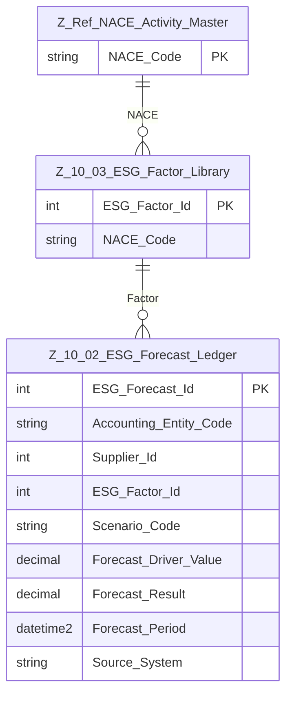

# Data Entity Specification: Z-10.02 ESG Forecast Ledger

| **Document ID** | **Version** | **Status** | **Owner (Author)** |
|---|---|---|---|
| Z-10.02 | 2.0.0 | **DRAFT** | Business Architect |

---

## 1. Description & Scope
The **Z-10.02 ESG Forecast Ledger** stores *projected* ESG impacts for future periods, using:
- ESG factors from **Z-10.03**  
- Forecast drivers (e.g., planned spend, forecast consumption)
- Scenario planning (baseline, best case, worst case)

It parallels **Z-10.01 Actual Ledger**, but includes **scenario + forecast horizon**.

NACE classification is inherited logically from the factor used.

---

## 2. Referential Integrity Standard
Logical-only relationships. Application/reporting enforce correctness.

Physical table:
- `[ESG].[Z_10_02_ESG_Forecast_Ledger]`

Logical references:
- `ESG_Factor_Id` → Z-10.03 ESG_Factor_Library  
- `Supplier_Id` → Procurement Supplier Master  
- `Accounting_Entity_Code` → Accounting Entity Master  

---

## 3. ERD

---

## 4. Table Definition
| Column | Type | Null | Notes |
|--------|------|------|-------|
| `ESG_Forecast_Id` | INT IDENTITY | PK | Unique record |
| `Accounting_Entity_Code` | NVARCHAR(50) | NOT NULL | Logical FK |
| `Supplier_Id` | INT | NULL | Scope 3 relevance |
| `ESG_Factor_Id` | INT | NOT NULL | Logical FK to factor |
| `Scenario_Code` | NVARCHAR(50) | NOT NULL | BASELINE / BEST / WORST |
| `Forecast_Driver_Value` | DECIMAL(18,6) | NOT NULL | Predicted consumption/spend |
| `Forecast_Result` | DECIMAL(18,6) | NOT NULL | Predicted ESG impact |
| `Forecast_Period` | DATETIME2 | NOT NULL | Future period |
| `Source_System` | NVARCHAR(100) | NULL | Origin |
| `CreatedAtUtc` | DATETIME2 | NOT NULL | Audit |
| `ModifiedAtUtc` | DATETIME2 | NULL | Audit |

---

## 5. Data Management
- `usp_Z_10_02_ESG_Forecast_Insert`
- `usp_Z_10_02_ESG_Forecast_RecalcScenario`
- `vw_Z_10_02_ESG_Forecast_WithNACE`
- `DQ_ESG_Forecast_ValidationReport`

---

## 6. Business Rules
- Forecasts cannot overwrite closed periods.
- Scenario must be valid per scenario master.
- Factors must remain active during forecast generation.
