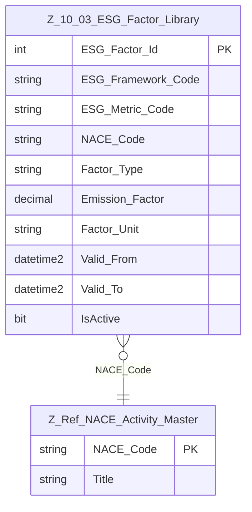

# Data Entity Specification: Z-10.03 ESG Factor Library

| **Document ID** | **Version** | **Status** | **Owner (Author)** |
|---|---|---|---|
| Z-10.03 | 2.0.0 | **DRAFT** | Business Architect |

---

## 1. Description & Scope
The **ESG Factor Library** (Z-10.03) defines the emission factors and ESG metrics used in:
- Z-10.01 Actual Ledger  
- Z-10.02 Forecast Ledger  

Each factor may correspond to:
- A greenhouse gas conversion factor  
- Water usage impact factor  
- Waste treatment factor  
- Any ESG metric defined by reporting framework  

Factors may be **NACE-specific** or **generic**.

---

## 2. Referential Integrity Standard
Logical-only relationships.  
No physical FKs.

Physical table:
- `[ESG].[Z_10_03_ESG_Factor_Library]`

---

## 3. ERD

---

## 4. Table Definition
| Column | Type | Null | Notes |
|--------|------|------|-------|
| `ESG_Factor_Id` | INT IDENTITY | PK |
| `ESG_Framework_Code` | NVARCHAR(50) | NOT NULL | e.g. DEFRA, GHG-P |
| `ESG_Metric_Code` | NVARCHAR(50) | NOT NULL | e.g. CO2E, CH4, H2O |
| `NACE_Code` | NVARCHAR(10) | NULL | Null = generic factor |
| `Factor_Type` | NVARCHAR(50) | NOT NULL | E.g., Emission, Water, Waste |
| `Emission_Factor` | DECIMAL(18,6) | NOT NULL |
| `Factor_Unit` | NVARCHAR(50) | NOT NULL | e.g., kgCO2e/kWh |
| `Valid_From` | DATETIME2 | NOT NULL |
| `Valid_To` | DATETIME2 | NULL |
| `IsActive` | BIT | NOT NULL DEFAULT 1 |
| `CreatedAtUtc` | DATETIME2 | NOT NULL |
| `ModifiedAtUtc` | DATETIME2 | NULL |

---

## 5. Data Management

| Z-Ref Code   | Object Type      | Name                                             | Description |
|--------------|------------------|--------------------------------------------------|-------------|
| Z_10_03_10   | Stored Procedure | usp_Z_10_03_ESG_Factor_Upsert                    | Inserts or updates an ESG factor while enforcing effective-date rules, preventing historical overwrites, and ensuring factor version integrity. |
| Z_10_03_11   | Stored Procedure | usp_Z_10_03_ESG_Factor_GetEffective              | Returns the effective ESG factor(s) for a given date, NACE Code, framework, or metric code. Used by ledger calculations (Z-10.01 & Z-10.02). |
| Z_10_03_12   | Stored Procedure | usp_Z_10_03_ESG_Factor_GetHistory                | Returns the historical sequence of factor values to support audit, reconciliation, and impact restatement analysis. |
| Z_10_03_13   | Stored Procedure | usp_Z_10_03_ESG_Factor_Deactivate                | Marks a factor inactive (without deletion); enforces replace-instead-of-modify governance. |
| Z_10_03_14   | View             | vw_Z_10_03_ESG_Factor_ByNACE                     | Exposes factors grouped by NACE code, enabling NACE-driven reporting and cross-reference into Z-10.01 & Z-10.02. |
| Z_10_03_40   | Stored Procedure | usp_Z_10_03_DQ_Factor_ValidityCheck              | Validates factor effective-date ranges, emissions values, unit formats, null titles, and invalid NACE references. |
| Z_10_03_41   | Stored Procedure | usp_Z_10_03_DQ_Factor_OverlapCheck               | Ensures no overlapping effective-date ranges for the same (Framework, Metric, NACE) combination. |
| Z_10_03_42   | Stored Procedure | usp_Z_10_03_DQ_Factor_NACECheck                  | Ensures that all referenced NACE Codes exist and are tied to the correct NACE version. |
| Z_10_03_43   | Stored Procedure | usp_Z_10_03_DQ_Factor_UnitCheck                  | Ensures unit codes follow approved ESG measurement conventions (kgCO2e/kWh, etc.). |
| Z_10_03_44   | Stored Procedure | usp_Z_10_03_DQ_Factor_EffectiveWindowCheck       | Ensures `Valid_From` and `Valid_To` ranges are chronologically valid and logically continuous. |
| Z_10_03_50   | DQ Process       | DQ_Z_10_03_Factor_DataQualitySuite               | Master Data Quality suite aggregating all Z-10.03 DQ procedures (40–44). Required for audit assurance across all ESG factor usage. |

---

## 6. Business Rules
- Factors cannot change historically: updates require new version.
- NACE-specific factors override generic factors.
- Only active factors can be used for ledger calculations.
