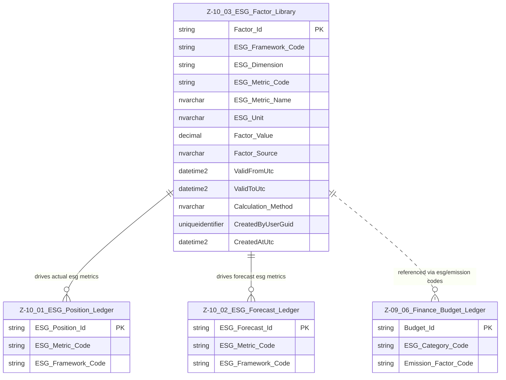

# Data Entity Specification: Z-10.03 ESG Factor Library

| **Document ID** | **Version** | **Status** | **Owner (Author)** | **Approved By** | **Approved On** |
| :--- | :--- | :--- | :--- | :--- | :--- |
| **Z-10.03** | 1.0.1 | **DRAFT** | Business Architect | Product Officer | |

---

## 1. Description & Scope

The **ESG Factor Library** stores all environmental, social, and governance factors used by:

- **Z‑10.01** (ESG Position Ledger)  
- **Z‑10.02** (ESG Forecast Ledger)  
- **Z‑09.06** (Budget Ledger — ESG Enhanced)

This is the **central repository** for:

- Emission factors  
- Social uplift factors  
- Governance risk weightings  
- Framework‑specific ESG metric mappings  

It provides the **authoritative mapping** between:

- Financial structures (Account / Cost Centre / Budget Line via Z‑09.06), and  
- ESG metrics and frameworks (via Z‑10.01 and Z‑10.02)

---

## 2. ERD — One-Tier View



> The dotted link to **Z‑09.06** indicates a **soft/code-based** relationship (`Emission_Factor_Code`, `ESG_Category_Code`) consistent with your one‑tier rule.

---

## 3. Structure

### 3.1 Column-Level Definitions

| Column | Type | Purpose |
|--------|------|---------|
| **Factor_Id** | NVARCHAR(50) | Unique factor key. |
| **ESG_Framework_Code** | NVARCHAR(50) | SME_SIMPLE, GHG_SCOPE3, CSRD_ESRS, INTERNAL. |
| **ESG_Dimension** | NVARCHAR(10) | E, S, G. |
| **ESG_Metric_Code** | NVARCHAR(50) | Metric identifier. |
| **ESG_Metric_Name** | NVARCHAR(200) | Description of metric. |
| **ESG_Unit** | NVARCHAR(50) | Unit of measurement. |
| **Factor_Value** | DECIMAL | Emission factor, weight, multiplier. |
| **Factor_Source** | NVARCHAR(200) | DEFRA, CSRD Table, Supplier, Internal, etc. |
| **ValidFromUtc** | DATETIME2 | Active from. |
| **ValidToUtc** | DATETIME2 | Active until (nullable). |
| **Calculation_Method** | NVARCHAR(200) | How the factor is applied in formulas. |
| **CreatedByUserGuid** | UNIQUEIDENTIFIER | Audit. |
| **CreatedAtUtc** | DATETIME2 | Audit timestamp. |

---

## 4. Behaviour

Examples:

```
CO2e       = Spend × Factor_Value
Social     = Spend × Social_Factor
Governance = Spend × Governance_Weighting
```

In **Z‑09.06 Budget Ledger**, the fields:

- `Emission_Factor_Code`  
- `ESG_Category_Code`  

are used to **look up** the correct Z‑10.03 factor row.

This keeps Finance “thin” while ESG logic stays fully centralised.

---

## 5. Data Management

| Type | Name | Purpose |
|------|------|---------|
| Stored Procedure | `usp_ESG_LoadFactor` | Load new factors. |
| Stored Procedure | `usp_ESG_UpdateFactor` | Amend factor values while maintaining history. |
| View | `vw_ESG_Factors_Active` | Returns currently valid factors. |
| View | `vw_ESG_Factor_History` | Full audit trail of factor changes. |

---

## 6. Summary

Z‑10.03 is the **single source of truth** for all ESG calculation factors:

- Powers **actual ESG** (Z‑10.01)  
- Powers **forecast ESG** (Z‑10.02)  
- Connects **Finance budgets** (Z‑09.06) to ESG impact  
- Supports **multiple ESG frameworks in parallel**  
- Ensures consistent, traceable, auditable ESG modelling

