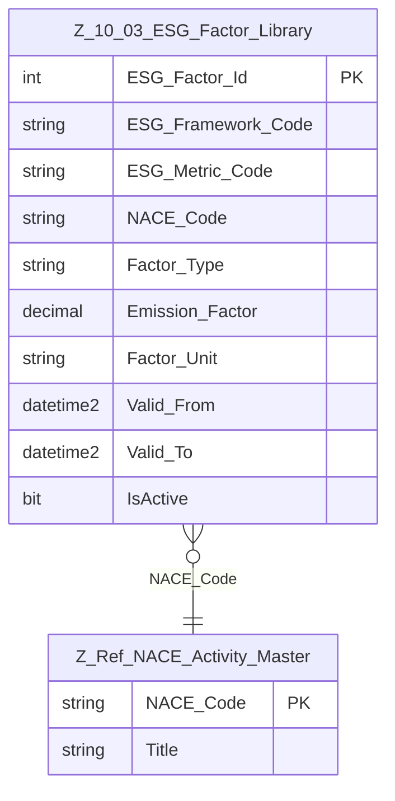

# Data Entity Specification: Z-10.03 ESG Factor Library

| **Document ID** | **Version** | **Status** | **Owner (Author)** |
|---|---|---|---|
| Z-10.03 | 2.0.0 | **DRAFT** | Business Architect |

---

## 1. Description & Scope
The **ESG Factor Library** (Z-10.03) defines the emission factors and ESG metrics used in:
- Z-10.01 Actual Ledger  
- Z-10.02 Forecast Ledger  

Each factor may correspond to:
- A greenhouse gas conversion factor  
- Water usage impact factor  
- Waste treatment factor  
- Any ESG metric defined by reporting framework  

Factors may be **NACE-specific** or **generic**.

---

## 2. Referential Integrity Standard
Logical-only relationships.  
No physical FKs.

Physical table:
- `[ESG].[Z_10_03_ESG_Factor_Library]`

---

## 3. ERD

---

## 4. Table Definition
| Column | Type | Null | Notes |
|--------|------|------|-------|
| `ESG_Factor_Id` | INT IDENTITY | PK |
| `ESG_Framework_Code` | NVARCHAR(50) | NOT NULL | e.g. DEFRA, GHG-P |
| `ESG_Metric_Code` | NVARCHAR(50) | NOT NULL | e.g. CO2E, CH4, H2O |
| `NACE_Code` | NVARCHAR(10) | NULL | Null = generic factor |
| `Factor_Type` | NVARCHAR(50) | NOT NULL | E.g., Emission, Water, Waste |
| `Emission_Factor` | DECIMAL(18,6) | NOT NULL |
| `Factor_Unit` | NVARCHAR(50) | NOT NULL | e.g., kgCO2e/kWh |
| `Valid_From` | DATETIME2 | NOT NULL |
| `Valid_To` | DATETIME2 | NULL |
| `IsActive` | BIT | NOT NULL DEFAULT 1 |
| `CreatedAtUtc` | DATETIME2 | NOT NULL |
| `ModifiedAtUtc` | DATETIME2 | NULL |

---

## 5. Data Management
- `usp_Z_10_03_ESG_Factor_Upsert`
- `usp_Z_10_03_ESG_Factor_GetEffective`
- `vw_Z_10_03_ESG_Factor_ByNACE`
- `DQ_ESG_Factor_ValidityReport`

---

## 6. Business Rules
- Factors cannot change historically: updates require new version.
- NACE-specific factors override generic factors.
- Only active factors can be used for ledger calculations.
