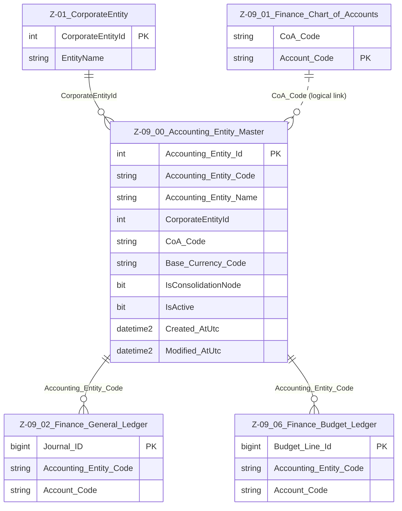

# Data Entity Specification: Z-09.00 Accounting_Entity_Master

| **Document ID** | **Version** | **Status** | **Owner (Author)** | **Approved By** | **Approved On** |
| :--- | :--- | :--- | :--- | :--- | :--- |
| **Z-09.00** | 1.0.0 | **DRAFT** | Business Architect | Product Officer | |

---

## 1. Description & Scope

The **Z-09.00 Accounting_Entity_Master** entity defines the *finance-facing representation* of legal entities and consolidation nodes used in the platform.

It provides the bridge between:

- **Z-01 CorporateEntity** (legal/group structure), and  
- **Z-09 Finance ledgers** (General Ledger, Budget Ledger, Trial Balance, etc.).  

Each row represents a single **Accounting Entity** – a unit to which financial postings, budgets, and ESG calculations can be attributed (e.g. a legal company, branch, or consolidation node).

Typical examples:

- `UK01` – UK Trading Company  
- `CH01` – Swiss Subsidiary  
- `GRP_EU` – European Consolidation Node  

The Accounting Entity then links to:

- One **CorporateEntity** (Z-01) for legal identity, and  
- One **Chart of Accounts** (Z-09.01) via `CoA_Code`.

---

## 2. Referential Integrity Standard

> **Referential Integrity Standard**  
> Relationships involving Accounting_Entity_Master are **logical only** — application and reporting layers enforce correctness.  
> No physical FOREIGN KEY constraints are created at database level.

Physical implementation:

- **Table**: `[Finance].[Z_09_00_Accounting_Entity_Master]`

Logical relationships (no physical FKs) exist to:

- `[Entity].[CorporateEntity]` (Z-01)  
- `[Finance].[Z_09_01_Finance_Chart_of_Accounts]` (via `CoA_Code`)  
- All Finance ledgers (Z-09.02, Z-09.06, etc.) via `Accounting_Entity_Code`

---

## 3. Entity–Relationship Diagram (ERD)

> **Note:** Z-09.02 and Z-09.06 will include an `Accounting_Entity_Code` column logically pointing back to Z-09.00.  
> CoA linkage is managed via `CoA_Code`.

---

## 4. Table Definition

### 4.1 Column Definitions

| Column | Type | Nullability | Notes |
|--------|------|-------------|-------|
| `Accounting_Entity_Id` | INT IDENTITY | NOT NULL | Surrogate primary key for internal use. |
| `Accounting_Entity_Code` | NVARCHAR(50) | NOT NULL | Stable business identifier used in all Finance ledgers (e.g. UK01, CH01). |
| `Accounting_Entity_Name` | NVARCHAR(200) | NOT NULL | Human-readable name (e.g. "UK Trading Company"). |
| `CorporateEntityId` | INT | NOT NULL | Logical pointer → Z-01 CorporateEntity (legal identity). |
| `CoA_Code` | NVARCHAR(50) | NOT NULL | Logical pointer to the applicable Chart of Accounts (Z-09.01). |
| `Base_Currency_Code` | CHAR(3) | NOT NULL | ISO 4217 currency code for accounting and reporting purposes. |
| `IsConsolidationNode` | BIT | NOT NULL DEFAULT 0 | 1 = consolidation-only node (no direct operational postings). |
| `IsActive` | BIT | NOT NULL DEFAULT 1 | Lifecycle flag; inactive entities should not receive new postings/budgets. |
| `Created_AtUtc` | DATETIME2(3) | NOT NULL | Creation timestamp in UTC. |
| `Modified_AtUtc` | DATETIME2(3) | NULL | Last modification timestamp in UTC. |

---

## 5. Behaviour & Business Rules

- Every **Accounting Entity** must be associated with a **CorporateEntity** (Z-01) where applicable.  
- `Accounting_Entity_Code` is the **canonical identifier** used in:

  - Z-09.02 Finance_General_Ledger  
  - Z-09.03 Finance_Trial_Balance  
  - Z-09.06 Finance_Budget_Ledger  
  - Z-10 ESG ledgers (Actual & Forecast) when attributing ESG positions to entities  

- `CoA_Code` ensures that each Accounting Entity is linked to the correct **Chart of Accounts**.  
- Consolidation nodes (`IsConsolidationNode = 1`) may not correspond 1:1 with a legal entity but must still have:
  - A clear purpose in group reporting  
  - Proper governance approval  

- Deactivating an Accounting Entity (`IsActive = 0`) must follow governance rules and should ensure:  
  - No open or future-dated transactions  
  - No active budgets or forecasts tied to the entity

---

## 6. Data Management

| Object Type | Name | Description |
|-------------|------|-------------|
| **Stored Procedure** | **usp_Z_09_00_AccountingEntity_Create** | Creates a new Accounting Entity, validates `CorporateEntityId`, assigns `CoA_Code`, sets base currency, and initial audit fields. |
| **Stored Procedure** | **usp_Z_09_00_AccountingEntity_Update** | Updates Accounting Entity name, mappings (CorporateEntity, CoA_Code), consolidation flag, and lifecycle. |
| **Stored Procedure** | **usp_Z_09_00_AccountingEntity_Get** | Retrieves Accounting Entity details by `Accounting_Entity_Code` or `Accounting_Entity_Id` for application services and integrations. |
| **Stored Procedure** | **usp_Z_09_00_AccountingEntity_Deactivate** | Applies lifecycle rules to deactivate an entity safely (`IsActive = 0`). |
| **View** | **vw_Z_09_00_AccountingEntity_AllActive** | Exposes all active Accounting Entities for UI selection, reporting, and downstream Finance/ESG processes. |
| **Governance Process** | **Accounting Entity Stewardship Workflow** | Controls creation, modification, mapping to CorporateEntity and CoA, and deactivation of Accounting Entities. |
| **DQ Process** | **DQ_AccountingEntity_ValidationReport** | Identifies Accounting Entities without valid CorporateEntityId or CoA_Code, inactive entities still used in ledgers, and currency inconsistencies. |

---

## 7. Architectural Role

Z-09.00 **Accounting_Entity_Master** is the **finance-facing view of the group structure**. It:

- Sits between **Z-01 CorporateEntity** and the **Z-09 Finance ledgers**  
- Determines **which entity** a posting, budget, or ESG position belongs to  
- Ensures that every financial and ESG record can be traced back to both:
  - A **legal entity** (via CorporateEntity), and  
  - A **Chart of Accounts** (via CoA_Code)

This makes it a **core master-data object** for Finance and ESG integration.

---