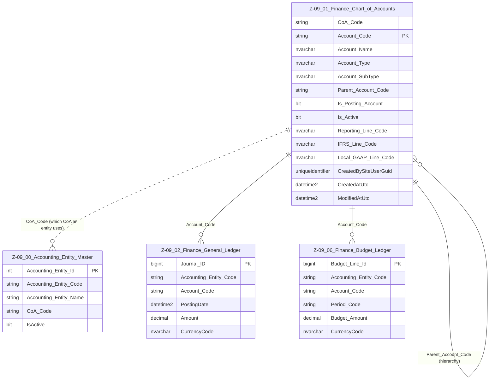

# Data Entity Specification: Z-09.01 Finance_Chart_of_Accounts

| **Document ID** | **Version** | **Status** | **Owner (Author)** | **Approved By** | **Approved On** |
| :--- | :--- | :--- | :--- | :--- | :--- |
| **Z-09.01** | 1.2.0 | **DRAFT** | Business Architect | Product Officer | |

---

## 1. Description & Scope

The **Finance Chart of Accounts (CoA)** is the master list of all financial accounts used for posting and reporting in the platform.

With the introduction of **Z-09.00 Accounting_Entity_Master**, the CoA supports:

- A **single group-wide CoA**, or  
- **Multiple Charts of Accounts**, distinguished by `CoA_Code` (e.g. `GRP`, `UK_GAAP`, `CH_LOCAL`).

Z-09.01 defines:

- The **accounting structure** (types, sub-types, hierarchies)  
- The **posting accounts** that can be used in Finance ledgers (Z-09.02, Z-09.06)  
- The **reporting mappings** required for internal, IFRS, and local GAAP views  

It is a **Tier‑1 master data object**, referenced logically by:

- **Z-09.00 Accounting_Entity_Master** (via `CoA_Code`)  
- **Z-09.02 Finance_General_Ledger** (via `Account_Code`)  
- **Z-09.03 Finance_Trial_Balance**  
- **Z-09.06 Finance_Budget_Ledger**  
- Procurement and ESG processes that rely on account categorisation.

---

## 2. Referential Integrity Standard

> **Referential Integrity Standard**  
> Relationships involving Finance_Chart_of_Accounts are **logical only** — application and reporting layers enforce correctness.  
> No physical FOREIGN KEY constraints are created at database level.

The physical implementation of this entity is:

- **Table**: `[Finance].[Z_09_01_Finance_Chart_of_Accounts]`

`CoA_Code` is used to logically group accounts into one or more distinct Charts of Accounts.  
`Account_Code` remains the **primary business key** within a given CoA.

---

## 3. Entity–Relationship Diagram (ERD) — One-Tier View

> **Note:** The ERD shows only **one tier** of relationships from Z‑09.01 — Accounting_Entity_Master and the main Finance ledgers.

---

## 4. Table Definition

### 4.1 Column Definitions

| Feature | Column | Type | Purpose |
| :--- | :--- | :--- | :--- |
| **CoA Identifier** | `CoA_Code` | NVARCHAR(50) | Identifies which Chart of Accounts this row belongs to (e.g. `GRP`, `UK_GAAP`). |
| **Primary Key** | `Account_Code` | NVARCHAR(50) | Business key for the account within a CoA. Must be unique in the context of a given `CoA_Code`. |
| **Name** | `Account_Name` | NVARCHAR(200) | Human-readable label for the account. |
| **Type** | `Account_Type` | NVARCHAR(50) | High‑level classification: Asset, Liability, Equity, Income, Expense. |
| **Sub-Type** | `Account_SubType` | NVARCHAR(100) | More granular classification: AP, AR, Payroll, Operating Revenue, etc. |
| **Hierarchy** | `Parent_Account_Code` | NVARCHAR(50) | Logical parent account (within the same `CoA_Code`) to support multi-level roll-ups. |
| **Posting Flag** | `Is_Posting_Account` | BIT | 1 = posting‑level account; 0 = header/summary node only. |
| **Active Flag** | `Is_Active` | BIT | Lifecycle control — inactive accounts blocked for new postings/budgets. |
| **Reporting Line** | `Reporting_Line_Code` | NVARCHAR(50) | Internal management reporting mapping. |
| **IFRS Mapping** | `IFRS_Line_Code` | NVARCHAR(50) | Mapping to IFRS line items. |
| **Local GAAP Mapping** | `Local_GAAP_Line_Code` | NVARCHAR(50) | Mapping to local GAAP reporting lines. |
| **Audit – Created By** | `CreatedBySiteUserGuid` | UNIQUEIDENTIFIER | Creator (user/service). |
| **Audit – Created At** | `CreatedAtUtc` | DATETIME2(3) | Creation timestamp (UTC). |
| **Audit – Modified At** | `ModifiedAtUtc` | DATETIME2(3) | Last modification timestamp (UTC). |

> **Implementation Note**  
> Uniqueness of `Account_Code` may be enforced at application level as **(CoA_Code, Account_Code)** pairs, consistent with the logical‑only FK standard.

---

## 5. Behaviour & Business Rules

- Every **Accounting Entity** (Z-09.00) must reference a single `CoA_Code`, determining **which subset of accounts** it is allowed to use.  
- Only accounts with `Is_Posting_Account = 1` may be used in GL and Budget ledgers.  
- Header accounts (`Is_Posting_Account = 0`) provide **roll-up structure only** and must not receive direct postings.  
- Accounts with `Is_Active = 0` remain valid historically but must not be used for new postings, budgets, or forecasts.  
- `Parent_Account_Code` must refer to another account within the **same `CoA_Code`** to maintain a valid tree structure.  
- Reporting mappings (`Reporting_Line_Code`, `IFRS_Line_Code`, `Local_GAAP_Line_Code`) should be kept stable to preserve reporting comparability over time.

---

## 6. Data Management

| Object Type | Name | Description |
|-------------|------|-------------|
| **Stored Procedure** | **usp_Z_09_01_Account_Create** | Creates a new account within a given `CoA_Code`. Validates uniqueness of `(CoA_Code, Account_Code)`, hierarchy placement, and required fields. |
| **Stored Procedure** | **usp_Z_09_01_Account_Update** | Updates account name, type, sub-type, reporting mappings, and hierarchy; enforces consistency with posting rules and active status. |
| **Stored Procedure** | **usp_Z_09_01_Account_Deactivate** | Safely deactivates an account (`Is_Active = 0`) following governance checks (no future-dated budgets, no prohibited usage). |
| **Stored Procedure** | **usp_Z_09_01_Account_Get** | Retrieves an account by `CoA_Code` and `Account_Code` for use in application services and integrations. |
| **View** | **vw_Z_09_01_ChartOfAccounts_ByCoA** | Returns the full CoA for a supplied `CoA_Code`, including hierarchy and reporting mappings. |
| **View** | **vw_Z_09_01_ChartOfAccounts_AllActive** | Returns all active posting accounts across all CoAs for validation and cross‑entity reporting. |
| **Governance Process** | **Chart of Accounts Stewardship Workflow** | Controls creation, modification, and deactivation of accounts; ensures Finance approval and traceable change history. |
| **DQ Process** | **DQ_Finance_CoA_ValidationReport** | Detects orphaned accounts (invalid parent), inactive accounts still used in ledgers, missing reporting mappings, and inconsistencies between CoA and Accounting_Entity_Master. |

---

## 7. Architectural Role

Z-09.01 **Finance_Chart_of_Accounts** is the **authoritative dictionary of financial accounts** across the platform.  

In combination with **Z-09.00 Accounting_Entity_Master**, it enables:

- Multi‑entity, multi‑CoA operation within a single platform  
- Consistent mapping from **legal structure** (Z-01) to **financial reporting structure** (Z-09)  
- Clean integration with **ESG ledgers** (Z-10) and other analytic domains through stable `Account_Code` semantics

---